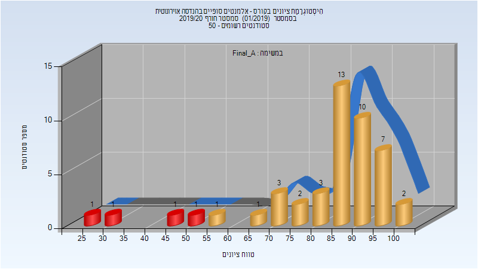
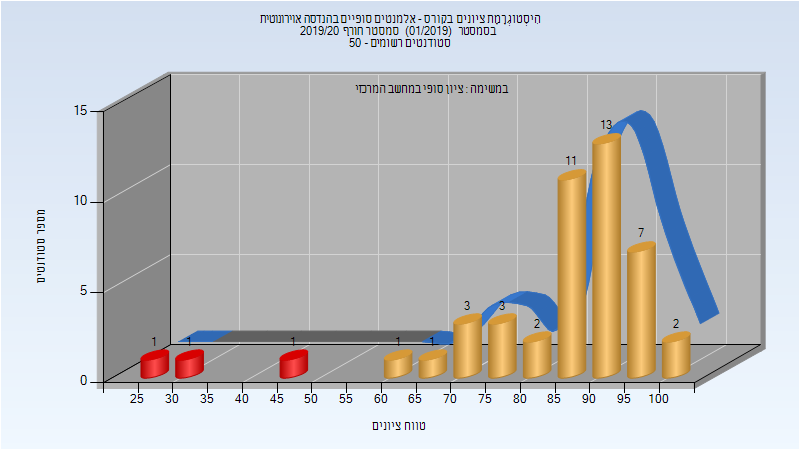

# 086574 - אלמנטים סופיים בהנדסה אוירונוטית

## חורף 2019-2020

| איש סגל | תפקיד |
| ---- | ---- |
| מלכיאל נחמן | מתרגל |
| גבעולי דן | מרצה - אחראי מקצוע |

### מבחן מועד א'

| סטודנטים | עברו/נכשלו | אחוז עוברים | ציון מינימלי | ציון מקסימלי | ממוצע | חציון |
| ---- | ---- | ---- | ---- | ---- | ---- | ---- |
| 46 | 42/4 | 91 | 28 | 102 | 82.065 | 87.5 |

### סופי מועד א'

| סטודנטים | עברו/נכשלו | אחוז עוברים | ציון מינימלי | ציון מקסימלי | ממוצע | חציון |
| ---- | ---- | ---- | ---- | ---- | ---- | ---- |
| 46 | 42/4 | 91 | 28 | 100 | 83.858 | 89.025 |

### סופי

| סטודנטים | עברו/נכשלו | אחוז עוברים | ציון מינימלי | ציון מקסימלי | ממוצע | חציון |
| ---- | ---- | ---- | ---- | ---- | ---- | ---- |
| 48 | 47/1 | 98 | 38 | 100 | 85.5 | 88.5 |

## אביב 2021

| איש סגל | תפקיד |
| ---- | ---- |
| מלכיאל נחמן | מתרגל |
| גבעולי דן | מרצה - אחראי מקצוע |

