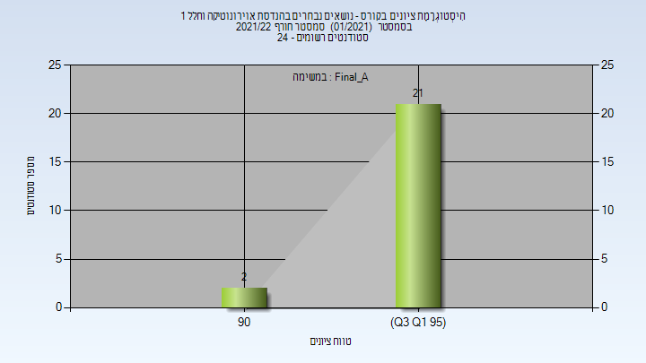

# 086821 - נושאים נבחרים בהנדסת אויר-חלל 1

## חורף 2021-2022

| איש סגל | תפקיד |
| ---- | ---- |
| קידר מיכאל | מרצה - אחראי מקצוע |
| הרשקו דפנה | מרצה |

### סופי מועד א'

| סטודנטים | עברו/נכשלו | אחוז עוברים | ציון מינימלי | ציון מקסימלי | ממוצע | חציון |
| ---- | ---- | ---- | ---- | ---- | ---- | ---- |
| 23 | 23/0 | 100 | 92.75 | 99.35 | 97.741 | 97.95 |

