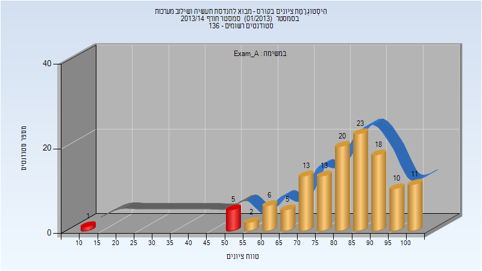
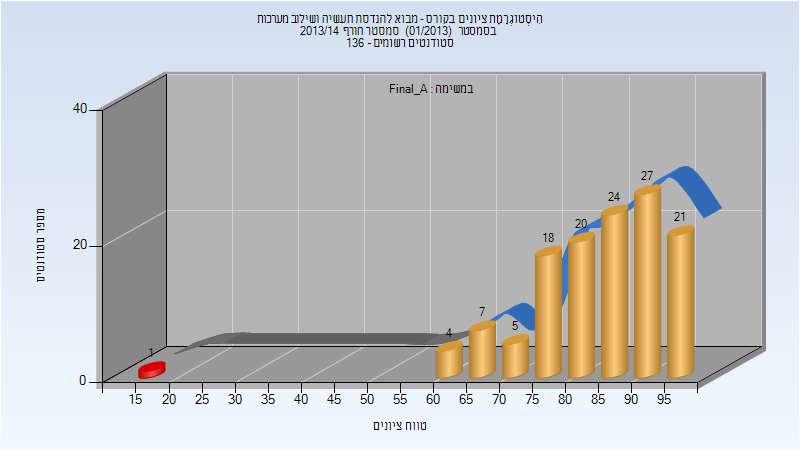
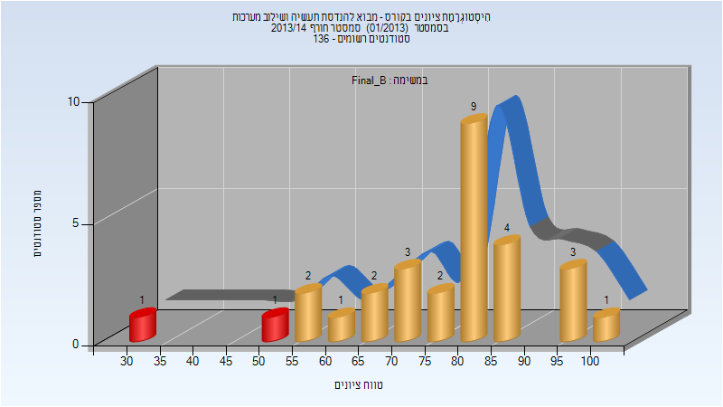

# 094100 - מבוא להנדסת תעשיה ושילוב מערכות

## חורף 2013-2014

| איש סגל | תפקיד |
| ---- | ---- |
| אברהמי אסף | מרצה - אחראי מקצוע |
| סמירנוב דינה | מתרגל |

### מבחן מועד א'

| סטודנטים | עברו/נכשלו | אחוז עוברים | ציון מינימלי | ציון מקסימלי | ממוצע | חציון |
| ---- | ---- | ---- | ---- | ---- | ---- | ---- |
| 127 | 121/6 | 95 | 10 | 100 | 81.953 | 84 |

### סופי מועד א'

| סטודנטים | עברו/נכשלו | אחוז עוברים | ציון מינימלי | ציון מקסימלי | ממוצע | חציון |
| ---- | ---- | ---- | ---- | ---- | ---- | ---- |
| 127 | 126/1 | 99 | 19 | 99 | 84.654 | 86 |

### סופי מועד ב'

| סטודנטים | עברו/נכשלו | אחוז עוברים | ציון מינימלי | ציון מקסימלי | ממוצע | חציון |
| ---- | ---- | ---- | ---- | ---- | ---- | ---- |
| 29 | 27/2 | 93 | 31 | 100 | 77.103 | 80 |

