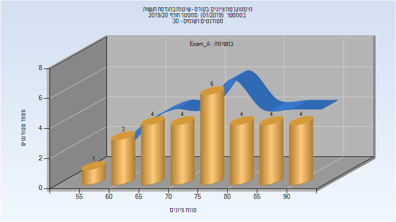
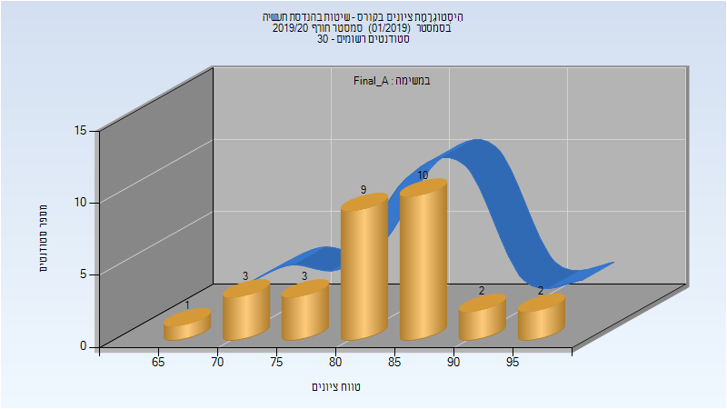
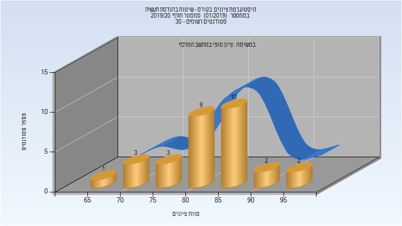

# 094170 - שיטות בהנדסת תעשיה

## חורף 2019-2020

| איש סגל | תפקיד |
| ---- | ---- |
| לויפר שלומי | מרצה - אחראי מקצוע |
| בנבנישתי אלעד | מתרגל - עם הרשאות מרצה אחראי |
| אשור רועי | מתרגל - עם הרשאות מרצה אחראי |

### מבחן מועד א'

| סטודנטים | עברו/נכשלו | אחוז עוברים | ציון מינימלי | ציון מקסימלי | ממוצע | חציון |
| ---- | ---- | ---- | ---- | ---- | ---- | ---- |
| 30 | 30/0 | 100 | 57.5 | 94 | 76.8 | 76.5 |

### סופי מועד א'

| סטודנטים | עברו/נכשלו | אחוז עוברים | ציון מינימלי | ציון מקסימלי | ממוצע | חציון |
| ---- | ---- | ---- | ---- | ---- | ---- | ---- |
| 30 | 30/0 | 100 | 69 | 95.1 | 83.337 | 84 |

### סופי

| סטודנטים | עברו/נכשלו | אחוז עוברים | ציון מינימלי | ציון מקסימלי | ממוצע | חציון |
| ---- | ---- | ---- | ---- | ---- | ---- | ---- |
| 30 | 30/0 | 100 | 69 | 95 | 83.333 | 84 |

