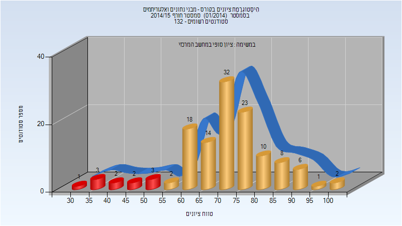

# 094223 - מבני נתונים ואלגוריתמים

## חורף 2014-2015

| איש סגל | תפקיד |
| ---- | ---- |
| גל אביגדור | מרצה - אחראי מקצוע |

### סופי

| סטודנטים | עברו/נכשלו | אחוז עוברים | ציון מינימלי | ציון מקסימלי | ממוצע | חציון |
| ---- | ---- | ---- | ---- | ---- | ---- | ---- |
| 127 | 116/11 | 91 | 34 | 100 | 71.756 | 73 |

