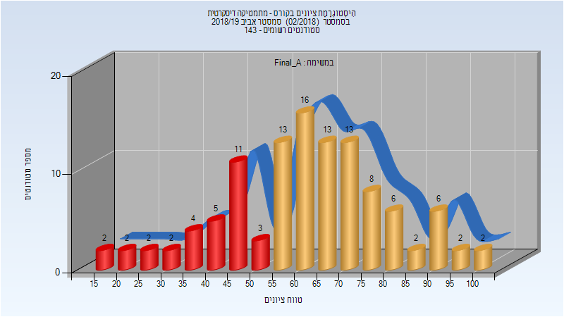
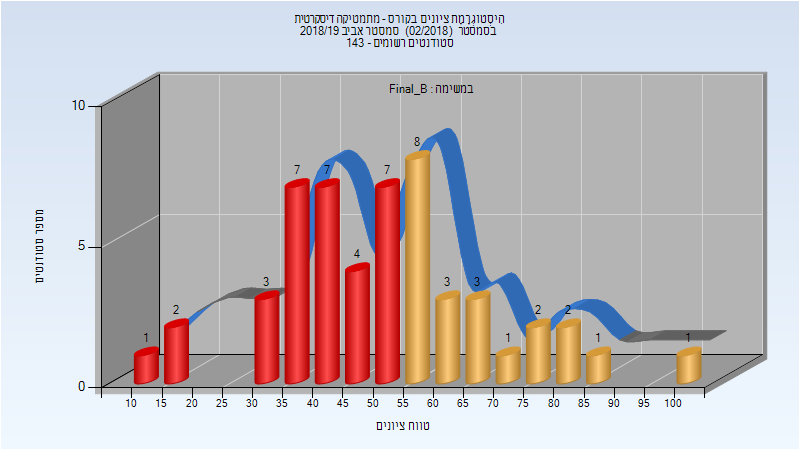
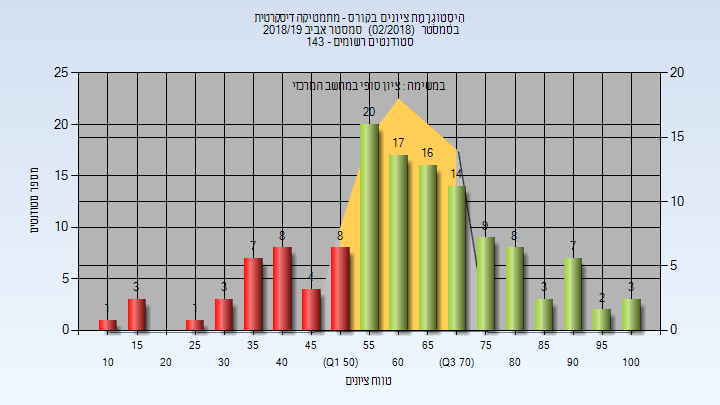

# 094346 - מתמטיקה דיסקרטית

## אביב 2019

| איש סגל | תפקיד |
| ---- | ---- |
| פן מיכל | מרצה - אחראי מקצוע |

### סופי מועד א'

| סטודנטים | עברו/נכשלו | אחוז עוברים | ציון מינימלי | ציון מקסימלי | ממוצע | חציון |
| ---- | ---- | ---- | ---- | ---- | ---- | ---- |
| 112 | 81/31 | 72 | 19 | 100 | 62.375 | 62 |

### סופי מועד ב'

| סטודנטים | עברו/נכשלו | אחוז עוברים | ציון מינימלי | ציון מקסימלי | ממוצע | חציון |
| ---- | ---- | ---- | ---- | ---- | ---- | ---- |
| 52 | 21/31 | 40 | 13 | 100 | 51.404 | 52 |

### סופי

| סטודנטים | עברו/נכשלו | אחוז עוברים | ציון מינימלי | ציון מקסימלי | ממוצע | חציון |
| ---- | ---- | ---- | ---- | ---- | ---- | ---- |
| 134 | 99/35 | 74 | 13 | 100 | 62.679 | 62 |

