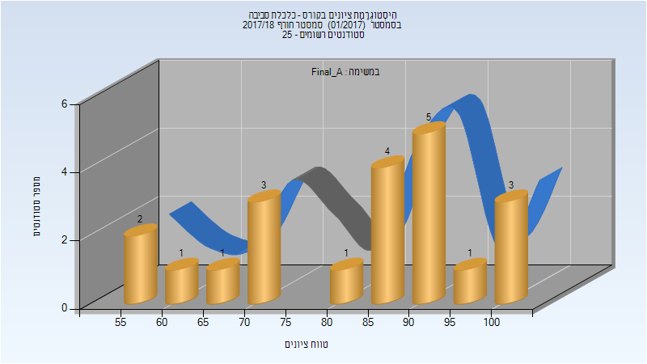
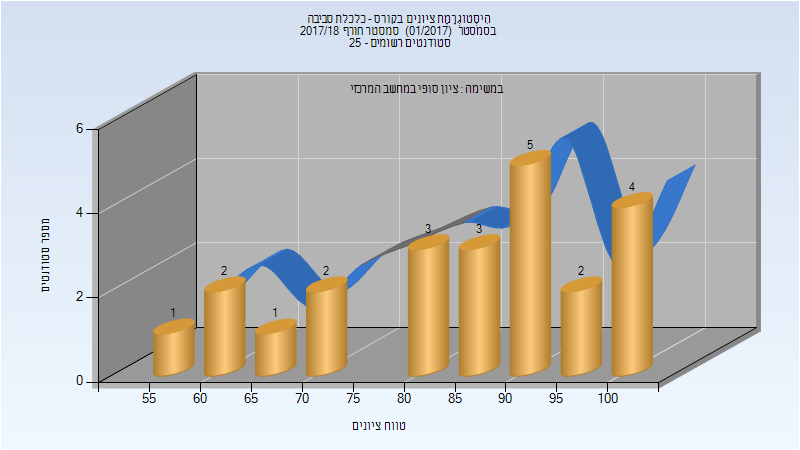

# 096553 - כלכלת סביבה

## חורף 2017-2018

| איש סגל | תפקיד |
| ---- | ---- |
| סמורודינסקי רן | מרצה - אחראי מקצוע |
| בן-חקון אליקים | מרצה |

### סופי מועד א'

| סטודנטים | עברו/נכשלו | אחוז עוברים | ציון מינימלי | ציון מקסימלי | ממוצע | חציון |
| ---- | ---- | ---- | ---- | ---- | ---- | ---- |
| 21 | 21/0 | 100 | 56 | 100 | 82.238 | 86 |

### סופי

| סטודנטים | עברו/נכשלו | אחוז עוברים | ציון מינימלי | ציון מקסימלי | ממוצע | חציון |
| ---- | ---- | ---- | ---- | ---- | ---- | ---- |
| 23 | 23/0 | 100 | 56 | 100 | 84.043 | 86 |

