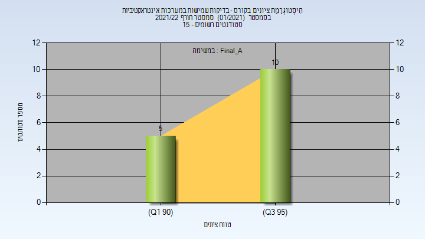
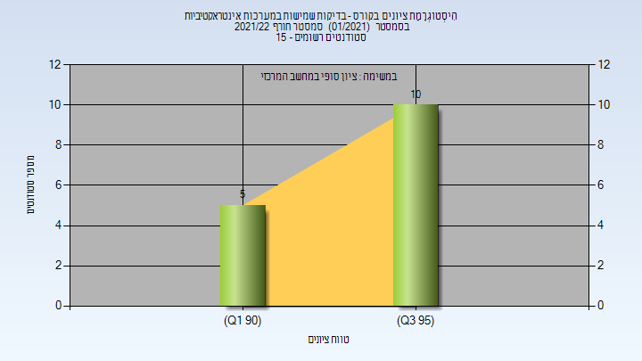

# 097136 - בדיקות שמישות במערכות אינטראקטיבי

## חורף 2021-2022

| איש סגל | תפקיד |
| ---- | ---- |
| פרוש אבי | מרצה - אחראי מקצוע |
| עזר עדי | מתרגל - עם הרשאות מרצה אחראי |
| זיו דוד מורן | סגל מנהלי - עם הרשאות מרצה אחראי |

### סופי מועד א'

| סטודנטים | עברו/נכשלו | אחוז עוברים | ציון מינימלי | ציון מקסימלי | ממוצע | חציון |
| ---- | ---- | ---- | ---- | ---- | ---- | ---- |
| 15 | 15/0 | 100 | 94 | 97 | 95.667 | 96 |

### סופי

| סטודנטים | עברו/נכשלו | אחוז עוברים | ציון מינימלי | ציון מקסימלי | ממוצע | חציון |
| ---- | ---- | ---- | ---- | ---- | ---- | ---- |
| 15 | 15/0 | 100 | 94 | 97 | 95.667 | 96 |

