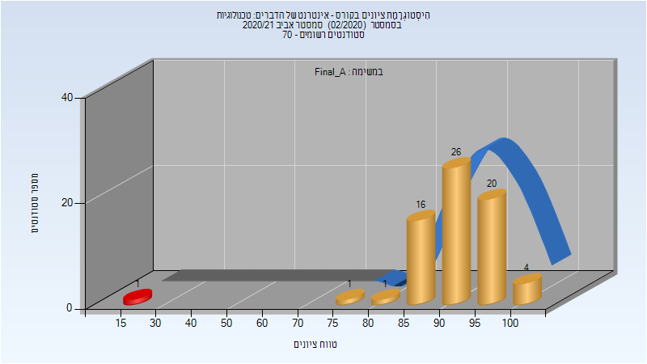
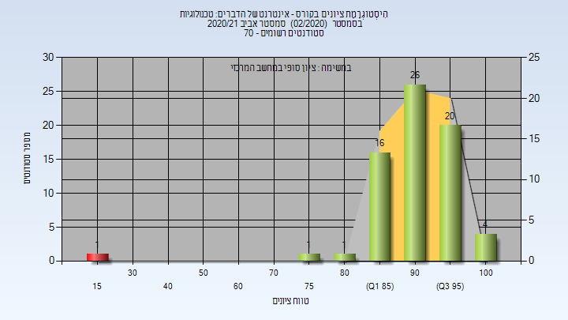

# 097247 - אינטרנט של הדברים# טכנולוגיות

## אביב 2020

| איש סגל | תפקיד |
| ---- | ---- |
| לויפר שלומי | מרצה - אחראי מקצוע |
| גרשוב ספיר | מתרגל - עם הרשאות מרצה אחראי |
| גולדבראיך אדם ודים | מתרגל - עם הרשאות מרצה אחראי |
| אגסי זיוה | סגל מנהלי - עם הרשאות מרצה אחראי |
| זיו דוד מורן | סגל מנהלי - עם הרשאות מרצה אחראי |

### סופי מועד א'

| סטודנטים | עברו/נכשלו | אחוז עוברים | ציון מינימלי | ציון מקסימלי | ממוצע | חציון |
| ---- | ---- | ---- | ---- | ---- | ---- | ---- |
| 54 | 52/2 | 96 | 25 | 100 | 89.981 | 92.5 |

### סופי

| סטודנטים | עברו/נכשלו | אחוז עוברים | ציון מינימלי | ציון מקסימלי | ממוצע | חציון |
| ---- | ---- | ---- | ---- | ---- | ---- | ---- |
| 54 | 52/2 | 96 | 25 | 100 | 89.981 | 92.5 |

## אביב 2021

| איש סגל | תפקיד |
| ---- | ---- |
| לויפר שלומי | מרצה - אחראי מקצוע |
| גולדבראיך אדם ודים | מתרגל |
| זיו דוד מורן | סגל מנהלי - עם הרשאות מרצה אחראי |

### סופי מועד א'

| סטודנטים | עברו/נכשלו | אחוז עוברים | ציון מינימלי | ציון מקסימלי | ממוצע | חציון |
| ---- | ---- | ---- | ---- | ---- | ---- | ---- |
| 69 | 68/1 | 99 | 18 | 100 | 91.159 | 92 |

### סופי

| סטודנטים | עברו/נכשלו | אחוז עוברים | ציון מינימלי | ציון מקסימלי | ממוצע | חציון |
| ---- | ---- | ---- | ---- | ---- | ---- | ---- |
| 69 | 68/1 | 99 | 18 | 100 | 91.159 | 92 |

