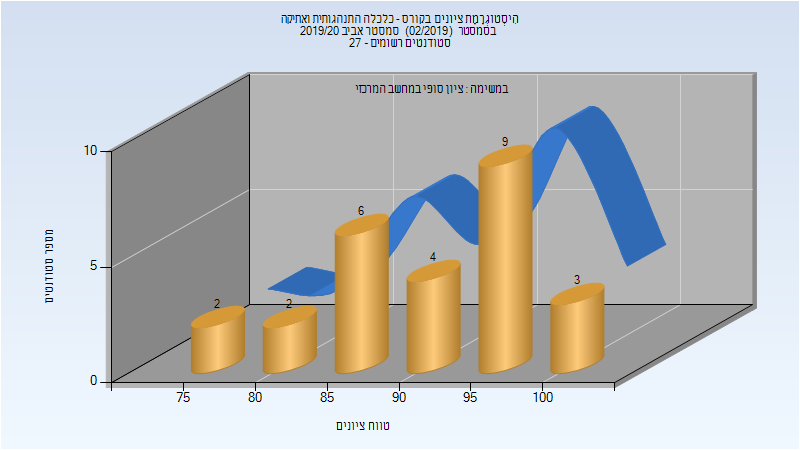

# 098748 - כלכלה ואתיקה

## אביב 2020

| איש סגל | תפקיד |
| ---- | ---- |
| תיאודורסקו כנרת | מרצה - אחראי מקצוע |
| גנאור אילנית | סגל מנהלי - עם הרשאות מרצה אחראי |

### סופי מועד א'

| סטודנטים | עברו/נכשלו | אחוז עוברים | ציון מינימלי | ציון מקסימלי | ממוצע | חציון |
| ---- | ---- | ---- | ---- | ---- | ---- | ---- |
| 26 | 26/0 | 100 | 77 | 100 | 91.577 | 92.5 |

### סופי

| סטודנטים | עברו/נכשלו | אחוז עוברים | ציון מינימלי | ציון מקסימלי | ממוצע | חציון |
| ---- | ---- | ---- | ---- | ---- | ---- | ---- |
| 26 | 26/0 | 100 | 77 | 100 | 91.577 | 92.5 |

