# 104012 - חשבון דיפרנציאלי ואינטגרלי 1ת'

## חורף 2008-2009

| איש סגל | תפקיד |
| ---- | ---- |
| בנימיני יואב | מרצה - אחראי מקצוע |
| הרי אסף ז"ל | מתרגל |
| אביטל רבקה | מתרגל |

### סופי מועד א'

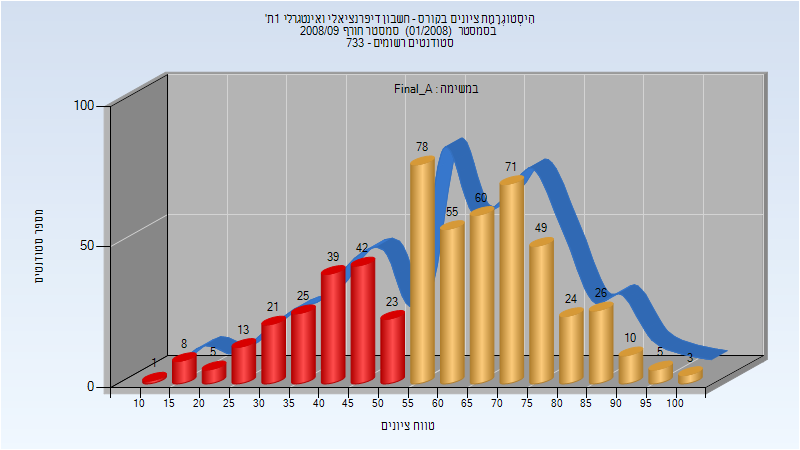

| סטודנטים | עברו/נכשלו | אחוז עוברים | ציון מינימלי | ציון מקסימלי | ממוצע | חציון |
| ---- | ---- | ---- | ---- | ---- | ---- | ---- |
| 558 | 381/177 | 68 | 13 | 100 | 60.333 | 62 |

### סופי מועד ב'

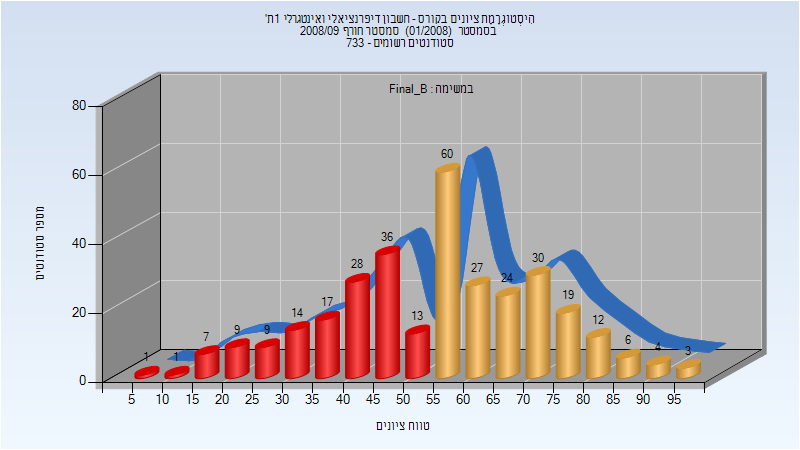

| סטודנטים | עברו/נכשלו | אחוז עוברים | ציון מינימלי | ציון מקסימלי | ממוצע | חציון |
| ---- | ---- | ---- | ---- | ---- | ---- | ---- |
| 320 | 185/135 | 58 | 6 | 96 | 55.212 | 56 |

## חורף 2010-2011

| איש סגל | תפקיד |
| ---- | ---- |
| פנחסי רום | מרצה - אחראי מקצוע |
| פרומקין ולרי | מתרגל |

### סופי מועד א'

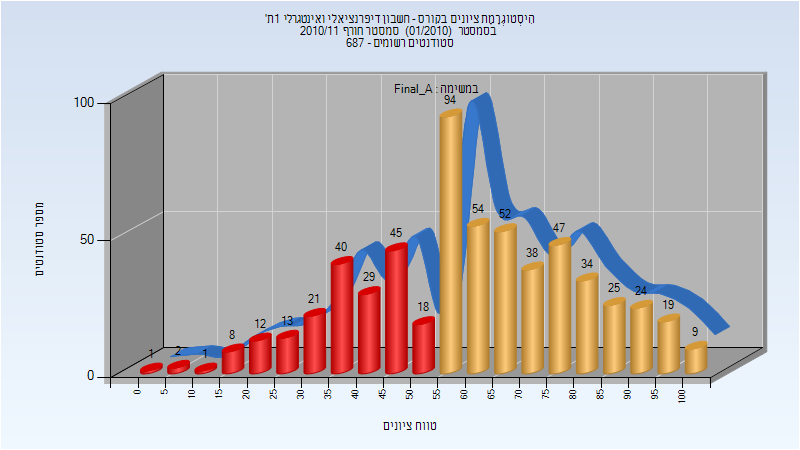

| סטודנטים | עברו/נכשלו | אחוז עוברים | ציון מינימלי | ציון מקסימלי | ממוצע | חציון |
| ---- | ---- | ---- | ---- | ---- | ---- | ---- |
| 586 | 396/190 | 68 | 2 | 100 | 60.662 | 60 |

### סופי מועד ב'

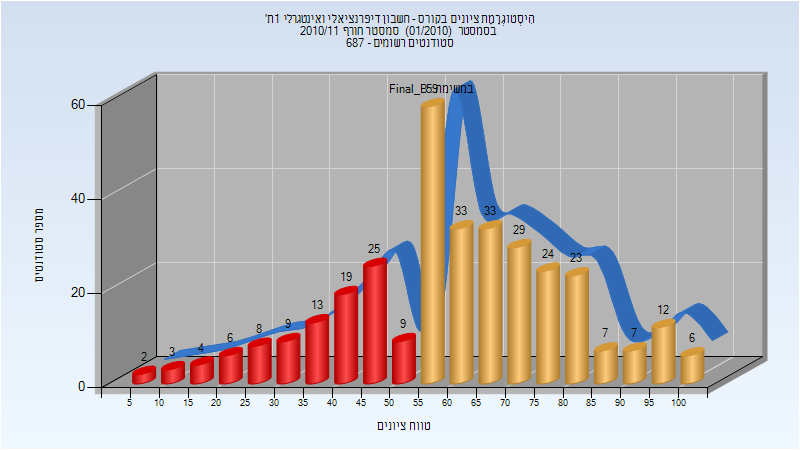

| סטודנטים | עברו/נכשלו | אחוז עוברים | ציון מינימלי | ציון מקסימלי | ממוצע | חציון |
| ---- | ---- | ---- | ---- | ---- | ---- | ---- |
| 331 | 233/98 | 70 | 8 | 100 | 60.686 | 61 |

## אביב 2011

| איש סגל | תפקיד |
| ---- | ---- |
| רייך שמעון | מרצה - אחראי מקצוע |
| פרומקין ולרי | מתרגל |

### סופי מועד א'

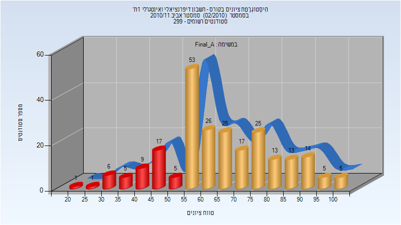

| סטודנטים | עברו/נכשלו | אחוז עוברים | ציון מינימלי | ציון מקסימלי | ממוצע | חציון |
| ---- | ---- | ---- | ---- | ---- | ---- | ---- |
| 240 | 196/44 | 82 | 20 | 100 | 65.567 | 64 |

### סופי מועד ב'

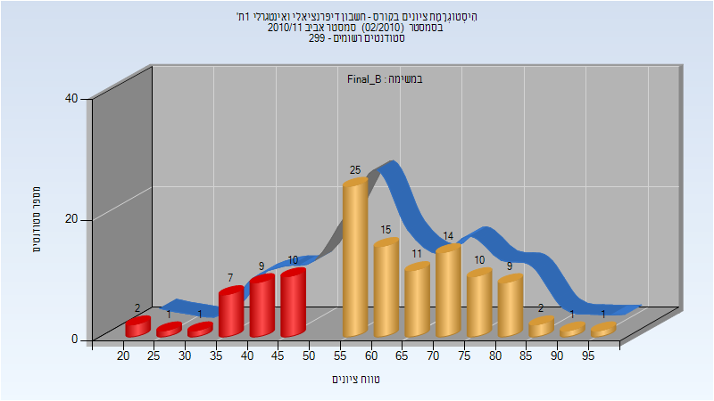

| סטודנטים | עברו/נכשלו | אחוז עוברים | ציון מינימלי | ציון מקסימלי | ממוצע | חציון |
| ---- | ---- | ---- | ---- | ---- | ---- | ---- |
| 118 | 88/30 | 75 | 21 | 96 | 60.517 | 60 |

## חורף 2011-2012

| איש סגל | תפקיד |
| ---- | ---- |
| צנזור אביב | מרצה - אחראי מקצוע |
| פרומקין ולרי | מתרגל |

### מבחן מועד א'

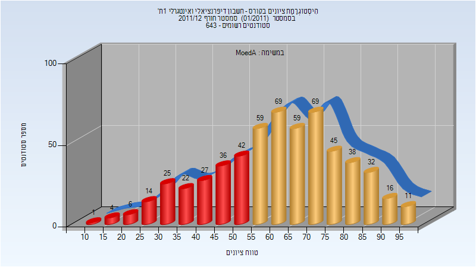

| סטודנטים | עברו/נכשלו | אחוז עוברים | ציון מינימלי | ציון מקסימלי | ממוצע | חציון |
| ---- | ---- | ---- | ---- | ---- | ---- | ---- |
| 575 | 398/177 | 69 | 14 | 99 | 62.057 | 63 |

### סופי מועד א'

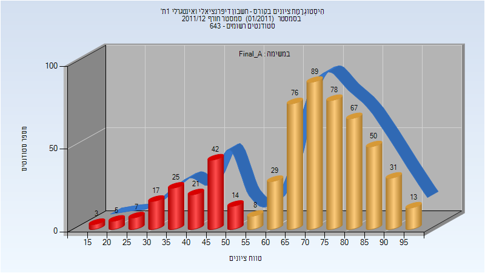

| סטודנטים | עברו/נכשלו | אחוז עוברים | ציון מינימלי | ציון מקסימלי | ממוצע | חציון |
| ---- | ---- | ---- | ---- | ---- | ---- | ---- |
| 575 | 441/134 | 77 | 17 | 99 | 68.016 | 72 |

### סופי מועד ב'

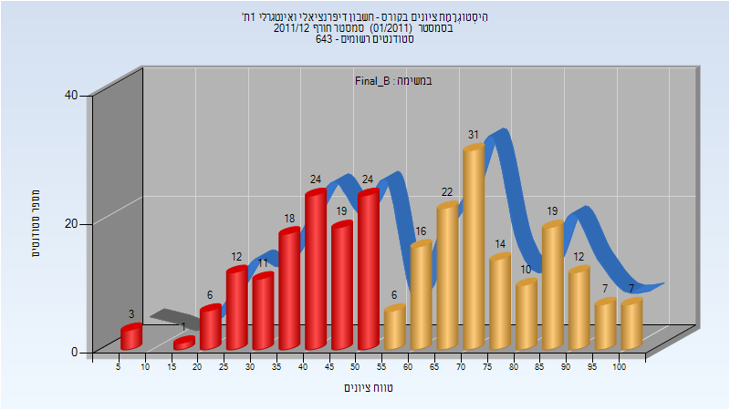

| סטודנטים | עברו/נכשלו | אחוז עוברים | ציון מינימלי | ציון מקסימלי | ממוצע | חציון |
| ---- | ---- | ---- | ---- | ---- | ---- | ---- |
| 262 | 144/118 | 55 | 8 | 100 | 60.031 | 63 |

## אביב 2012

| איש סגל | תפקיד |
| ---- | ---- |
| פנחסי רום | מרצה - אחראי מקצוע |
| פרומקין ולרי | מתרגל |

### סופי מועד א'

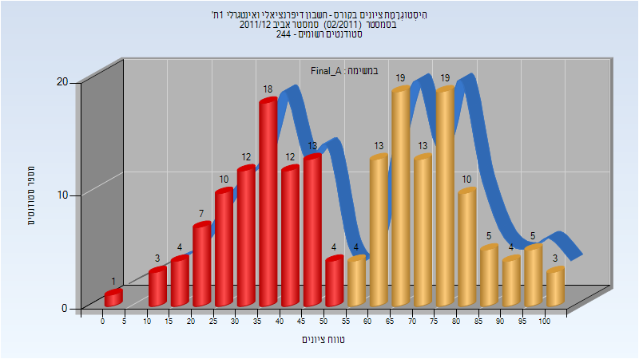

| סטודנטים | עברו/נכשלו | אחוז עוברים | ציון מינימלי | ציון מקסימלי | ממוצע | חציון |
| ---- | ---- | ---- | ---- | ---- | ---- | ---- |
| 179 | 95/84 | 53 | 4 | 100 | 55.899 | 60 |

### סופי מועד ב'

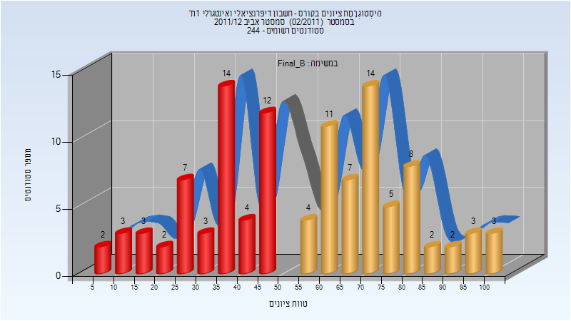

| סטודנטים | עברו/נכשלו | אחוז עוברים | ציון מינימלי | ציון מקסימלי | ממוצע | חציון |
| ---- | ---- | ---- | ---- | ---- | ---- | ---- |
| 109 | 59/50 | 54 | 9 | 100 | 55.661 | 60 |

## חורף 2012-2013

| איש סגל | תפקיד |
| ---- | ---- |
| שפריר איתי | מרצה - אחראי מקצוע |
| פרומקין ולרי | מתרגל |

### מבחן מועד א'

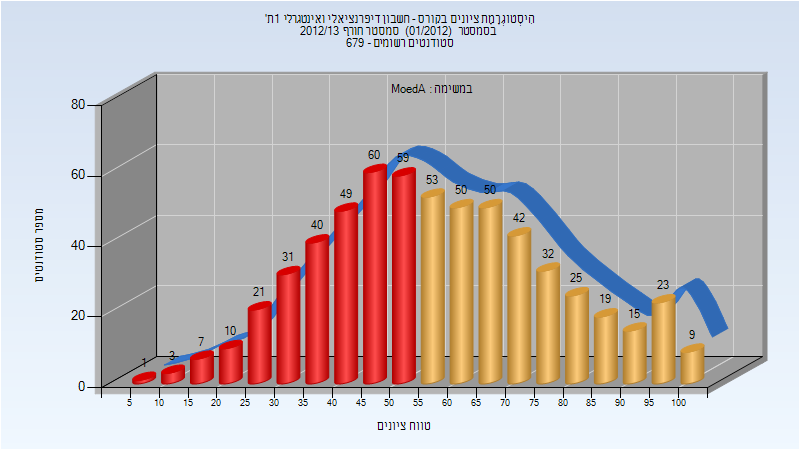

| סטודנטים | עברו/נכשלו | אחוז עוברים | ציון מינימלי | ציון מקסימלי | ממוצע | חציון |
| ---- | ---- | ---- | ---- | ---- | ---- | ---- |
| 599 | 318/281 | 53 | 8 | 100 | 57.599 | 56 |

### סופי מועד א'

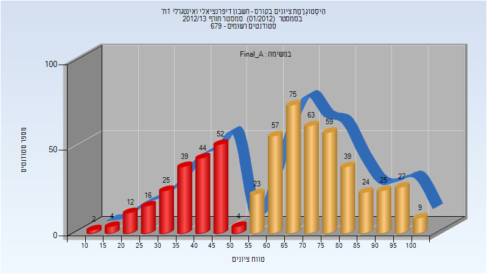

| סטודנטים | עברו/נכשלו | אחוז עוברים | ציון מינימלי | ציון מקסימלי | ממוצע | חציון |
| ---- | ---- | ---- | ---- | ---- | ---- | ---- |
| 599 | 401/198 | 67 | 10 | 100 | 62.689 | 66 |

### סופי מועד ב'

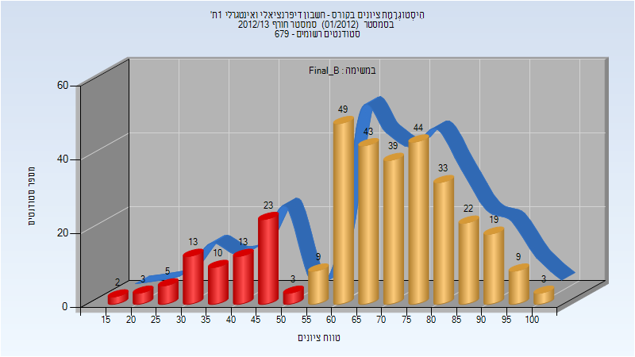

| סטודנטים | עברו/נכשלו | אחוז עוברים | ציון מינימלי | ציון מקסימלי | ממוצע | חציון |
| ---- | ---- | ---- | ---- | ---- | ---- | ---- |
| 342 | 270/72 | 79 | 16 | 100 | 67.228 | 69 |

## אביב 2013

### מבחן מועד א'

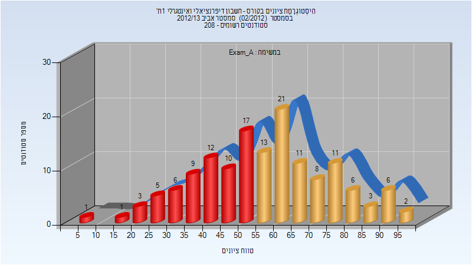

| סטודנטים | עברו/נכשלו | אחוז עוברים | ציון מינימלי | ציון מקסימלי | ממוצע | חציון |
| ---- | ---- | ---- | ---- | ---- | ---- | ---- |
| 145 | 81/64 | 56 | 8 | 95 | 57.083 | 57 |

### סופי מועד א'

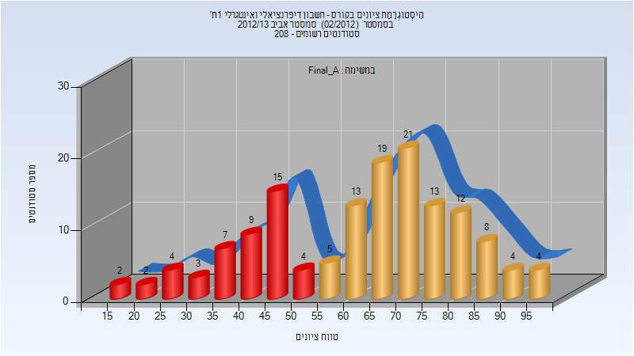

| סטודנטים | עברו/נכשלו | אחוז עוברים | ציון מינימלי | ציון מקסימלי | ממוצע | חציון |
| ---- | ---- | ---- | ---- | ---- | ---- | ---- |
| 145 | 99/46 | 68 | 16 | 99 | 63 | 67 |

### סופי מועד ב'

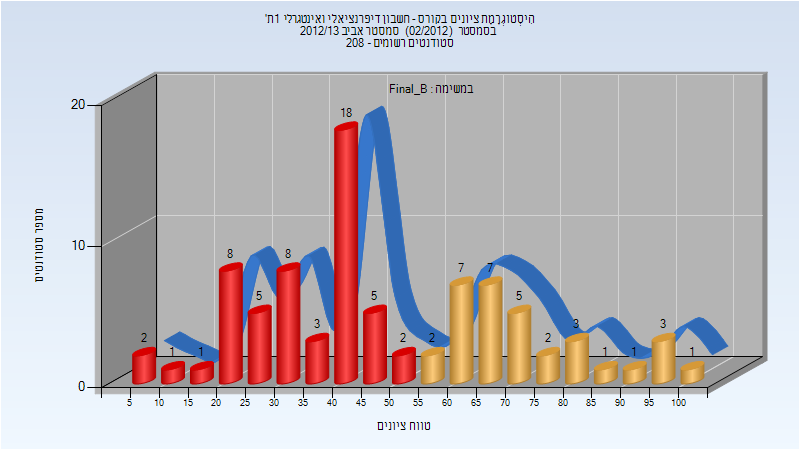

| סטודנטים | עברו/נכשלו | אחוז עוברים | ציון מינימלי | ציון מקסימלי | ממוצע | חציון |
| ---- | ---- | ---- | ---- | ---- | ---- | ---- |
| 85 | 32/53 | 38 | 6 | 100 | 49.035 | 44 |

## חורף 2013-2014

| איש סגל | תפקיד |
| ---- | ---- |
| נבו עמוס | מרצה - אחראי מקצוע |
| הרי אסף ז"ל | מתרגל |
| פרומקין ולרי | מתרגל |
| רז אור | מתרגל |

### מבחן מועד א'

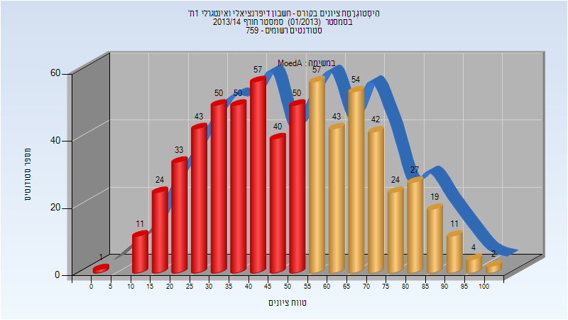

| סטודנטים | עברו/נכשלו | אחוז עוברים | ציון מינימלי | ציון מקסימלי | ממוצע | חציון |
| ---- | ---- | ---- | ---- | ---- | ---- | ---- |
| 642 | 283/359 | 44 | 0 | 100 | 50.763 | 50.5 |

### סופי מועד א'

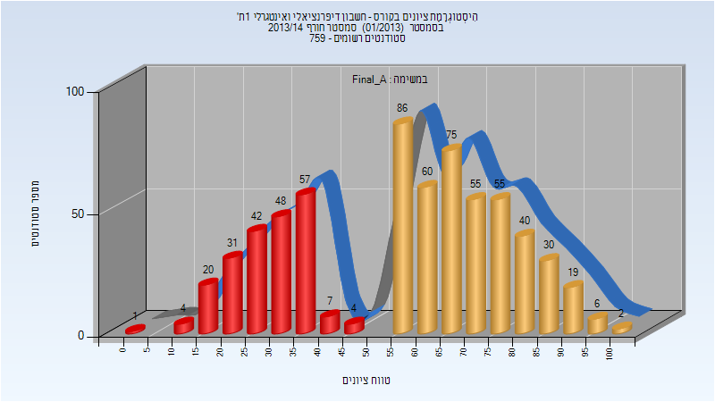

| סטודנטים | עברו/נכשלו | אחוז עוברים | ציון מינימלי | ציון מקסימלי | ממוצע | חציון |
| ---- | ---- | ---- | ---- | ---- | ---- | ---- |
| 642 | 428/214 | 67 | 3 | 100 | 56.776 | 60.5 |

### סופי מועד ב'

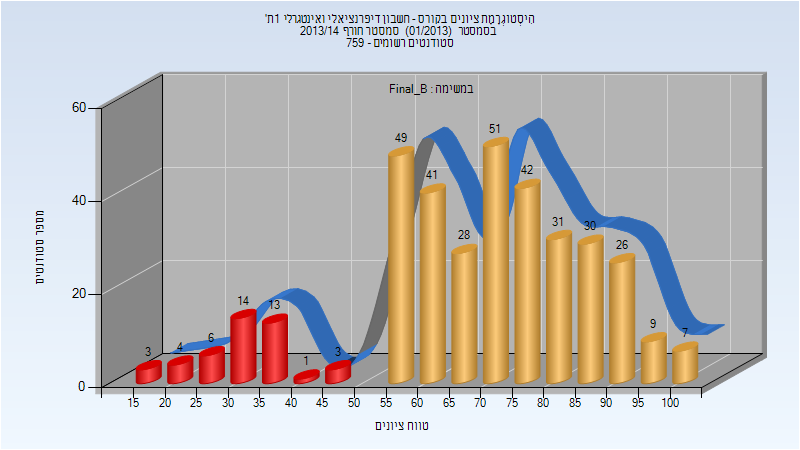

| סטודנטים | עברו/נכשלו | אחוז עוברים | ציון מינימלי | ציון מקסימלי | ממוצע | חציון |
| ---- | ---- | ---- | ---- | ---- | ---- | ---- |
| 358 | 314/44 | 88 | 15 | 100 | 68.693 | 71 |

