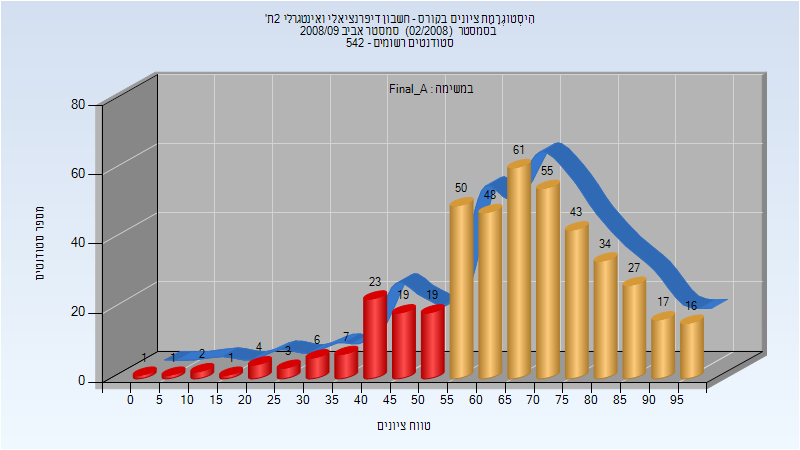

# 104014 - חשבון דיפרנציאלי ואינטגרלי 2ת'

## אביב 2009

| איש סגל | תפקיד |
| ---- | ---- |
| מניוביץ רות | מרצה - אחראי מקצוע |
| אביטל רבקה | מתרגל |

### סופי מועד א'

| סטודנטים | עברו/נכשלו | אחוז עוברים | ציון מינימלי | ציון מקסימלי | ממוצע | חציון |
| ---- | ---- | ---- | ---- | ---- | ---- | ---- |
| 437 | 351/86 | 80 | 2 | 98 | 65.97 | 67 |

### סופי מועד ב'

| סטודנטים | עברו/נכשלו | אחוז עוברים | ציון מינימלי | ציון מקסימלי | ממוצע | חציון |
| ---- | ---- | ---- | ---- | ---- | ---- | ---- |
| 224 | 190/34 | 85 | 14 | 99 | 70.951 | 74 |

## אביב 2010

| איש סגל | תפקיד |
| ---- | ---- |
| יריב אהוד | מרצה - אחראי מקצוע |
| אביטל רבקה | מתרגל |

### סופי מועד א'

| סטודנטים | עברו/נכשלו | אחוז עוברים | ציון מינימלי | ציון מקסימלי | ממוצע | חציון |
| ---- | ---- | ---- | ---- | ---- | ---- | ---- |
| 457 | 364/93 | 80 | 2 | 100 | 67.392 | 70 |

### סופי מועד ב'

| סטודנטים | עברו/נכשלו | אחוז עוברים | ציון מינימלי | ציון מקסימלי | ממוצע | חציון |
| ---- | ---- | ---- | ---- | ---- | ---- | ---- |
| 221 | 152/69 | 69 | 1 | 100 | 60.579 | 61 |

