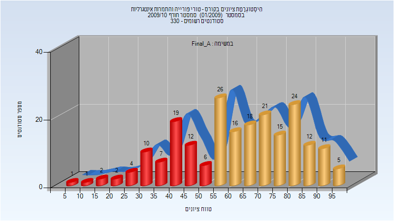
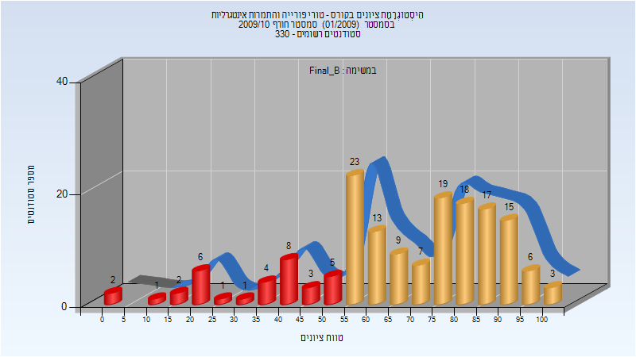
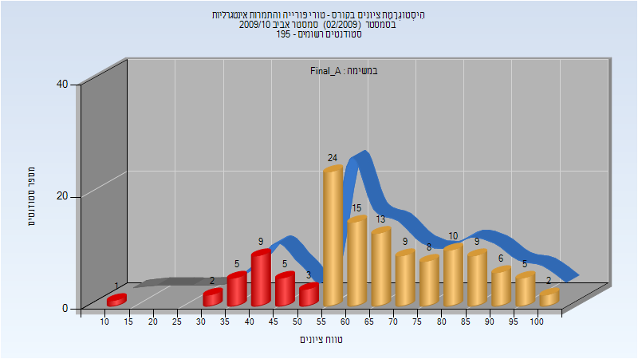
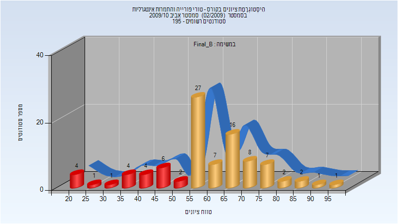

# 104214 - טורי פורייה והתמרות אינטגרליות

## חורף 2009-2010

| איש סגל | תפקיד |
| ---- | ---- |
| הרמלין ראובן | מרצה - אחראי מקצוע |
| יחיא יורם | מתרגל |

### סופי מועד א'

| סטודנטים | עברו/נכשלו | אחוז עוברים | ציון מינימלי | ציון מקסימלי | ממוצע | חציון |
| ---- | ---- | ---- | ---- | ---- | ---- | ---- |
| 212 | 148/64 | 70 | 6 | 99 | 62.613 | 65 |

### סופי מועד ב'

| סטודנטים | עברו/נכשלו | אחוז עוברים | ציון מינימלי | ציון מקסימלי | ממוצע | חציון |
| ---- | ---- | ---- | ---- | ---- | ---- | ---- |
| 163 | 130/33 | 80 | 3 | 100 | 67.454 | 70 |

## אביב 2010

| איש סגל | תפקיד |
| ---- | ---- |
| ויסלטר עמי | מרצה - אחראי מקצוע |
| יחיא יורם | מתרגל |

### סופי מועד א'

| סטודנטים | עברו/נכשלו | אחוז עוברים | ציון מינימלי | ציון מקסימלי | ממוצע | חציון |
| ---- | ---- | ---- | ---- | ---- | ---- | ---- |
| 126 | 101/25 | 80 | 11 | 100 | 65.849 | 64 |

### סופי מועד ב'

| סטודנטים | עברו/נכשלו | אחוז עוברים | ציון מינימלי | ציון מקסימלי | ממוצע | חציון |
| ---- | ---- | ---- | ---- | ---- | ---- | ---- |
| 93 | 71/22 | 76 | 20 | 95 | 59.204 | 58 |

