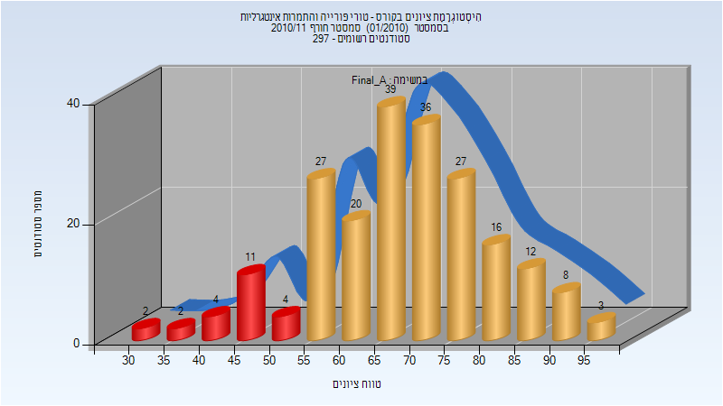
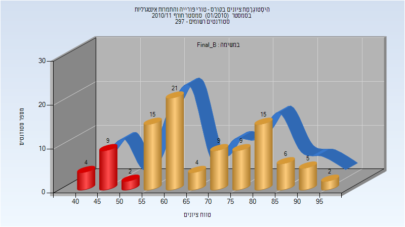
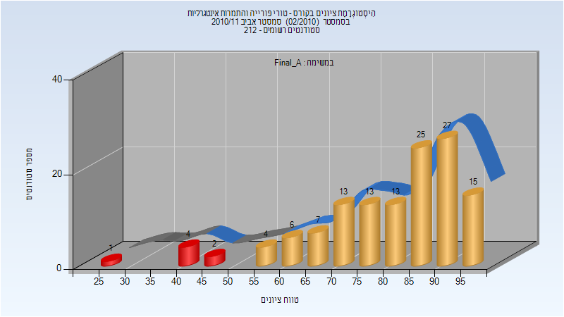
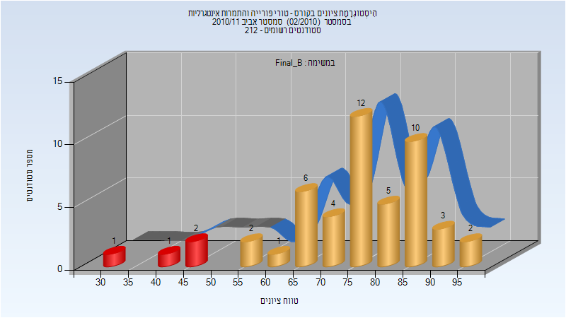

# 104214 - טורי פורייה והתמרות אינטגרליות

## חורף 2009-2010

| איש סגל | תפקיד |
| ---- | ---- |
| הרמלין ראובן | מרצה - אחראי מקצוע |
| יחיא יורם | מתרגל |

### סופי מועד א'

| סטודנטים | עברו/נכשלו | אחוז עוברים | ציון מינימלי | ציון מקסימלי | ממוצע | חציון |
| ---- | ---- | ---- | ---- | ---- | ---- | ---- |
| 212 | 148/64 | 70 | 6 | 99 | 62.613 | 65 |

### סופי מועד ב'

| סטודנטים | עברו/נכשלו | אחוז עוברים | ציון מינימלי | ציון מקסימלי | ממוצע | חציון |
| ---- | ---- | ---- | ---- | ---- | ---- | ---- |
| 163 | 130/33 | 80 | 3 | 100 | 67.454 | 70 |

## אביב 2010

| איש סגל | תפקיד |
| ---- | ---- |
| ויסלטר עמי | מרצה - אחראי מקצוע |
| יחיא יורם | מתרגל |

### סופי מועד א'

| סטודנטים | עברו/נכשלו | אחוז עוברים | ציון מינימלי | ציון מקסימלי | ממוצע | חציון |
| ---- | ---- | ---- | ---- | ---- | ---- | ---- |
| 126 | 101/25 | 80 | 11 | 100 | 65.849 | 64 |

### סופי מועד ב'

| סטודנטים | עברו/נכשלו | אחוז עוברים | ציון מינימלי | ציון מקסימלי | ממוצע | חציון |
| ---- | ---- | ---- | ---- | ---- | ---- | ---- |
| 93 | 71/22 | 76 | 20 | 95 | 59.204 | 58 |

## חורף 2010-2011

| איש סגל | תפקיד |
| ---- | ---- |
| ציגלר תמר | מרצה - אחראי מקצוע |
| יחיא יורם | מתרגל |
| ויסלטר עמי | מתרגל |

### סופי מועד א'

| סטודנטים | עברו/נכשלו | אחוז עוברים | ציון מינימלי | ציון מקסימלי | ממוצע | חציון |
| ---- | ---- | ---- | ---- | ---- | ---- | ---- |
| 211 | 188/23 | 89 | 34 | 97 | 68.583 | 69 |

### סופי מועד ב'

| סטודנטים | עברו/נכשלו | אחוז עוברים | ציון מינימלי | ציון מקסימלי | ממוצע | חציון |
| ---- | ---- | ---- | ---- | ---- | ---- | ---- |
| 101 | 86/15 | 85 | 42 | 95 | 67.822 | 64 |

## אביב 2011

| איש סגל | תפקיד |
| ---- | ---- |
| ברוך אהוד | מרצה - אחראי מקצוע |
| יחיא יורם | מתרגל |

### סופי מועד א'

| סטודנטים | עברו/נכשלו | אחוז עוברים | ציון מינימלי | ציון מקסימלי | ממוצע | חציון |
| ---- | ---- | ---- | ---- | ---- | ---- | ---- |
| 130 | 123/7 | 95 | 29 | 97 | 80.531 | 85 |

### סופי מועד ב'

| סטודנטים | עברו/נכשלו | אחוז עוברים | ציון מינימלי | ציון מקסימלי | ממוצע | חציון |
| ---- | ---- | ---- | ---- | ---- | ---- | ---- |
| 49 | 45/4 | 92 | 33 | 98 | 75.918 | 78 |

