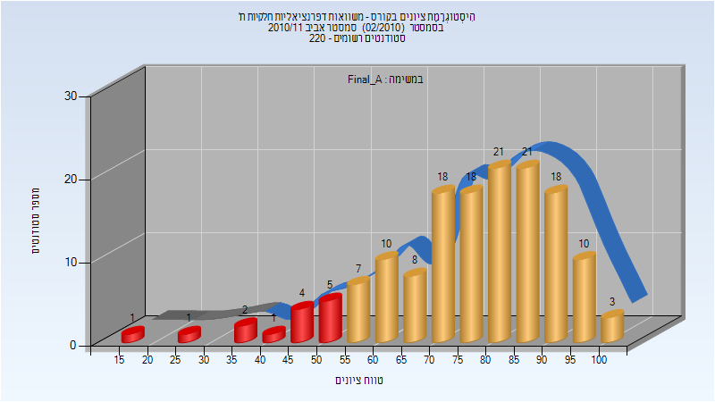
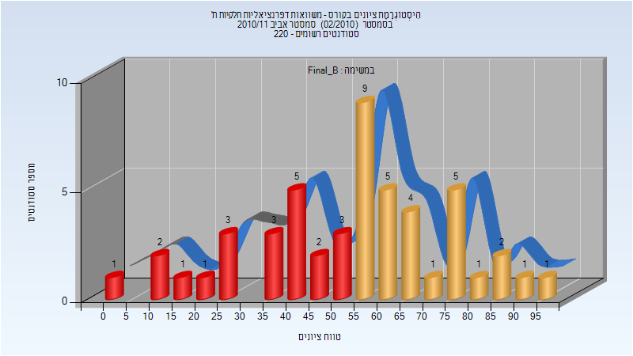

# 104220 - משוואות דפרנציאליות חלקיות ת'

## חורף 2009-2010

| איש סגל | תפקיד |
| ---- | ---- |
| סעדון תפארת | מרצה - אחראי מקצוע |
| גרוזד מרינה | מתרגל |

### סופי מועד א'

| סטודנטים | עברו/נכשלו | אחוז עוברים | ציון מינימלי | ציון מקסימלי | ממוצע | חציון |
| ---- | ---- | ---- | ---- | ---- | ---- | ---- |
| 278 | 205/73 | 74 | 13 | 100 | 67.025 | 71 |

### סופי מועד ב'

| סטודנטים | עברו/נכשלו | אחוז עוברים | ציון מינימלי | ציון מקסימלי | ממוצע | חציון |
| ---- | ---- | ---- | ---- | ---- | ---- | ---- |
| 161 | 101/60 | 63 | 3 | 100 | 60.559 | 62 |

## אביב 2011

| איש סגל | תפקיד |
| ---- | ---- |
| נוביק-כהן איימי | מרצה - אחראי מקצוע |
| זלקמן-סמירין אולגה | מתרגל |

### סופי מועד א'

| סטודנטים | עברו/נכשלו | אחוז עוברים | ציון מינימלי | ציון מקסימלי | ממוצע | חציון |
| ---- | ---- | ---- | ---- | ---- | ---- | ---- |
| 148 | 134/14 | 91 | 18 | 100 | 76.473 | 79 |

### סופי מועד ב'

| סטודנטים | עברו/נכשלו | אחוז עוברים | ציון מינימלי | ציון מקסימלי | ממוצע | חציון |
| ---- | ---- | ---- | ---- | ---- | ---- | ---- |
| 50 | 29/21 | 58 | 0 | 97 | 54.16 | 55 |

