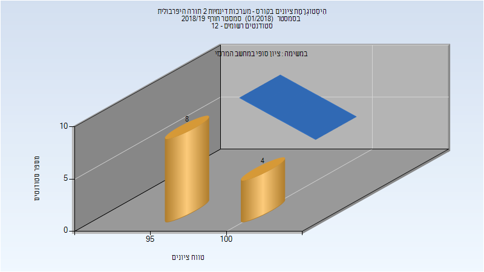

# 106970 - מערכות דינמיות 2 תורה היפרבולית

## חורף 2018-2019

### סופי

| סטודנטים | עברו/נכשלו | אחוז עוברים | ציון מינימלי | ציון מקסימלי | ממוצע | חציון |
| ---- | ---- | ---- | ---- | ---- | ---- | ---- |
| 12 | 12/0 | 100 | 96 | 100 | 98.833 | 99 |

