# 124118 - יסודות הכימיה ב'

## אביב 2013

| איש סגל | תפקיד |
| ---- | ---- |
| קולודני אלי | מרצה - אחראי מקצוע |
| הלוי גבריאלה | מתרגל |
| טלמון אינה | מתרגל |
| לוין ליאת | מתרגל |

### מבחן מועד א'

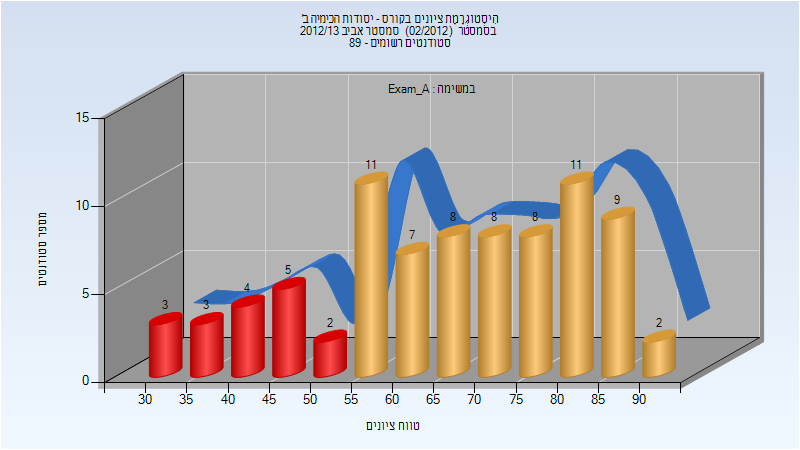

| סטודנטים | עברו/נכשלו | אחוז עוברים | ציון מינימלי | ציון מקסימלי | ממוצע | חציון |
| ---- | ---- | ---- | ---- | ---- | ---- | ---- |
| 81 | 64/17 | 79 | 30 | 93 | 66.235 | 68 |

### סופי מועד א'

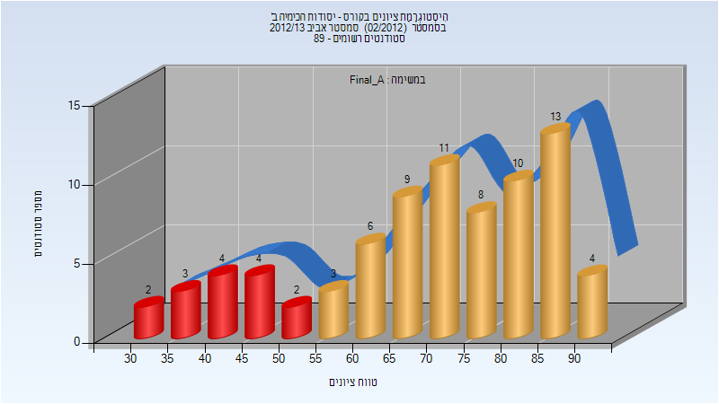

| סטודנטים | עברו/נכשלו | אחוז עוברים | ציון מינימלי | ציון מקסימלי | ממוצע | חציון |
| ---- | ---- | ---- | ---- | ---- | ---- | ---- |
| 79 | 64/15 | 81 | 32 | 94 | 69.924 | 74 |

### סופי מועד ב'

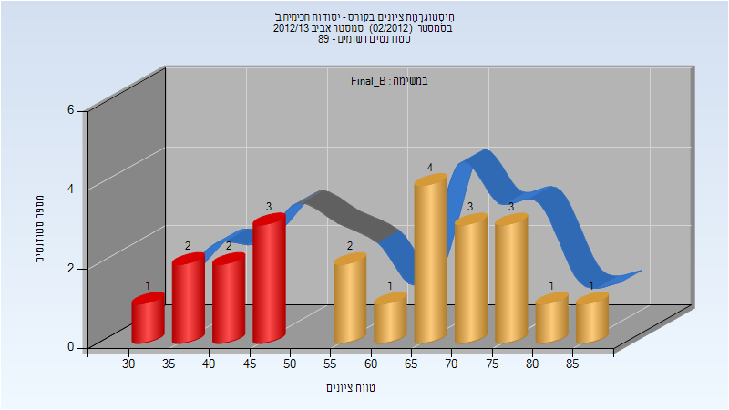

| סטודנטים | עברו/נכשלו | אחוז עוברים | ציון מינימלי | ציון מקסימלי | ממוצע | חציון |
| ---- | ---- | ---- | ---- | ---- | ---- | ---- |
| 23 | 15/8 | 65 | 34 | 87 | 60.609 | 62 |

## אביב 2015

| איש סגל | תפקיד |
| ---- | ---- |
| אמיתי זוהר | מרצה - אחראי מקצוע |
| חונונוב מקסים | מתרגל |
| פרי-גל אפרת | מתרגל |
| האשם מדה | מתרגל |
| לוין ליאת | מתרגל - עם הרשאות מרצה אחראי |
| הלוי גבריאלה | סגל מנהלי - עם הרשאות מרצה אחראי |

### מבחן מועד א'

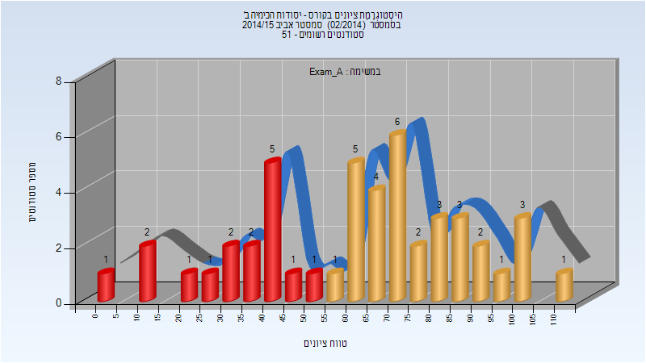

| סטודנטים | עברו/נכשלו | אחוז עוברים | ציון מינימלי | ציון מקסימלי | ממוצע | חציון |
| ---- | ---- | ---- | ---- | ---- | ---- | ---- |
| 47 | 31/16 | 66 | 0 | 110 | 63.238 | 67.1 |

### סופי מועד א'

| סטודנטים | עברו/נכשלו | אחוז עוברים | ציון מינימלי | ציון מקסימלי | ממוצע | חציון |
| ---- | ---- | ---- | ---- | ---- | ---- | ---- |
| 47 | 41/6 | 87 | 19.933 | 100 | 73.428 | 76.042 |

### מבחן מועד ב'

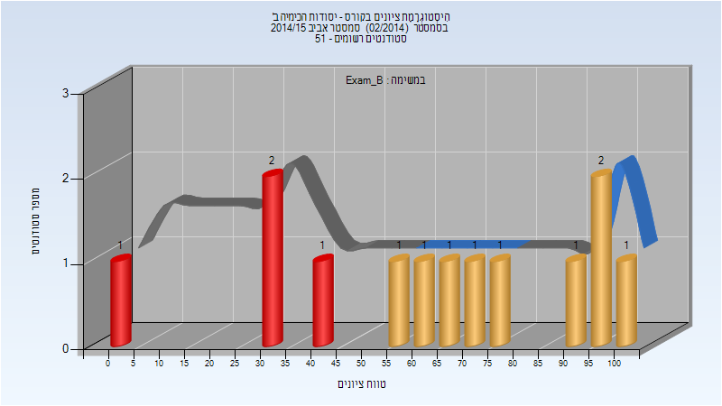

| סטודנטים | עברו/נכשלו | אחוז עוברים | ציון מינימלי | ציון מקסימלי | ממוצע | חציון |
| ---- | ---- | ---- | ---- | ---- | ---- | ---- |
| 13 | 9/4 | 69 | 0 | 103.95 | 64.212 | 66.15 |

### סופי מועד ב'

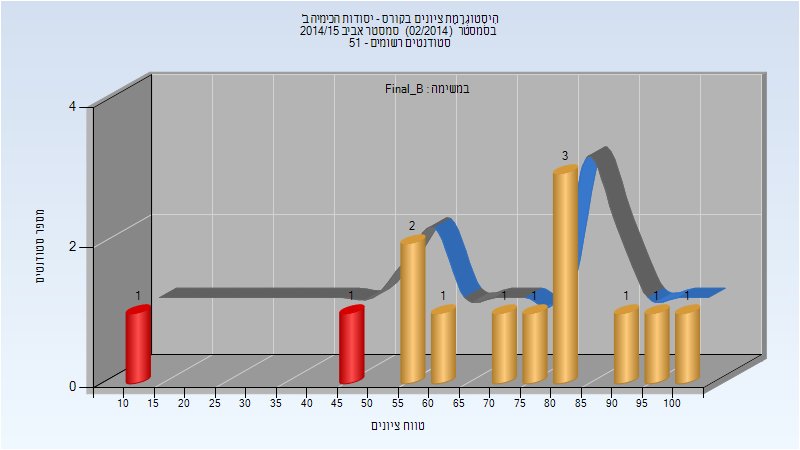

| סטודנטים | עברו/נכשלו | אחוז עוברים | ציון מינימלי | ציון מקסימלי | ממוצע | חציון |
| ---- | ---- | ---- | ---- | ---- | ---- | ---- |
| 13 | 11/2 | 85 | 13.8 | 100 | 70.869 | 76.147 |

### סופי

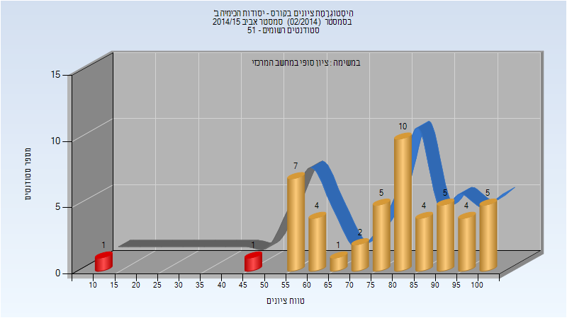

| סטודנטים | עברו/נכשלו | אחוז עוברים | ציון מינימלי | ציון מקסימלי | ממוצע | חציון |
| ---- | ---- | ---- | ---- | ---- | ---- | ---- |
| 49 | 47/2 | 96 | 14 | 100 | 77.531 | 81 |

## אביב 2016

| איש סגל | תפקיד |
| ---- | ---- |
| קולודני אלי | מרצה - אחראי מקצוע |
| לוין ליאת | מתרגל |
| וסטפריד יבגניה | מדריך מעבדה |
| חונונוב מקסים | מדריך מעבדה |
| הלוי גבריאלה | סגל מנהלי - עם הרשאות מרצה אחראי |

### מבחן מועד א'

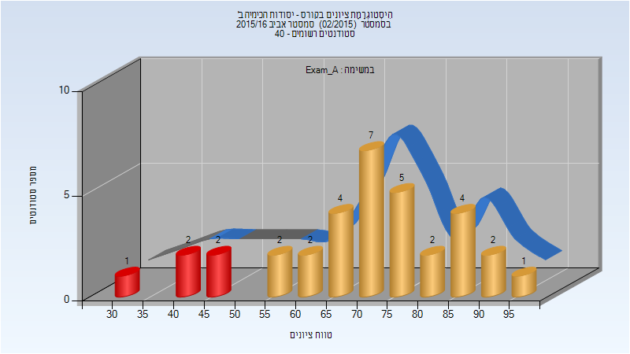

| סטודנטים | עברו/נכשלו | אחוז עוברים | ציון מינימלי | ציון מקסימלי | ממוצע | חציון |
| ---- | ---- | ---- | ---- | ---- | ---- | ---- |
| 34 | 29/5 | 85 | 34 | 98 | 70.882 | 72.5 |

### סופי מועד א'

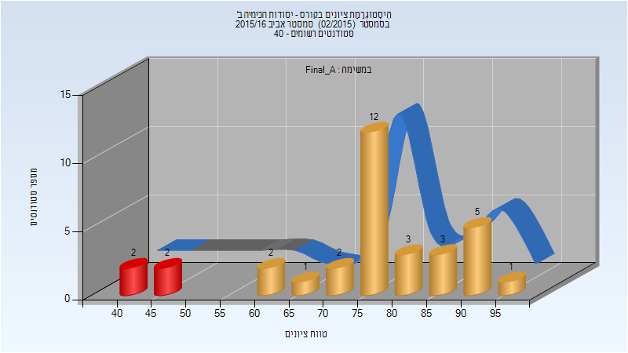

| סטודנטים | עברו/נכשלו | אחוז עוברים | ציון מינימלי | ציון מקסימלי | ממוצע | חציון |
| ---- | ---- | ---- | ---- | ---- | ---- | ---- |
| 33 | 29/4 | 88 | 42 | 98 | 76.03 | 78 |

### סופי

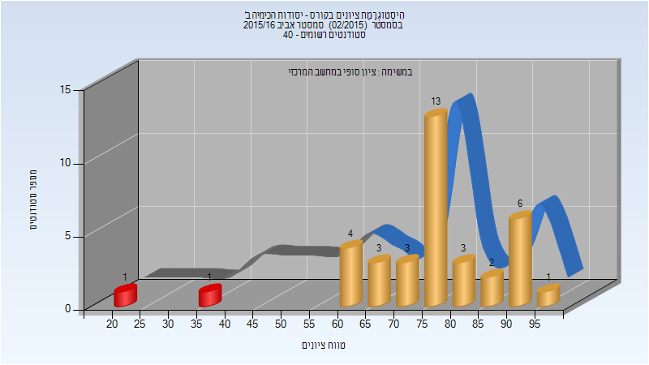

| סטודנטים | עברו/נכשלו | אחוז עוברים | ציון מינימלי | ציון מקסימלי | ממוצע | חציון |
| ---- | ---- | ---- | ---- | ---- | ---- | ---- |
| 37 | 35/2 | 95 | 20 | 98 | 75.649 | 78 |

## אביב 2017

| איש סגל | תפקיד |
| ---- | ---- |
| אגמי איריס | מתרגל |
| קולודני אלי | מרצה |
| בוגוד אילנה | מתרגל - עם הרשאות מרצה אחראי |
| זלנר-יפע משה מיכאל |  |
| חריטן עידן |  |
| גלנט אור |  |
| הלוי גבריאלה | סגל מנהלי - עם הרשאות מרצה אחראי |

### מבחן מועד א'

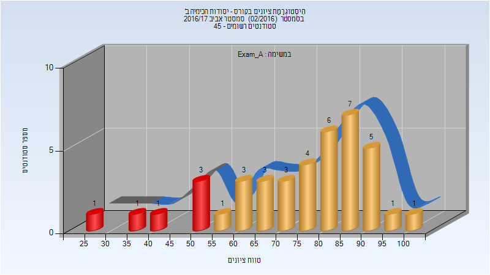

| סטודנטים | עברו/נכשלו | אחוז עוברים | ציון מינימלי | ציון מקסימלי | ממוצע | חציון |
| ---- | ---- | ---- | ---- | ---- | ---- | ---- |
| 40 | 34/6 | 85 | 29 | 100 | 74.875 | 79.5 |

### סופי מועד א'

| סטודנטים | עברו/נכשלו | אחוז עוברים | ציון מינימלי | ציון מקסימלי | ממוצע | חציון |
| ---- | ---- | ---- | ---- | ---- | ---- | ---- |
| 40 | 34/6 | 85 | 29 | 99.5 | 77.026 | 82.625 |

### סופי

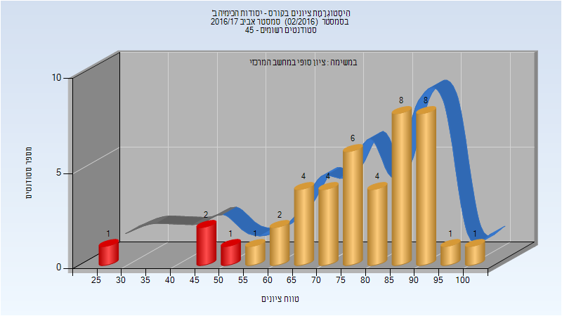

| סטודנטים | עברו/נכשלו | אחוז עוברים | ציון מינימלי | ציון מקסימלי | ממוצע | חציון |
| ---- | ---- | ---- | ---- | ---- | ---- | ---- |
| 43 | 39/4 | 91 | 29 | 100 | 77.442 | 79 |

## אביב 2018

| איש סגל | תפקיד |
| ---- | ---- |
| קולודני אלי | מרצה |
| בוגוד אילנה | מתרגל - עם הרשאות מרצה אחראי |
| אגמי איריס |  |
| גלנט אור |  |
| הלוי גבריאלה | סגל מנהלי - עם הרשאות מרצה אחראי |

### מבחן מועד א'

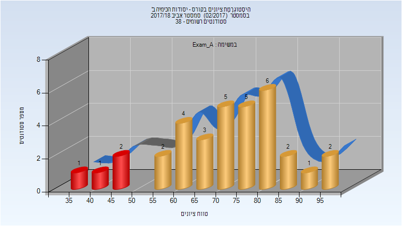

| סטודנטים | עברו/נכשלו | אחוז עוברים | ציון מינימלי | ציון מקסימלי | ממוצע | חציון |
| ---- | ---- | ---- | ---- | ---- | ---- | ---- |
| 34 | 30/4 | 88 | 38 | 98 | 71.706 | 73.5 |

### סופי מועד א'

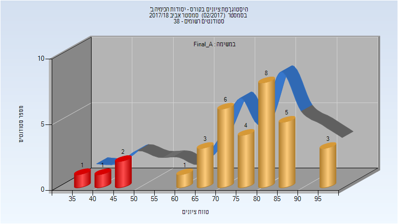

| סטודנטים | עברו/נכשלו | אחוז עוברים | ציון מינימלי | ציון מקסימלי | ממוצע | חציון |
| ---- | ---- | ---- | ---- | ---- | ---- | ---- |
| 34 | 30/4 | 88 | 38 | 98 | 75.206 | 78.5 |

### סופי

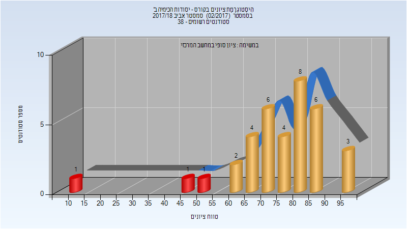

| סטודנטים | עברו/נכשלו | אחוז עוברים | ציון מינימלי | ציון מקסימלי | ממוצע | חציון |
| ---- | ---- | ---- | ---- | ---- | ---- | ---- |
| 36 | 33/3 | 92 | 14 | 98 | 75.417 | 78.5 |

## אביב 2019

| איש סגל | תפקיד |
| ---- | ---- |
| קולודני אלי | מרצה - אחראי מקצוע |
| גבע מורן | מתרגל |
| גלנט אור | מדריך מעבדה |
| אגמי איריס | מדריך מעבדה |
| הלוי גבריאלה | סגל מנהלי - עם הרשאות מרצה אחראי |

### מבחן מועד א'

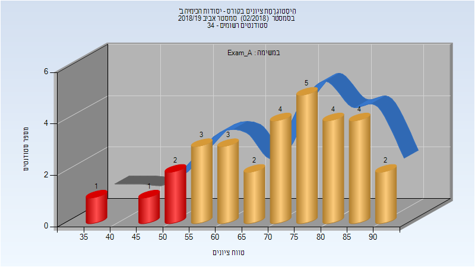

| סטודנטים | עברו/נכשלו | אחוז עוברים | ציון מינימלי | ציון מקסימלי | ממוצע | חציון |
| ---- | ---- | ---- | ---- | ---- | ---- | ---- |
| 31 | 27/4 | 87 | 39 | 92.5 | 70.976 | 71 |

### סופי מועד א'

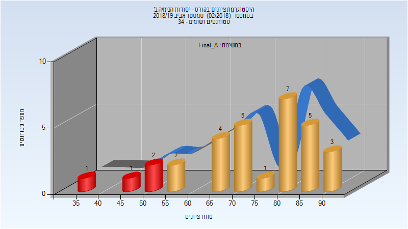

| סטודנטים | עברו/נכשלו | אחוז עוברים | ציון מינימלי | ציון מקסימלי | ממוצע | חציון |
| ---- | ---- | ---- | ---- | ---- | ---- | ---- |
| 31 | 27/4 | 87 | 39 | 94 | 74.323 | 74 |

### סופי

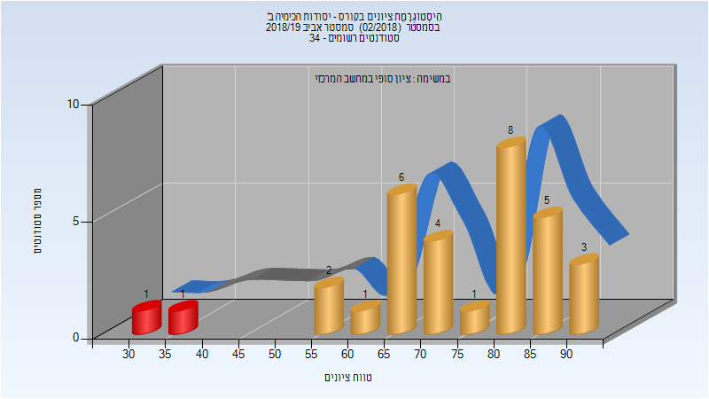

| סטודנטים | עברו/נכשלו | אחוז עוברים | ציון מינימלי | ציון מקסימלי | ממוצע | חציון |
| ---- | ---- | ---- | ---- | ---- | ---- | ---- |
| 32 | 30/2 | 94 | 34 | 94 | 74.844 | 79 |

## אביב 2020

| איש סגל | תפקיד |
| ---- | ---- |
| קולודני אלי | מרצה - אחראי מקצוע |
| דורון דינה | מרצה |
| גבע מורן | מתרגל |
| נ'גם סאלי | מדריך מעבדה |
| גלנט אור | מדריך מעבדה |
| הלוי גבריאלה | סגל מנהלי - עם הרשאות מרצה אחראי |

### מבחן מועד א'

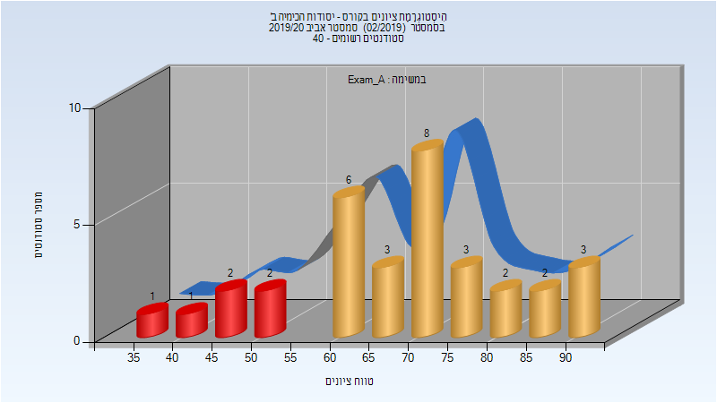

| סטודנטים | עברו/נכשלו | אחוז עוברים | ציון מינימלי | ציון מקסימלי | ממוצע | חציון |
| ---- | ---- | ---- | ---- | ---- | ---- | ---- |
| 33 | 27/6 | 82 | 35.5 | 92 | 69.364 | 73.5 |

### סופי מועד א'

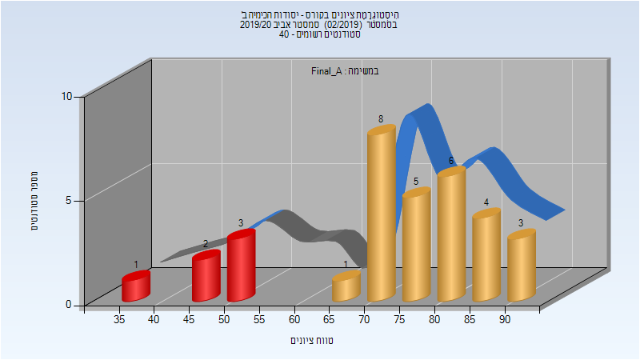

| סטודנטים | עברו/נכשלו | אחוז עוברים | ציון מינימלי | ציון מקסימלי | ממוצע | חציון |
| ---- | ---- | ---- | ---- | ---- | ---- | ---- |
| 33 | 27/6 | 82 | 36 | 93 | 73.364 | 77 |

### מבחן מועד ב'

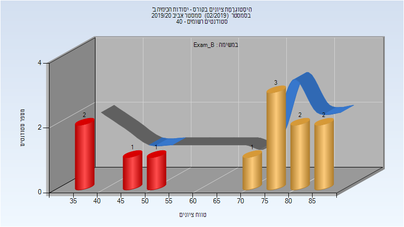

| סטודנטים | עברו/נכשלו | אחוז עוברים | ציון מינימלי | ציון מקסימלי | ממוצע | חציון |
| ---- | ---- | ---- | ---- | ---- | ---- | ---- |
| 12 | 8/4 | 67 | 35 | 89 | 68.083 | 76.25 |

### סופי מועד ב'

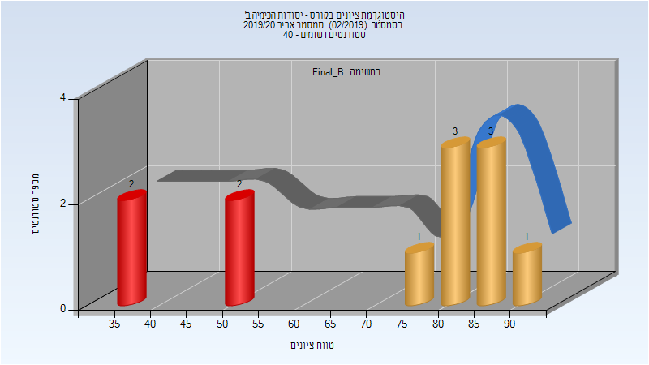

| סטודנטים | עברו/נכשלו | אחוז עוברים | ציון מינימלי | ציון מקסימלי | ממוצע | חציון |
| ---- | ---- | ---- | ---- | ---- | ---- | ---- |
| 12 | 8/4 | 67 | 35 | 91 | 70.5 | 80.5 |

### סופי

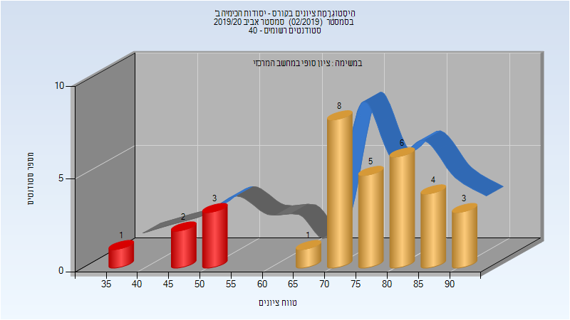

| סטודנטים | עברו/נכשלו | אחוז עוברים | ציון מינימלי | ציון מקסימלי | ממוצע | חציון |
| ---- | ---- | ---- | ---- | ---- | ---- | ---- |
| 35 | 31/4 | 89 | 35 | 93 | 76.6 | 80 |

## אביב 2021

| איש סגל | תפקיד |
| ---- | ---- |
| קולודני אלי | מרצה - אחראי מקצוע |
| גבע מורן | מתרגל |
| הלוי גבריאלה |  |
| סויסה שלייף מעיין | מדריך מעבדה |
| פרבר אליהו מרדכ | מדריך מעבדה |

