# 124214 - מעבדה בכימיה אנליטית 2 מורחב

## קיץ 2017

| איש סגל | תפקיד |
| ---- | ---- |
| שכטר ישראל | מרצה - אחראי מקצוע |

### סופי מועד א'

| סטודנטים | עברו/נכשלו | אחוז עוברים | ציון מינימלי | ציון מקסימלי | ממוצע | חציון |
| ---- | ---- | ---- | ---- | ---- | ---- | ---- |
| 20 | 20/0 | 100 | 87 | 97 | 92.7 | 93 |

### סופי

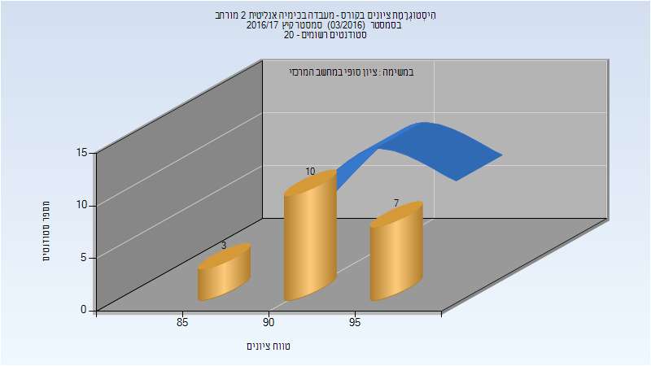

| סטודנטים | עברו/נכשלו | אחוז עוברים | ציון מינימלי | ציון מקסימלי | ממוצע | חציון |
| ---- | ---- | ---- | ---- | ---- | ---- | ---- |
| 20 | 20/0 | 100 | 87 | 97 | 92.7 | 93 |

## חורף 2017-2018

| איש סגל | תפקיד |
| ---- | ---- |
| בלנק אהרן | מדריך מעבדה - עם הרשאות מרצה אחראי |
| סברדלוב רוני |  |
| טיגר הגר |  |
| ליובין אלכסנדרה |  |
| בסקין מריה |  |
| שריץ רוזליה |  |
| ערבה שלומי |  |
| קאושנסקי אלכסנדר |  |
| חסין אסף |  |
| מקסימנקו שמעון |  |

### סופי מועד א'

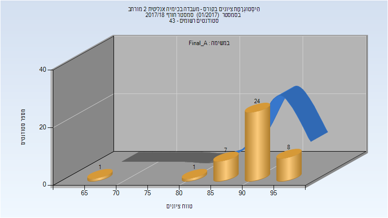

| סטודנטים | עברו/נכשלו | אחוז עוברים | ציון מינימלי | ציון מקסימלי | ממוצע | חציון |
| ---- | ---- | ---- | ---- | ---- | ---- | ---- |
| 41 | 41/0 | 100 | 67 | 98 | 91.512 | 93 |

### סופי

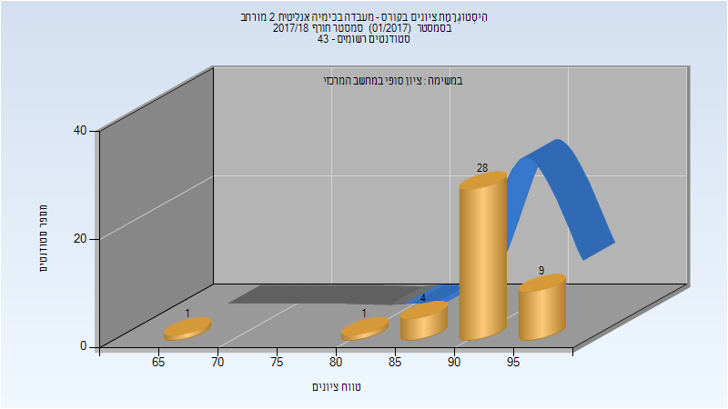

| סטודנטים | עברו/נכשלו | אחוז עוברים | ציון מינימלי | ציון מקסימלי | ממוצע | חציון |
| ---- | ---- | ---- | ---- | ---- | ---- | ---- |
| 43 | 43/0 | 100 | 67 | 98 | 92.023 | 93 |

## קיץ 2018

| איש סגל | תפקיד |
| ---- | ---- |
| שכטר ישראל | מרצה - אחראי מקצוע |
| בלנק אהרן | מרצה |
| מעיין גליה | מרצה |

### סופי מועד א'

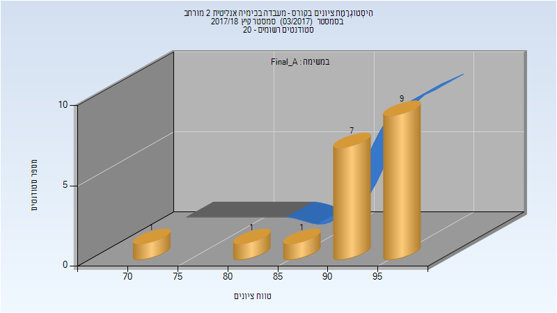

| סטודנטים | עברו/נכשלו | אחוז עוברים | ציון מינימלי | ציון מקסימלי | ממוצע | חציון |
| ---- | ---- | ---- | ---- | ---- | ---- | ---- |
| 19 | 19/0 | 100 | 71 | 97 | 91.947 | 94 |

### סופי

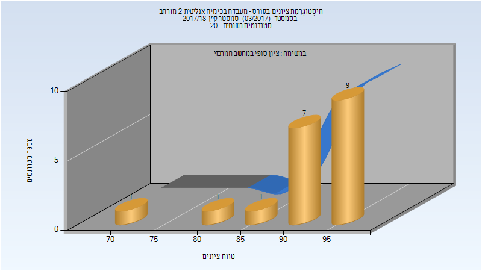

| סטודנטים | עברו/נכשלו | אחוז עוברים | ציון מינימלי | ציון מקסימלי | ממוצע | חציון |
| ---- | ---- | ---- | ---- | ---- | ---- | ---- |
| 19 | 19/0 | 100 | 71 | 97 | 91.947 | 94 |

## חורף 2018-2019

| איש סגל | תפקיד |
| ---- | ---- |
| איזנברג דוד | מרצה - אחראי מקצוע |
| מקסימנקו שמעון | מדריך מעבדה |
| מינקוביץ בוריס | מדריך מעבדה |
| וילנסקי אלינה | מדריך מעבדה |
| בסקין מריה | מדריך מעבדה |
| פירזון ורה | מדריך מעבדה |
| לוי חרות | מדריך מעבדה |
| ליובין אלכסנדרה | מדריך מעבדה |
| מקרוב קונסטנטין | מדריך מעבדה |

### סופי מועד א'

| סטודנטים | עברו/נכשלו | אחוז עוברים | ציון מינימלי | ציון מקסימלי | ממוצע | חציון |
| ---- | ---- | ---- | ---- | ---- | ---- | ---- |
| 37 | 37/0 | 100 | 86.27 | 97.555 | 92.031 | 92.15 |

### סופי

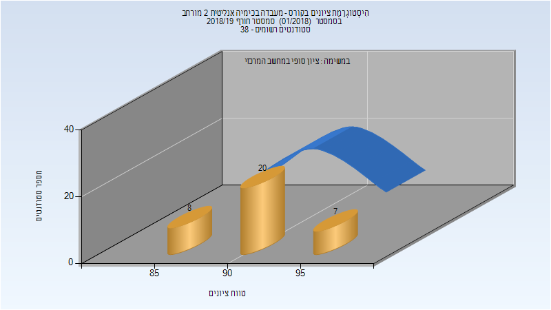

| סטודנטים | עברו/נכשלו | אחוז עוברים | ציון מינימלי | ציון מקסימלי | ממוצע | חציון |
| ---- | ---- | ---- | ---- | ---- | ---- | ---- |
| 35 | 35/0 | 100 | 86 | 98 | 91.914 | 92 |

## אביב 2019

| איש סגל | תפקיד |
| ---- | ---- |
| בלנק אהרן | מדריך מעבדה - עם הרשאות מרצה אחראי |
| מקרוב קונסטנטין | מדריך מעבדה |
| ליובין אלכסנדרה | מדריך מעבדה |
| מקסימנקו שמעון | מדריך מעבדה |

### סופי מועד א'

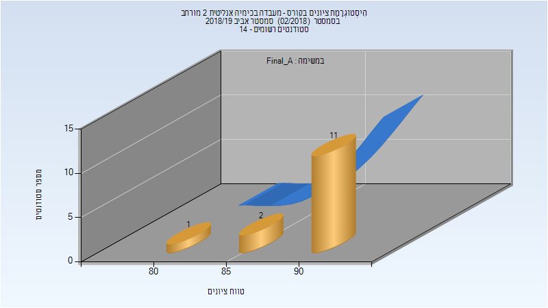

| סטודנטים | עברו/נכשלו | אחוז עוברים | ציון מינימלי | ציון מקסימלי | ממוצע | חציון |
| ---- | ---- | ---- | ---- | ---- | ---- | ---- |
| 14 | 14/0 | 100 | 82 | 93 | 90.357 | 91 |

### סופי

| סטודנטים | עברו/נכשלו | אחוז עוברים | ציון מינימלי | ציון מקסימלי | ממוצע | חציון |
| ---- | ---- | ---- | ---- | ---- | ---- | ---- |
| 14 | 14/0 | 100 | 82 | 93 | 90.357 | 91 |

## קיץ 2019

| איש סגל | תפקיד |
| ---- | ---- |
| שכטר ישראל | מדריך מעבדה - עם הרשאות מרצה אחראי |

### סופי מועד א'

| סטודנטים | עברו/נכשלו | אחוז עוברים | ציון מינימלי | ציון מקסימלי | ממוצע | חציון |
| ---- | ---- | ---- | ---- | ---- | ---- | ---- |
| 16 | 16/0 | 100 | 90 | 95 | 93.438 | 94 |

### סופי

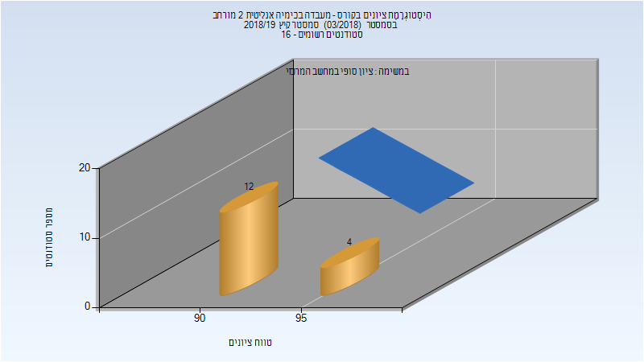

| סטודנטים | עברו/נכשלו | אחוז עוברים | ציון מינימלי | ציון מקסימלי | ממוצע | חציון |
| ---- | ---- | ---- | ---- | ---- | ---- | ---- |
| 16 | 16/0 | 100 | 90 | 95 | 93.438 | 94 |

## חורף 2019-2020

| איש סגל | תפקיד |
| ---- | ---- |
| איזנברג דוד | מדריך מעבדה - עם הרשאות מרצה אחראי |
| בורשטיין תומר | מדריך מעבדה |
| לוי חרות | מדריך מעבדה |
| זלמן בת-חן | מדריך מעבדה |
| סברדלוב רוני | מדריך מעבדה |
| וילנסקי אלינה | מדריך מעבדה |
| מינקוביץ בוריס | מדריך מעבדה |
| קאושנסקי אלכסנדר | מדריך מעבדה |
| סויסה שלייף מעיין | מדריך מעבדה |

### סופי מועד א'

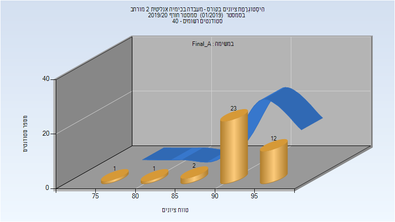

| סטודנטים | עברו/נכשלו | אחוז עוברים | ציון מינימלי | ציון מקסימלי | ממוצע | חציון |
| ---- | ---- | ---- | ---- | ---- | ---- | ---- |
| 39 | 39/0 | 100 | 79 | 97 | 92.744 | 93 |

### סופי

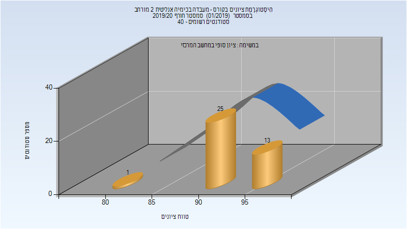

| סטודנטים | עברו/נכשלו | אחוז עוברים | ציון מינימלי | ציון מקסימלי | ממוצע | חציון |
| ---- | ---- | ---- | ---- | ---- | ---- | ---- |
| 39 | 39/0 | 100 | 84 | 97 | 93.308 | 94 |

## אביב 2020

| איש סגל | תפקיד |
| ---- | ---- |
| גילרי עידו | מדריך מעבדה - עם הרשאות מרצה אחראי |
| סברדלוב רוני | מדריך מעבדה |
| ליובין אלכסנדרה | מדריך מעבדה |
| קופרמן מעין | מדריך מעבדה |

### סופי מועד א'

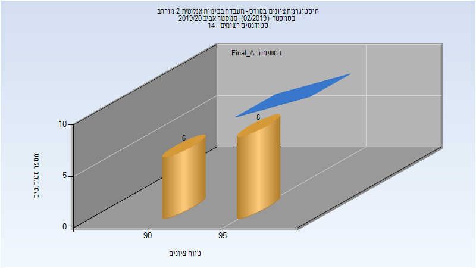

| סטודנטים | עברו/נכשלו | אחוז עוברים | ציון מינימלי | ציון מקסימלי | ממוצע | חציון |
| ---- | ---- | ---- | ---- | ---- | ---- | ---- |
| 14 | 14/0 | 100 | 90 | 97 | 94.571 | 95 |

### סופי

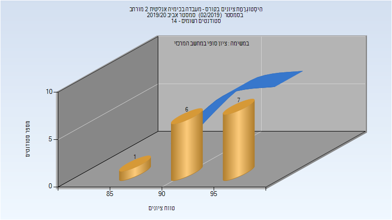

| סטודנטים | עברו/נכשלו | אחוז עוברים | ציון מינימלי | ציון מקסימלי | ממוצע | חציון |
| ---- | ---- | ---- | ---- | ---- | ---- | ---- |
| 14 | 14/0 | 100 | 90 | 97 | 94.571 | 95 |

## קיץ 2020

| איש סגל | תפקיד |
| ---- | ---- |
| בלנק אהרן | מרצה - אחראי מקצוע |
| קאושנסקי אלכסנדר | מדריך מעבדה |
| גלנט אור | מדריך מעבדה |
| לוי חרות | מדריך מעבדה |

### סופי מועד א'

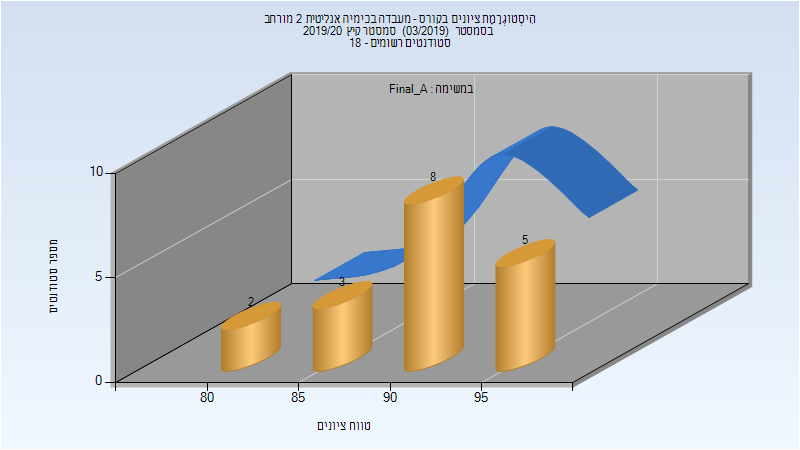

| סטודנטים | עברו/נכשלו | אחוז עוברים | ציון מינימלי | ציון מקסימלי | ממוצע | חציון |
| ---- | ---- | ---- | ---- | ---- | ---- | ---- |
| 18 | 18/0 | 100 | 82 | 98 | 91.722 | 92.5 |

### סופי

| סטודנטים | עברו/נכשלו | אחוז עוברים | ציון מינימלי | ציון מקסימלי | ממוצע | חציון |
| ---- | ---- | ---- | ---- | ---- | ---- | ---- |
| 18 | 18/0 | 100 | 82 | 98 | 91.722 | 92.5 |

## חורף 2020-2021

| איש סגל | תפקיד |
| ---- | ---- |
| איזנברג דוד | מדריך מעבדה - עם הרשאות מרצה אחראי |
| ליבוביץ ליאב | מדריך מעבדה |
| זלמן בת-חן | מדריך מעבדה |
| בורשטיין תומר | מדריך מעבדה |
| ליובין אלכסנדרה | מדריך מעבדה |
| פירזון ורה | מדריך מעבדה |
| גלנט אור | מדריך מעבדה |
| מקרוב קונסטנטין | מדריך מעבדה |
| וילנסקי אלינה | מדריך מעבדה |
| סברדלוב רוני | מדריך מעבדה |

### סופי מועד א'

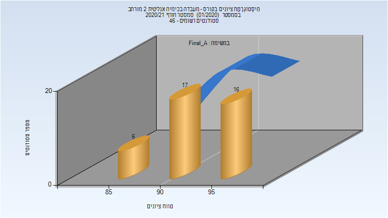

| סטודנטים | עברו/נכשלו | אחוז עוברים | ציון מינימלי | ציון מקסימלי | ממוצע | חציון |
| ---- | ---- | ---- | ---- | ---- | ---- | ---- |
| 39 | 39/0 | 100 | 86 | 98 | 93.026 | 93 |

### סופי

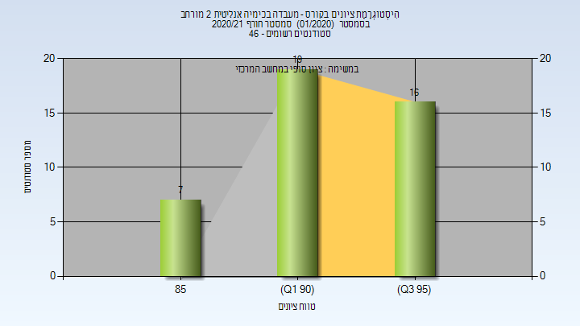

| סטודנטים | עברו/נכשלו | אחוז עוברים | ציון מינימלי | ציון מקסימלי | ממוצע | חציון |
| ---- | ---- | ---- | ---- | ---- | ---- | ---- |
| 42 | 42/0 | 100 | 86 | 98 | 92.881 | 93 |

