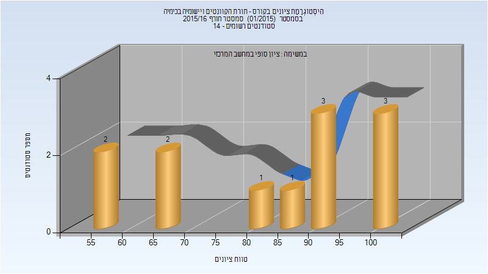

# 124408 - תורת הקוונטים ויישומיה בכימיה

## חורף 2015-2016

| איש סגל | תפקיד |
| ---- | ---- |
| מויסייב נימרוד | מרצה - אחראי מקצוע |
| גולדזק תמר | מתרגל |

### סופי

| סטודנטים | עברו/נכשלו | אחוז עוברים | ציון מינימלי | ציון מקסימלי | ממוצע | חציון |
| ---- | ---- | ---- | ---- | ---- | ---- | ---- |
| 12 | 12/0 | 100 | 56 | 100 | 82.833 | 88 |

