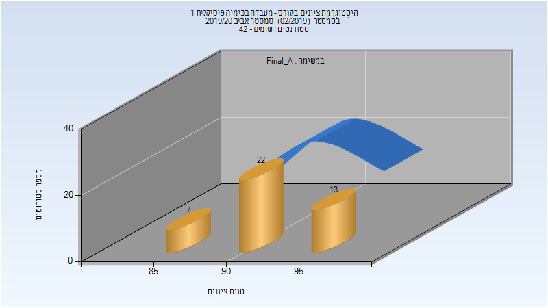
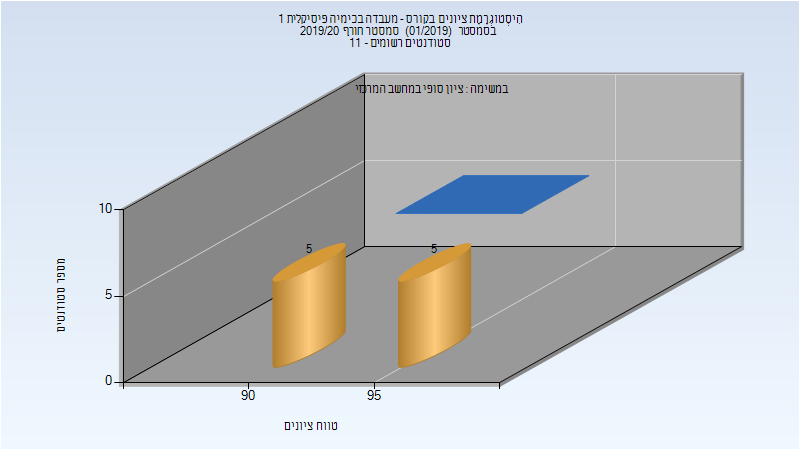
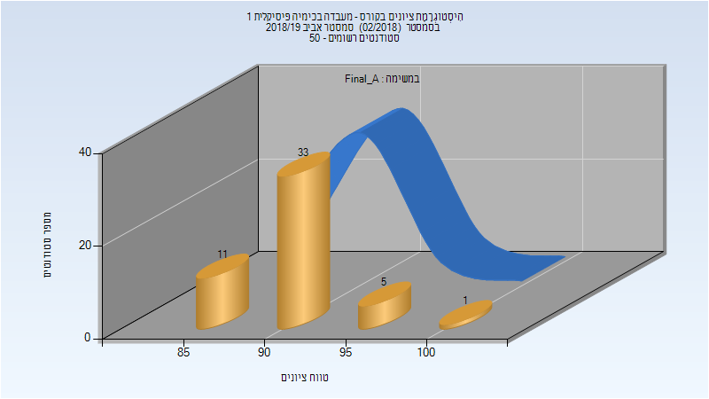
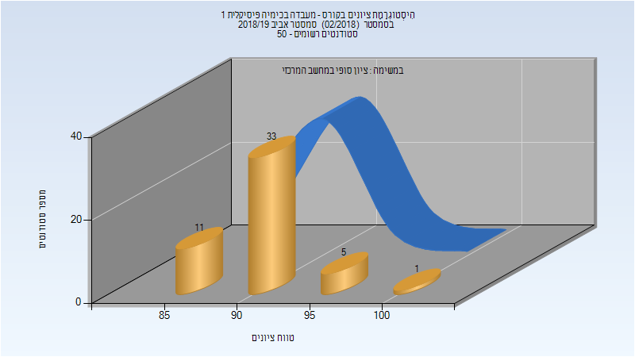
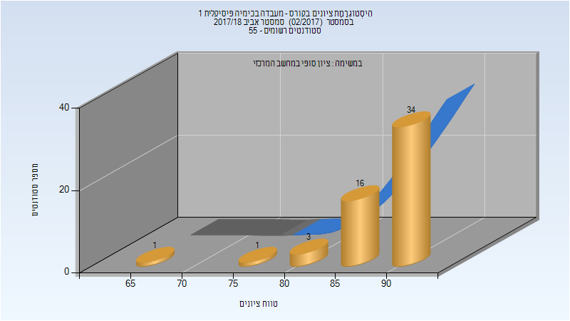

# 124601 - מעבדה בכימיה פיסיקלית 1

**הערה**: מאגר ההיסטוגרמות הוקם עבור [CheeseFork](https://cheesefork.cf/), כלי בניית מערכת שעות עבור סטודנטים בטכניון. באתר בו אתם גולשים ניתן לעיין בהיסטוגרמות, אך הדרך היותר נוחה היא לעיין בהיסטוגרמות, ובמידע נוסף כגון חוות דעת של סטודנטים, באתר CheeseFork.

* [אביב 2020](#201902)
  * [סופי מועד א'](#201902-Final_A)
  * [סופי](#201902-Finals)
* [חורף 2019-2020](#201901)
  * [סופי](#201901-Finals)
* [אביב 2019](#201802)
  * [סופי מועד א'](#201802-Final_A)
  * [סופי](#201802-Finals)
* [אביב 2018](#201702)
  * [סופי מועד א'](#201702-Final_A)
  * [סופי](#201702-Finals)

<h2 id="201902">אביב 2020</h2>

| איש סגל | תפקיד |
| ---- | ---- |
| צ'ונטונוב לב | מדריך מעבדה - עם הרשאות מרצה אחראי |
| שלוסברג יניב | מדריך מעבדה |
| ליבני אורית | מדריך מעבדה |
| נהור עודד | מדריך מעבדה |
| לנגבהיים יהונתן עמי | מדריך מעבדה |
| סטוצקי יוליה | מדריך מעבדה |
| ריטוב אסתר | מדריך מעבדה |
| ברק יהל | מדריך מעבדה |
| דיין ניר | מדריך מעבדה |
| אוסקר עליזה | סגל מנהלי - עם הרשאות מרצה אחראי |

<h3 id="201902-Final_A">סופי מועד א'</h3>

| סטודנטים | עברו/נכשלו | אחוז עוברים | ציון מינימלי | ציון מקסימלי | ממוצע | חציון |
| ---- | ---- | ---- | ---- | ---- | ---- | ---- |
| 42 | 42/0 | 100 | 87 | 98 | 92.929 | 93 |

<h3 id="201902-Finals">סופי</h3>

| סטודנטים | עברו/נכשלו | אחוז עוברים | ציון מינימלי | ציון מקסימלי | ממוצע | חציון |
| ---- | ---- | ---- | ---- | ---- | ---- | ---- |
| 42 | 42/0 | 100 | 87 | 98 | 92.929 | 93 |

<h2 id="201901">חורף 2019-2020</h2>

| איש סגל | תפקיד |
| ---- | ---- |
| קולודני אלי | מדריך מעבדה - עם הרשאות מרצה אחראי |
| גבארה מואמן | מדריך מעבדה |
| דיין ניר | מדריך מעבדה |
| שלוסברג יניב | מדריך מעבדה |
| אוסקר עליזה | סגל מנהלי - עם הרשאות מרצה אחראי |

<h3 id="201901-Finals">סופי</h3>

| סטודנטים | עברו/נכשלו | אחוז עוברים | ציון מינימלי | ציון מקסימלי | ממוצע | חציון |
| ---- | ---- | ---- | ---- | ---- | ---- | ---- |
| 10 | 10/0 | 100 | 91 | 97 | 94.3 | 94.5 |

<h2 id="201802">אביב 2019</h2>

| איש סגל | תפקיד |
| ---- | ---- |
| אמיתי זוהר | מדריך מעבדה - עם הרשאות מרצה אחראי |
| ריטוב אסתר | מדריך מעבדה |
| סטוצקי יוליה | מדריך מעבדה |
| קופרמן מעין | מדריך מעבדה |
| שלוסברג יניב | מדריך מעבדה |
| ברק יהל | מדריך מעבדה |
| דיין ניר | מדריך מעבדה |
| לנגבהיים יהונתן עמי | מדריך מעבדה |
| נאור עודד | מדריך מעבדה |
| אוסקר עליזה | סגל מנהלי - עם הרשאות מרצה אחראי |

<h3 id="201802-Final_A">סופי מועד א'</h3>

| סטודנטים | עברו/נכשלו | אחוז עוברים | ציון מינימלי | ציון מקסימלי | ממוצע | חציון |
| ---- | ---- | ---- | ---- | ---- | ---- | ---- |
| 50 | 50/0 | 100 | 87 | 100 | 91.74 | 91.5 |

<h3 id="201802-Finals">סופי</h3>

| סטודנטים | עברו/נכשלו | אחוז עוברים | ציון מינימלי | ציון מקסימלי | ממוצע | חציון |
| ---- | ---- | ---- | ---- | ---- | ---- | ---- |
| 50 | 50/0 | 100 | 87 | 100 | 91.74 | 91.5 |

<h2 id="201702">אביב 2018</h2>

| איש סגל | תפקיד |
| ---- | ---- |
| אמיתי זוהר | מדריך מעבדה - עם הרשאות מרצה אחראי |
| זטלמן לילך |  |
| ברק יהל |  |
| קוסטדינוב אליסה |  |
| מאיר איתי-אי |  |
| חוראני פארס |  |
| לנגבהיים יהונתן עמי |  |
| אבו חרירי אזהאר |  |
| טרביה טארק |  |
| קופרמן מעין |  |
| דיין ניר |  |
| אוסקר עליזה | סגל מנהלי - עם הרשאות מרצה אחראי |

<h3 id="201702-Final_A">סופי מועד א'</h3>

| סטודנטים | עברו/נכשלו | אחוז עוברים | ציון מינימלי | ציון מקסימלי | ממוצע | חציון |
| ---- | ---- | ---- | ---- | ---- | ---- | ---- |
| 55 | 55/0 | 100 | 68.604 | 94.481 | 89.031 | 90.226 |

<h3 id="201702-Finals">סופי</h3>

| סטודנטים | עברו/נכשלו | אחוז עוברים | ציון מינימלי | ציון מקסימלי | ממוצע | חציון |
| ---- | ---- | ---- | ---- | ---- | ---- | ---- |
| 55 | 55/0 | 100 | 69 | 94 | 89.018 | 90 |

