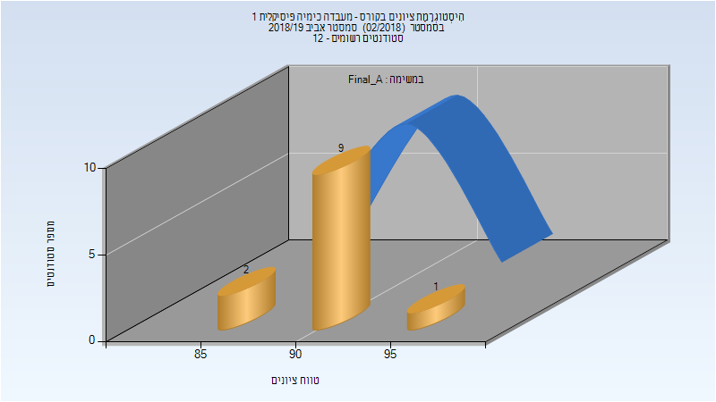
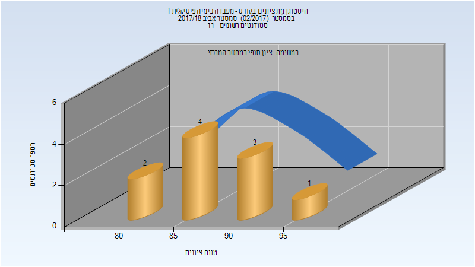

# 124610 - מעבדה כימיה פיסיקלית 1

**הערה**: מאגר ההיסטוגרמות הוקם עבור [CheeseFork](https://cheesefork.cf/), כלי בניית מערכת שעות עבור סטודנטים בטכניון. באתר בו אתם גולשים ניתן לעיין בהיסטוגרמות, אך הדרך היותר נוחה היא לעיין בהיסטוגרמות, ובמידע נוסף כגון חוות דעת של סטודנטים, באתר CheeseFork.

* [אביב 2022](#202102)
* [אביב 2021](#202002)
* [אביב 2020](#201902)
* [אביב 2019](#201802)
  * [סופי מועד א'](#201802-Final_A)
  * [סופי](#201802-Finals)
* [אביב 2018](#201702)
  * [סופי](#201702-Finals)

<h2 id="202102">אביב 2022</h2>

| איש סגל | תפקיד |
| ---- | ---- |
| צ'ונטונוב לב | מרצה - אחראי מקצוע |
| אבו חרירי אזהאר | מדריך מעבדה |
| מססה אמה | מדריך מעבדה |
| גלעד ברזילי יובל | מדריך מעבדה |
| אוסקר עליזה | סגל מנהלי - עם הרשאות מרצה אחראי |

<h2 id="202002">אביב 2021</h2>

| איש סגל | תפקיד |
| ---- | ---- |
| צ'ונטונוב לב | מדריך מעבדה - עם הרשאות מרצה אחראי |
| מאיר אילן-איתי | מדריך מעבדה |
| אבו חרירי אזהאר | מדריך מעבדה |
| ריטוב אסתר | מדריך מעבדה |
| אוסקר עליזה | סגל מנהלי - עם הרשאות מרצה אחראי |

<h2 id="201902">אביב 2020</h2>

| איש סגל | תפקיד |
| ---- | ---- |
| צ'ונטונוב לב | מדריך מעבדה - עם הרשאות מרצה אחראי |
| מאיר אילן-איתי | מדריך מעבדה |
| אבו חרירי אזהאר | מדריך מעבדה |
| צורי שחר | מדריך מעבדה |
| אוסקר עליזה | סגל מנהלי - עם הרשאות מרצה אחראי |

<h2 id="201802">אביב 2019</h2>

| איש סגל | תפקיד |
| ---- | ---- |
| אמיתי זוהר | מדריך מעבדה - עם הרשאות מרצה אחראי |
| אבו חרירי אזהאר | מדריך מעבדה |
| צורי שחר | מדריך מעבדה |
| ליבני אורית | מדריך מעבדה |
| מאיר אילן-איתי | מדריך מעבדה |
| אוסקר עליזה | סגל מנהלי - עם הרשאות מרצה אחראי |

<h3 id="201802-Final_A">סופי מועד א'</h3>

| סטודנטים | עברו/נכשלו | אחוז עוברים | ציון מינימלי | ציון מקסימלי | ממוצע | חציון |
| ---- | ---- | ---- | ---- | ---- | ---- | ---- |
| 12 | 12/0 | 100 | 88 | 98 | 92.833 | 93 |

<h3 id="201802-Finals">סופי</h3>

| סטודנטים | עברו/נכשלו | אחוז עוברים | ציון מינימלי | ציון מקסימלי | ממוצע | חציון |
| ---- | ---- | ---- | ---- | ---- | ---- | ---- |
| 12 | 12/0 | 100 | 88 | 98 | 92.833 | 93 |

<h2 id="201702">אביב 2018</h2>

| איש סגל | תפקיד |
| ---- | ---- |
| אמיתי זוהר | מדריך מעבדה - עם הרשאות מרצה אחראי |
| ליבני אורית |  |
| כורם גפן |  |
| אוסקר עליזה | סגל מנהלי - עם הרשאות מרצה אחראי |

<h3 id="201702-Finals">סופי</h3>

| סטודנטים | עברו/נכשלו | אחוז עוברים | ציון מינימלי | ציון מקסימלי | ממוצע | חציון |
| ---- | ---- | ---- | ---- | ---- | ---- | ---- |
| 10 | 10/0 | 100 | 84 | 95 | 88.8 | 87.5 |

