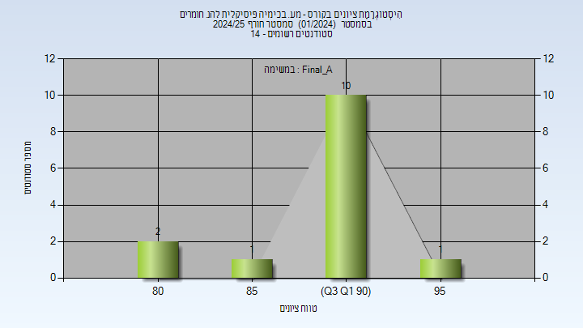
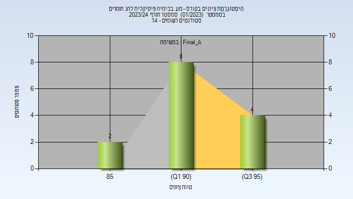
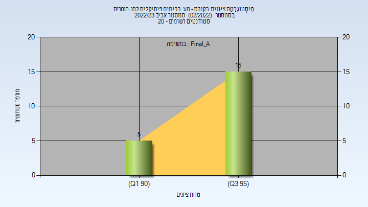
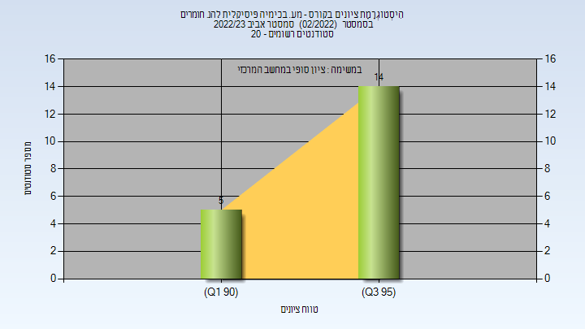
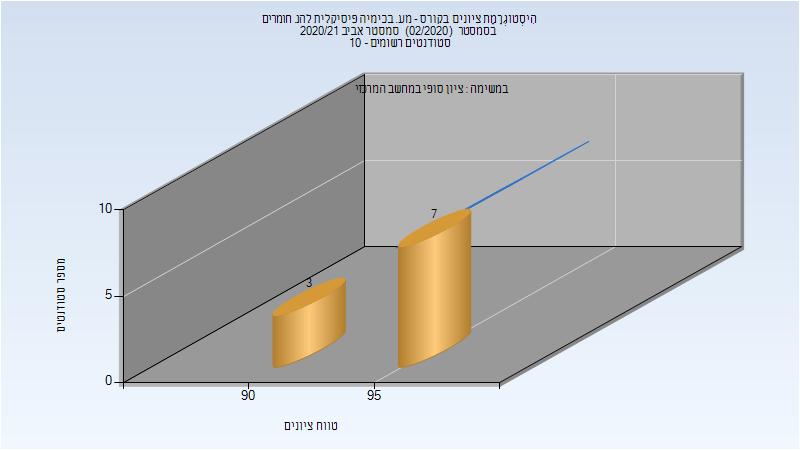

# 124618 - מע. בכימיה פיסיקלית להנ. חומרים

**הערה**: מאגר ההיסטוגרמות הוקם עבור [CheeseFork](https://cheesefork.cf/), כלי בניית מערכת שעות עבור סטודנטים בטכניון. באתר בו אתם גולשים ניתן לעיין בהיסטוגרמות, אך הדרך היותר נוחה היא לעיין בהיסטוגרמות, ובמידע נוסף כגון חוות דעת של סטודנטים, באתר CheeseFork.

* [חורף 2024-2025](#202401)
  * [סופי מועד א'](#202401-Final_A)
* [חורף 2023-2024](#202301)
  * [סופי מועד א'](#202301-Final_A)
  * [סופי](#202301-Finals)
* [אביב 2023](#202202)
  * [סופי מועד א'](#202202-Final_A)
  * [סופי](#202202-Finals)
* [חורף 2022-2023](#202201)
* [חורף 2021-2022](#202101)
* [אביב 2021](#202002)
  * [סופי](#202002-Finals)

<h2 id="202401">חורף 2024-2025</h2>

| איש סגל | תפקיד |
| ---- | ---- |
| צ'ונטונוב לב | מרצה - אחראי מקצוע |
| אוסקר עליזה | מתרגל |
| טרכנישוילי אנה | מתרגל |
| מוסקוביץ נועם- רז | מתרגל |
| גלעד ברזילי יובל | מתרגל |
| מססה אמה | מתרגל |

<h3 id="202401-Final_A">סופי מועד א'</h3>

| סטודנטים | עברו/נכשלו | אחוז עוברים | ציון מינימלי | ציון מקסימלי | ממוצע | חציון |
| ---- | ---- | ---- | ---- | ---- | ---- | ---- |
| 14 | 14/0 | 100 | 80 | 95 | 90.357 | 92 |

<h2 id="202301">חורף 2023-2024</h2>

| איש סגל | תפקיד |
| ---- | ---- |
| צ'ונטונוב לב | מרצה - אחראי מקצוע |
| אוסקר עליזה | מדריך מעבדה |
| ביטון רחל עדן | מדריך מעבדה |
| מוסקוביץ נועם- רז | מדריך מעבדה |
| גלעד ברזילי יובל | מדריך מעבדה |

<h3 id="202301-Final_A">סופי מועד א'</h3>

| סטודנטים | עברו/נכשלו | אחוז עוברים | ציון מינימלי | ציון מקסימלי | ממוצע | חציון |
| ---- | ---- | ---- | ---- | ---- | ---- | ---- |
| 14 | 14/0 | 100 | 87 | 96 | 92.286 | 93 |

<h3 id="202301-Finals">סופי</h3>

| סטודנטים | עברו/נכשלו | אחוז עוברים | ציון מינימלי | ציון מקסימלי | ממוצע | חציון |
| ---- | ---- | ---- | ---- | ---- | ---- | ---- |
| 14 | 14/0 | 100 | 87 | 96 | 92.429 | 93.5 |

<h2 id="202202">אביב 2023</h2>

| איש סגל | תפקיד |
| ---- | ---- |
| צ'ונטונוב לב | מדריך מעבדה - עם הרשאות מרצה אחראי |
| אוסקר עליזה | מדריך מעבדה |
| טרכנישוילי אנה | מדריך מעבדה |
| מוסקוביץ נועם- רז | מדריך מעבדה |

<h3 id="202202-Final_A">סופי מועד א'</h3>

| סטודנטים | עברו/נכשלו | אחוז עוברים | ציון מינימלי | ציון מקסימלי | ממוצע | חציון |
| ---- | ---- | ---- | ---- | ---- | ---- | ---- |
| 20 | 20/0 | 100 | 91 | 97 | 95.15 | 95.5 |

<h3 id="202202-Finals">סופי</h3>

| סטודנטים | עברו/נכשלו | אחוז עוברים | ציון מינימלי | ציון מקסימלי | ממוצע | חציון |
| ---- | ---- | ---- | ---- | ---- | ---- | ---- |
| 20 | 20/0 | 100 | 91 | 97 | 95.15 | 95.5 |

<h2 id="202201">חורף 2022-2023</h2>

| איש סגל | תפקיד |
| ---- | ---- |
| שגם יובל | מדריך מעבדה - עם הרשאות מרצה אחראי |
| מססה אמה | מדריך מעבדה |
| גלעד ברזילי יובל | מדריך מעבדה |

<h2 id="202101">חורף 2021-2022</h2>

| איש סגל | תפקיד |
| ---- | ---- |
| אמיתי זוהר | מדריך מעבדה - עם הרשאות מרצה אחראי |
| אוסקר עליזה |  |
| צורי שחר | מדריך מעבדה |
| אבו חרירי אזהאר | מדריך מעבדה |

<h2 id="202002">אביב 2021</h2>

| איש סגל | תפקיד |
| ---- | ---- |
| צ'ונטונוב לב | מדריך מעבדה - עם הרשאות מרצה אחראי |
| אוסקר עליזה | מדריך מעבדה |
| צורי שחר | מדריך מעבדה |
| ברק יהל | מדריך מעבדה |
| דיין ניר | מדריך מעבדה |

<h3 id="202002-Finals">סופי</h3>

| סטודנטים | עברו/נכשלו | אחוז עוברים | ציון מינימלי | ציון מקסימלי | ממוצע | חציון |
| ---- | ---- | ---- | ---- | ---- | ---- | ---- |
| 10 | 10/0 | 100 | 91 | 98 | 95.5 | 96 |

