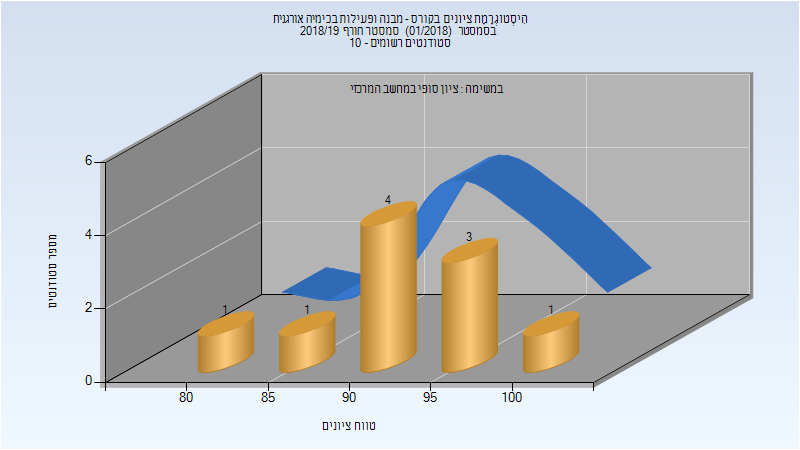
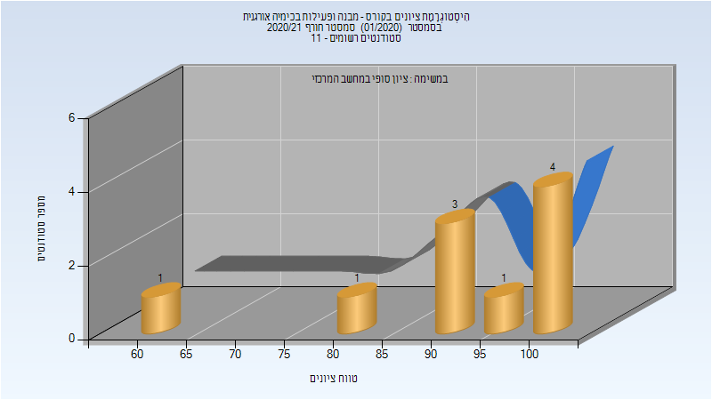

# 124703 - מבנה ופעילות בכימיה אורגנית

## חורף 2018-2019

| איש סגל | תפקיד |
| ---- | ---- |
| אפלויג יצחק | מרצה - אחראי מקצוע |
| קאושנסקי אלכסנדר | מתרגל |

### סופי

| סטודנטים | עברו/נכשלו | אחוז עוברים | ציון מינימלי | ציון מקסימלי | ממוצע | חציון |
| ---- | ---- | ---- | ---- | ---- | ---- | ---- |
| 10 | 10/0 | 100 | 82 | 100 | 93.3 | 93 |

## חורף 2019-2020

| איש סגל | תפקיד |
| ---- | ---- |
| אפלויג יצחק | מרצה - אחראי מקצוע |
| קאושנסקי אלכסנדר | מתרגל |

## חורף 2020-2021

| איש סגל | תפקיד |
| ---- | ---- |
| אפלויג יצחק | מרצה - אחראי מקצוע |
| גולדשטיין יוליה | מתרגל |

### סופי

| סטודנטים | עברו/נכשלו | אחוז עוברים | ציון מינימלי | ציון מקסימלי | ממוצע | חציון |
| ---- | ---- | ---- | ---- | ---- | ---- | ---- |
| 10 | 10/0 | 100 | 60 | 100 | 92.3 | 97 |

