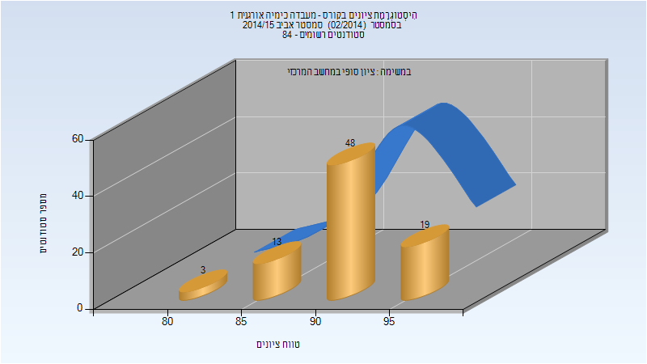
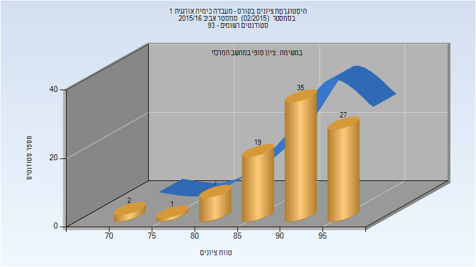
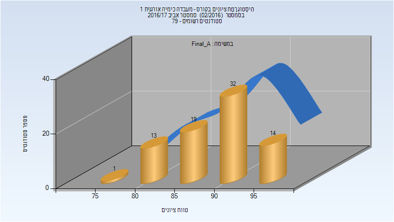
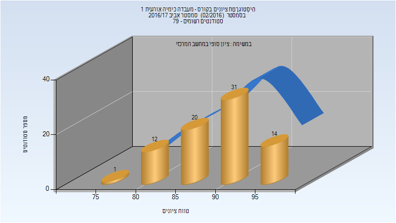
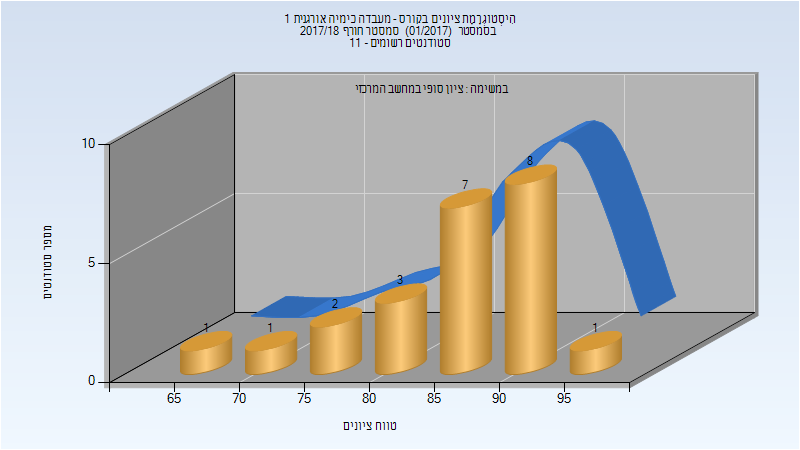
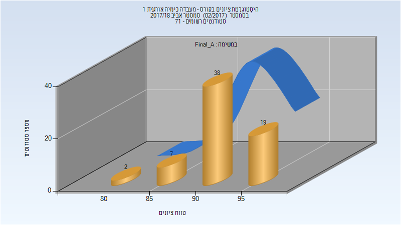
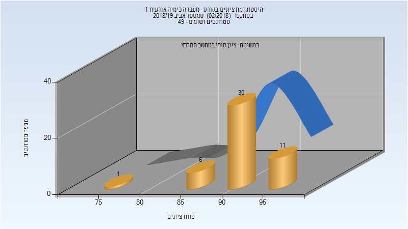
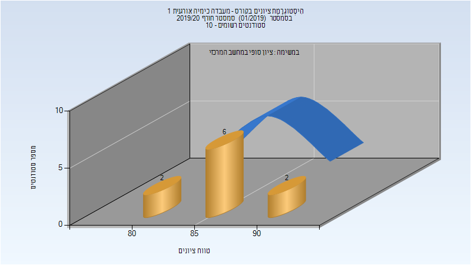
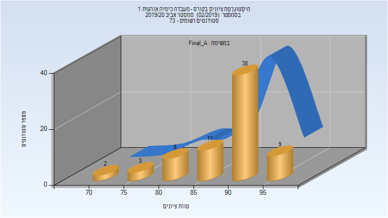

# 124911 - מעבדה כימיה אורגנית 1

## אביב 2015

| איש סגל | תפקיד |
| ---- | ---- |
| פוגורצלב אלה | מתרגל |
| ארטיאן אלכס | מתרגל |
| ג'בארה מחמד | מתרגל |
| גנדלמן מרק | מדריך מעבדה - עם הרשאות מרצה אחראי |
| סמולקין בוריס | מדריך מעבדה |
| סמעאן מרואן | מדריך מעבדה |
| קאושנסקי אלכסנדר | מדריך מעבדה |
| חסין אסף | מדריך מעבדה |
| קולביצקי קסניה | מדריך מעבדה |
| פירזון ורה | מדריך מעבדה |
| כרמל שרה | מדריך מעבדה |
| סולל אפרת | מדריך מעבדה |
| בלוך ויקטוריה | מדריך מעבדה |
| שריץ רוזליה | מדריך מעבדה |
| חייטמן אלנה | מדריך מעבדה |
| ברקוביץ טירן | מדריך מעבדה |
| סלם הילה | מדריך מעבדה |
| חיימוב אלוירה | מדריך מעבדה |

### סופי מועד א'

| סטודנטים | עברו/נכשלו | אחוז עוברים | ציון מינימלי | ציון מקסימלי | ממוצע | חציון |
| ---- | ---- | ---- | ---- | ---- | ---- | ---- |
| 83 | 83/0 | 100 | 83 | 99 | 91.831 | 92 |

### סופי

| סטודנטים | עברו/נכשלו | אחוז עוברים | ציון מינימלי | ציון מקסימלי | ממוצע | חציון |
| ---- | ---- | ---- | ---- | ---- | ---- | ---- |
| 83 | 83/0 | 100 | 83 | 99 | 91.831 | 92 |

## אביב 2016

| איש סגל | תפקיד |
| ---- | ---- |
| גנדלמן מרק | מרצה - אחראי מקצוע |
| כהן עירית |  |
| חסין אסף |  |
| מינקוביץ בוריס | מדריך מעבדה |
| גולדשטיין יוליה | מדריך מעבדה |
| ארטיאן אלכס | מדריך מעבדה |
| עיד עימאד | מדריך מעבדה |
| ברקוביץ טירן | מדריך מעבדה |
| טולדו הילה | מדריך מעבדה |
| סמעאן מרואן | מדריך מעבדה |
| בלוך ויקטוריה | מדריך מעבדה |
| שריץ רוזליה | מדריך מעבדה |
| פירזון ורה | מדריך מעבדה |
| חייטמן אלנה | מדריך מעבדה |

### סופי מועד א'

| סטודנטים | עברו/נכשלו | אחוז עוברים | ציון מינימלי | ציון מקסימלי | ממוצע | חציון |
| ---- | ---- | ---- | ---- | ---- | ---- | ---- |
| 91 | 91/0 | 100 | 73 | 98 | 90.857 | 91 |

### סופי

| סטודנטים | עברו/נכשלו | אחוז עוברים | ציון מינימלי | ציון מקסימלי | ממוצע | חציון |
| ---- | ---- | ---- | ---- | ---- | ---- | ---- |
| 91 | 91/0 | 100 | 73 | 98 | 90.857 | 91 |

## אביב 2017

| איש סגל | תפקיד |
| ---- | ---- |
| מעיין גליה | מרצה - אחראי מקצוע |
| שריץ רוזליה |  |
| אביגדורי עידן |  |
| חסין אסף |  |
| ערבה שלומי |  |
| פירזון ורה |  |
| רוזנטל לינה |  |
| ג'בארה מחמד |  |
| וילנסקי אלינה |  |
| טולדו הילה |  |
| מינקוביץ בוריס |  |
| פינצ'וק דניאל |  |
| זלמן בת-חן |  |
| סמעאן מרואן |  |
| לוי חרות |  |
| גולדשטיין יוליה |  |

### סופי מועד א'

| סטודנטים | עברו/נכשלו | אחוז עוברים | ציון מינימלי | ציון מקסימלי | ממוצע | חציון |
| ---- | ---- | ---- | ---- | ---- | ---- | ---- |
| 79 | 79/0 | 100 | 79 | 97 | 90.038 | 90 |

### סופי

| סטודנטים | עברו/נכשלו | אחוז עוברים | ציון מינימלי | ציון מקסימלי | ממוצע | חציון |
| ---- | ---- | ---- | ---- | ---- | ---- | ---- |
| 78 | 78/0 | 100 | 79 | 97 | 90.038 | 90.5 |

## חורף 2017-2018

| איש סגל | תפקיד |
| ---- | ---- |
| דיזנדרוק צ'רלס | מרצה - אחראי מקצוע |
| סמעאן מרואן |  |
| ג'בארה מחמד |  |

### סופי

| סטודנטים | עברו/נכשלו | אחוז עוברים | ציון מינימלי | ציון מקסימלי | ממוצע | חציון |
| ---- | ---- | ---- | ---- | ---- | ---- | ---- |
| 23 | 23/0 | 100 | 69 | 95 | 85.652 | 86 |

## אביב 2018

| איש סגל | תפקיד |
| ---- | ---- |
| מעיין גליה | מדריך מעבדה - עם הרשאות מרצה אחראי |
| עוזרי ענבל |  |
| ערבה שלומי |  |
| חסין אסף |  |
| טולדו הילה |  |
| מינקוביץ בוריס |  |
| לוי חרות |  |
| כהן עירית |  |
| זלמן בת-חן |  |
| ג'בארה מחמד |  |
| שטנברג דגני ירדן |  |
| קאושנסקי אלכסנדר |  |
| אביגדורי עידן |  |
| שריץ רוזליה |  |
| פירזון ורה |  |

### סופי מועד א'

| סטודנטים | עברו/נכשלו | אחוז עוברים | ציון מינימלי | ציון מקסימלי | ממוצע | חציון |
| ---- | ---- | ---- | ---- | ---- | ---- | ---- |
| 66 | 66/0 | 100 | 81 | 98 | 92.333 | 93 |

### סופי

| סטודנטים | עברו/נכשלו | אחוז עוברים | ציון מינימלי | ציון מקסימלי | ממוצע | חציון |
| ---- | ---- | ---- | ---- | ---- | ---- | ---- |
| 69 | 69/0 | 100 | 81 | 98 | 92.072 | 92 |

## חורף 2018-2019

| איש סגל | תפקיד |
| ---- | ---- |
| מעיין גליה | מדריך מעבדה - עם הרשאות מרצה אחראי |
| עוזרי ענבל | מדריך מעבדה |
| ג'בארה מחמד | מדריך מעבדה |

## אביב 2019

| איש סגל | תפקיד |
| ---- | ---- |
| מעיין גליה | מדריך מעבדה - עם הרשאות מרצה אחראי |
| בשקורוב רומן | מדריך מעבדה |
| ג'בארה מחמד | מדריך מעבדה |
| פירזון ורה | מדריך מעבדה |
| וילנסקי אלינה | מדריך מעבדה |
| חסין אסף | מדריך מעבדה |
| אביגדורי עידן | מדריך מעבדה |
| מינקוביץ בוריס | מדריך מעבדה |
| ערבה שלומי | מדריך מעבדה |
| עוזרי ענבל | מדריך מעבדה |

### סופי מועד א'

| סטודנטים | עברו/נכשלו | אחוז עוברים | ציון מינימלי | ציון מקסימלי | ממוצע | חציון |
| ---- | ---- | ---- | ---- | ---- | ---- | ---- |
| 46 | 46/0 | 100 | 76 | 98 | 92 | 92.5 |

### סופי

| סטודנטים | עברו/נכשלו | אחוז עוברים | ציון מינימלי | ציון מקסימלי | ממוצע | חציון |
| ---- | ---- | ---- | ---- | ---- | ---- | ---- |
| 48 | 48/0 | 100 | 76 | 98 | 92.292 | 93 |

## חורף 2019-2020

| איש סגל | תפקיד |
| ---- | ---- |
| מעיין גליה | מדריך מעבדה - עם הרשאות מרצה אחראי |
| פירזון ורה | מדריך מעבדה |
| גולדשטיין יוליה | מדריך מעבדה |

### סופי

| סטודנטים | עברו/נכשלו | אחוז עוברים | ציון מינימלי | ציון מקסימלי | ממוצע | חציון |
| ---- | ---- | ---- | ---- | ---- | ---- | ---- |
| 10 | 10/0 | 100 | 82 | 94 | 86.9 | 86 |

## אביב 2020

| איש סגל | תפקיד |
| ---- | ---- |
| דה-רויטר גראהם | מדריך מעבדה - עם הרשאות מרצה אחראי |
| מעיין גליה |  |
| מקרוב קונסטנטין | מדריך מעבדה |
| לפס שי | מדריך מעבדה |
| חסין אסף | מדריך מעבדה |
| עוזרי ענבל | מדריך מעבדה |
| אביגדורי עידן | מדריך מעבדה |
| עואד מוחמד | מדריך מעבדה |
| ליבוביץ ליאב | מדריך מעבדה |
| זלמן בת-חן | מדריך מעבדה |
| גולדשטיין יוליה | מדריך מעבדה |
| בשקורוב רומן | מדריך מעבדה |
| לוי חרות | מדריך מעבדה |
| לוי רומי | מדריך מעבדה |
| בורג טליה | מדריך מעבדה |

### סופי מועד א'

| סטודנטים | עברו/נכשלו | אחוז עוברים | ציון מינימלי | ציון מקסימלי | ממוצע | חציון |
| ---- | ---- | ---- | ---- | ---- | ---- | ---- |
| 71 | 71/0 | 100 | 72 | 98 | 89.592 | 91 |

### סופי

| סטודנטים | עברו/נכשלו | אחוז עוברים | ציון מינימלי | ציון מקסימלי | ממוצע | חציון |
| ---- | ---- | ---- | ---- | ---- | ---- | ---- |
| 71 | 71/0 | 100 | 72 | 98 | 89.592 | 91 |

