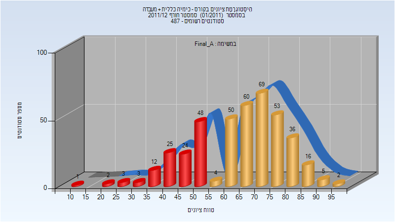
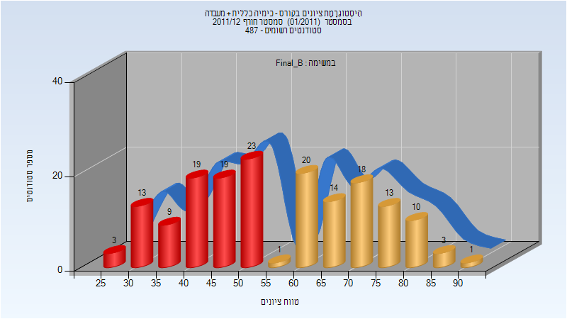
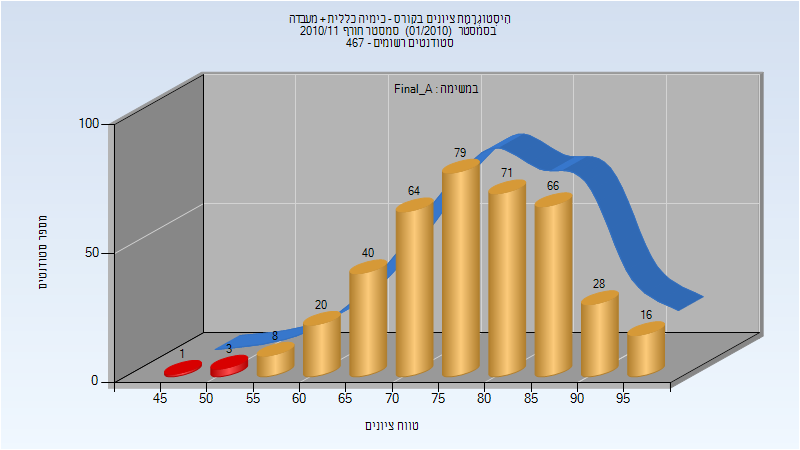
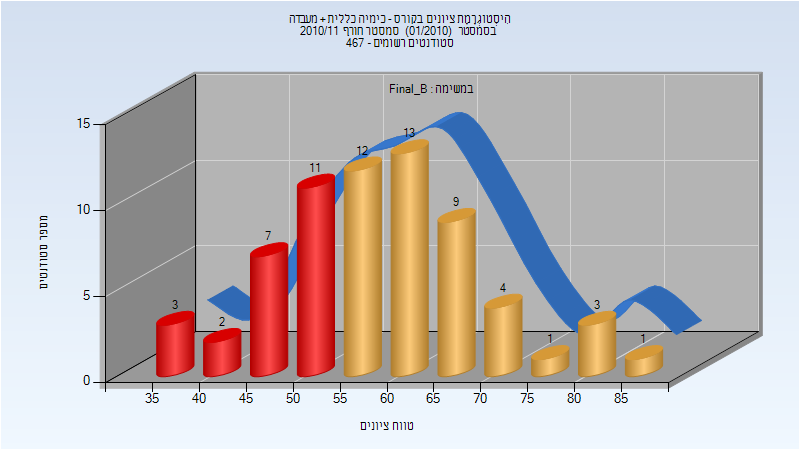
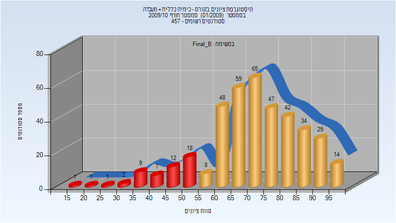
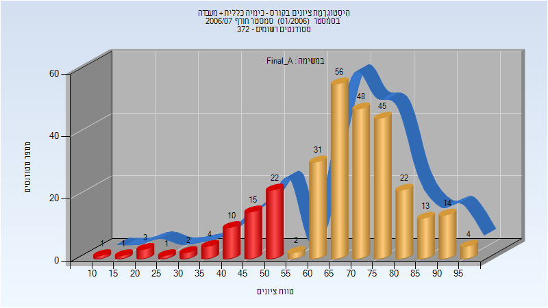
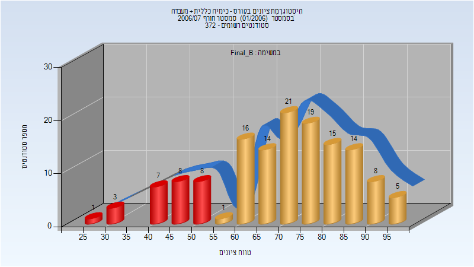

# 125011 - כימיה כללית + מעבדה

**הערה**: מאגר ההיסטוגרמות הוקם עבור [CheeseFork](https://cheesefork.cf/), כלי בניית מערכת שעות עבור סטודנטים בטכניון. באתר בו אתם גולשים ניתן לעיין בהיסטוגרמות, אך הדרך היותר נוחה היא לעיין בהיסטוגרמות, ובמידע נוסף כגון חוות דעת של סטודנטים, באתר CheeseFork.

* [חורף 2012-2013](#201201)
* [חורף 2011-2012](#201101)
  * [סופי מועד א'](#201101-Final_A)
  * [סופי מועד ב'](#201101-Final_B)
* [אביב 2011](#201002)
* [חורף 2010-2011](#201001)
  * [סופי מועד א'](#201001-Final_A)
  * [סופי מועד ב'](#201001-Final_B)
* [חורף 2009-2010](#200901)
  * [סופי מועד ב'](#200901-Final_B)
* [חורף 2006-2007](#200601)
  * [סופי מועד א'](#200601-Final_A)
  * [סופי מועד ב'](#200601-Final_B)

<h2 id="201201">חורף 2012-2013</h2>

| איש סגל | תפקיד |
| ---- | ---- |
| מיכלסון שאול | מרצה - אחראי מקצוע |
| בלומקין מוריה | מתרגל |
| סמולקין בוריס | מתרגל |
| טלמון אינה | מתרגל |
| רטנר תמר | מתרגל |
| הלוי גבריאלה | מתרגל |

<h2 id="201101">חורף 2011-2012</h2>

| איש סגל | תפקיד |
| ---- | ---- |
| רהב סער | מרצה - אחראי מקצוע |
| טלמון אינה | מתרגל |
| הלוי גבריאלה | מתרגל |

<h3 id="201101-Final_A">סופי מועד א'</h3>

| סטודנטים | עברו/נכשלו | אחוז עוברים | ציון מינימלי | ציון מקסימלי | ממוצע | חציון |
| ---- | ---- | ---- | ---- | ---- | ---- | ---- |
| 413 | 295/118 | 71 | 14 | 95 | 64.794 | 67 |

<h3 id="201101-Final_B">סופי מועד ב'</h3>

| סטודנטים | עברו/נכשלו | אחוז עוברים | ציון מינימלי | ציון מקסימלי | ממוצע | חציון |
| ---- | ---- | ---- | ---- | ---- | ---- | ---- |
| 166 | 80/86 | 48 | 27 | 91 | 56.94 | 53.5 |

<h2 id="201002">אביב 2011</h2>

| איש סגל | תפקיד |
| ---- | ---- |
| רהב סער | מרצה - אחראי מקצוע |
| טלמון אינה | מתרגל |
| שוכן דנה | מתרגל |
| הלוי גבריאלה | מתרגל |
| קאושנסקי אלכסנדר | מתרגל |
| רטנר תמר | מתרגל |
| חיימוב אלוירה | מתרגל |

<h2 id="201001">חורף 2010-2011</h2>

| איש סגל | תפקיד |
| ---- | ---- |
| שמידט אשר | מרצה - אחראי מקצוע |
| הלוי גבריאלה | מתרגל |
| עקיבא ענת | מתרגל |
| טלמון אינה | מתרגל |
| שריץ רוזליה | מתרגל |
| קאושנסקי אלכסנדר | מתרגל |
| בלומקין מוריה | מתרגל |
| רטנר תמר | מתרגל |
| מיכלסון שאול | מתרגל |
| שוכן דנה | מתרגל |

<h3 id="201001-Final_A">סופי מועד א'</h3>

| סטודנטים | עברו/נכשלו | אחוז עוברים | ציון מינימלי | ציון מקסימלי | ממוצע | חציון |
| ---- | ---- | ---- | ---- | ---- | ---- | ---- |
| 396 | 392/4 | 99 | 46 | 97 | 78.24 | 78 |

<h3 id="201001-Final_B">סופי מועד ב'</h3>

| סטודנטים | עברו/נכשלו | אחוז עוברים | ציון מינימלי | ציון מקסימלי | ממוצע | חציון |
| ---- | ---- | ---- | ---- | ---- | ---- | ---- |
| 66 | 43/23 | 65 | 35 | 85 | 59.045 | 58 |

<h2 id="200901">חורף 2009-2010</h2>

| איש סגל | תפקיד |
| ---- | ---- |
| כפתורי מנחם | מרצה - אחראי מקצוע |
| רטנר תמר | מתרגל |
| סמולקין בוריס | מתרגל |
| מושונוב משה | מתרגל |
| מלצמן שי | מתרגל |
| בוסי יונית | מתרגל |
| שוכן דנה | מתרגל |
| רבינוביץ ילנה | מתרגל |
| עקיבא ענת | מתרגל |
| טורוטקו אנדרי | מתרגל |
| קלופר ויקי | מתרגל |
| הלוי גבריאלה | מתרגל |
| בלומקין מוריה | מתרגל |
| טלמון אינה | מתרגל |
| טייב-פליגלמן עינב | מתרגל |

<h3 id="200901-Final_B">סופי מועד ב'</h3>

| סטודנטים | עברו/נכשלו | אחוז עוברים | ציון מינימלי | ציון מקסימלי | ממוצע | חציון |
| ---- | ---- | ---- | ---- | ---- | ---- | ---- |
| 397 | 346/51 | 87 | 15 | 99 | 71.141 | 72 |

<h2 id="200601">חורף 2006-2007</h2>

| איש סגל | תפקיד |
| ---- | ---- |
| שמידט אשר | מרצה - אחראי מקצוע |
| רטנר תמר | מתרגל |
| דוברובצקי רומן | מתרגל |
| טוביאס אולגה | מתרגל |
| לוין ענת | מתרגל |
| נודלמן איגור | מתרגל |
| גרציקוב יוליה | מתרגל |
| טלמון אינה | מתרגל |
| רבין נירה | מתרגל |
| הלוי גבריאלה | מתרגל |
| שכטר טליה | מתרגל |
| קלופר ויקי | מתרגל |

<h3 id="200601-Final_A">סופי מועד א'</h3>

| סטודנטים | עברו/נכשלו | אחוז עוברים | ציון מינימלי | ציון מקסימלי | ממוצע | חציון |
| ---- | ---- | ---- | ---- | ---- | ---- | ---- |
| 294 | 235/59 | 80 | 10 | 99 | 67.276 | 69 |

<h3 id="200601-Final_B">סופי מועד ב'</h3>

| סטודנטים | עברו/נכשלו | אחוז עוברים | ציון מינימלי | ציון מקסימלי | ממוצע | חציון |
| ---- | ---- | ---- | ---- | ---- | ---- | ---- |
| 140 | 113/27 | 81 | 25 | 95 | 69.707 | 71 |

