# 125013 - מעבדה בכימיה כללית

## אביב 2013

| איש סגל | תפקיד |
| ---- | ---- |
| שמידט אשר | מרצה - אחראי מקצוע |
| טייב-פליגלמן עינב | מתרגל |
| רזניק איל | מתרגל |
| טלמון אינה | מתרגל |
| הלוי גבריאלה | מתרגל |
| רוזלר חיים | מתרגל |
| קאושנסקי אלכסנדר | מתרגל |
| בלומקין מוריה | מתרגל |
| סמולקין בוריס | מתרגל |
| רטנר תמר | מתרגל |
| חיימוב אלוירה | מתרגל |
| אוסקר לירון | מתרגל |
| שטנברג דגני ירדן | מתרגל |

### סופי מועד א'

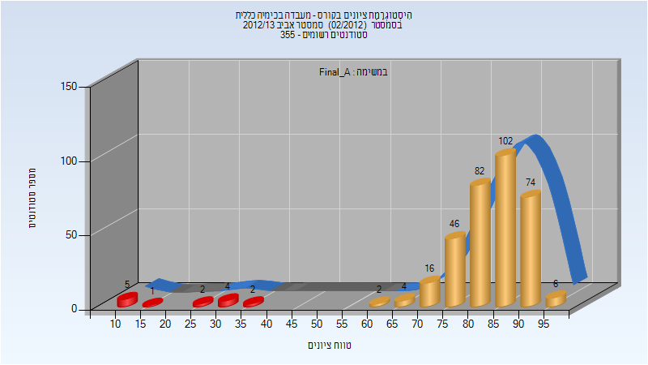

| סטודנטים | עברו/נכשלו | אחוז עוברים | ציון מינימלי | ציון מקסימלי | ממוצע | חציון |
| ---- | ---- | ---- | ---- | ---- | ---- | ---- |
| 346 | 332/14 | 96 | 10 | 97 | 81.971 | 85 |

## אביב 2014

| איש סגל | תפקיד |
| ---- | ---- |
| רהב סער | מרצה - אחראי מקצוע |
| יחזקאל שני | מתרגל |
| בסקין מריה | מתרגל |
| רטנר תמר | מתרגל |
| רזניק איל | מתרגל |
| טייב-פליגלמן עינב | מתרגל |
| חריטן עידן | מתרגל |
| טלמון אינה | מתרגל |
| טיגר הגר | מתרגל |
| פרשל מאיה | מתרגל |
| הלוי גבריאלה | סגל מנהלי - עם הרשאות מרצה אחראי |

### סופי מועד א'

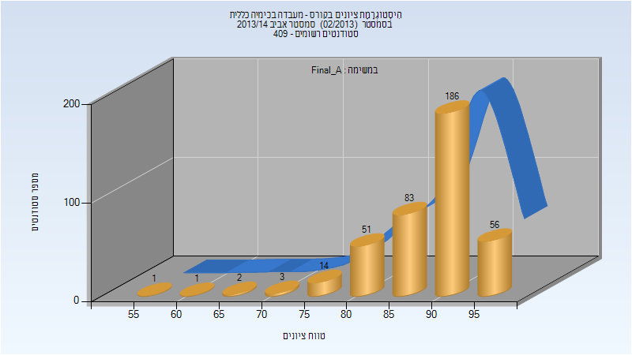

| סטודנטים | עברו/נכשלו | אחוז עוברים | ציון מינימלי | ציון מקסימלי | ממוצע | חציון |
| ---- | ---- | ---- | ---- | ---- | ---- | ---- |
| 397 | 397/0 | 100 | 59 | 98 | 89.542 | 91 |

## אביב 2015

| איש סגל | תפקיד |
| ---- | ---- |
| אישן יואב | מרצה - אחראי מקצוע |
| טיגר הגר | מתרגל |
| סמוליאקיב אליסה | מתרגל |
| קרני נורית | מתרגל |
| גולדמן יבגניה | מתרגל |
| דנטוס מאוריסיו | מתרגל |
| פרשל מאיה | מתרגל |
| זלנר-יפע משה מיכאל | מתרגל |
| בסקין מריה | מתרגל |
| יחזקאל שני | מתרגל |
| חריטן עידן | מתרגל |
| שטנברג דגני ירדן | מתרגל |
| הלוי גבריאלה | סגל מנהלי - עם הרשאות מרצה אחראי |

### סופי מועד א'

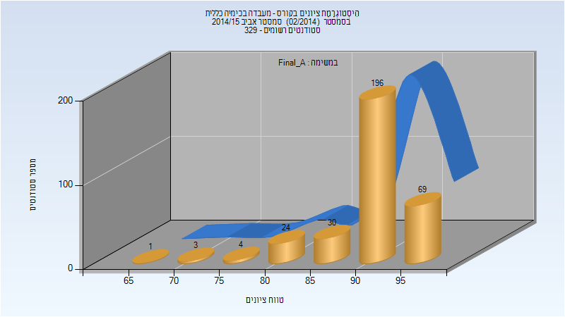

| סטודנטים | עברו/נכשלו | אחוז עוברים | ציון מינימלי | ציון מקסימלי | ממוצע | חציון |
| ---- | ---- | ---- | ---- | ---- | ---- | ---- |
| 327 | 327/0 | 100 | 67 | 98 | 91.434 | 93 |

### סופי

| סטודנטים | עברו/נכשלו | אחוז עוברים | ציון מינימלי | ציון מקסימלי | ממוצע | חציון |
| ---- | ---- | ---- | ---- | ---- | ---- | ---- |
| 328 | 328/0 | 100 | 67 | 98 | 91.439 | 93 |

## אביב 2016

| איש סגל | תפקיד |
| ---- | ---- |
| מעיין גליה | מרצה - אחראי מקצוע |
| חריטן עידן | מתרגל |
| נואטחה מיכאל | מתרגל |
| בסקין מריה | מתרגל |
| משין יבגני | מתרגל |
| פרשל מאיה | מתרגל |
| אבו חרירי אזהאר | מתרגל |
| לנדאו ילנה | מתרגל |
| אביגדורי עידן | מתרגל |
| אגמי איריס | מתרגל |
| זלנר-יפע משה מיכאל | מתרגל |
| עוזרי ענבל | מתרגל |
| גלנט אור | מתרגל |
| הלוי גבריאלה | סגל מנהלי - עם הרשאות מרצה אחראי |

### סופי מועד א'

| סטודנטים | עברו/נכשלו | אחוז עוברים | ציון מינימלי | ציון מקסימלי | ממוצע | חציון |
| ---- | ---- | ---- | ---- | ---- | ---- | ---- |
| 327 | 326/1 | 100 | 39 | 99 | 92.511 | 94 |

### סופי

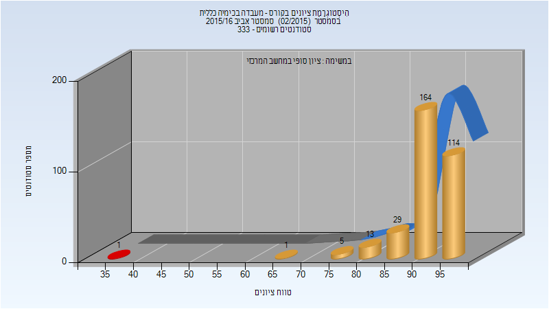

| סטודנטים | עברו/נכשלו | אחוז עוברים | ציון מינימלי | ציון מקסימלי | ממוצע | חציון |
| ---- | ---- | ---- | ---- | ---- | ---- | ---- |
| 327 | 326/1 | 100 | 39 | 99 | 92.511 | 94 |

## חורף 2016-2017

| איש סגל | תפקיד |
| ---- | ---- |
| דיזנדרוק צ'רלס | מרצה - אחראי מקצוע |
| זלנר-יפע משה מיכאל | מתרגל |
| הלוי גבריאלה |  |
| אגמי איריס |  |
| עוזרי ענבל |  |

### סופי מועד א'

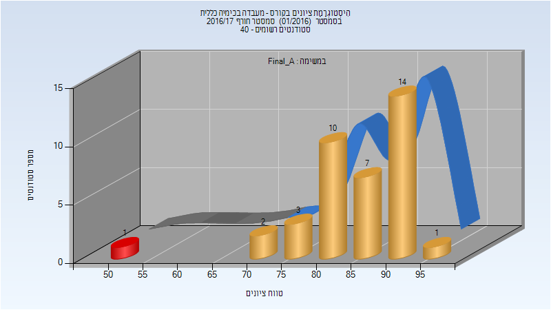

| סטודנטים | עברו/נכשלו | אחוז עוברים | ציון מינימלי | ציון מקסימלי | ממוצע | חציון |
| ---- | ---- | ---- | ---- | ---- | ---- | ---- |
| 38 | 37/1 | 97 | 52 | 95 | 85.263 | 87.5 |

### סופי

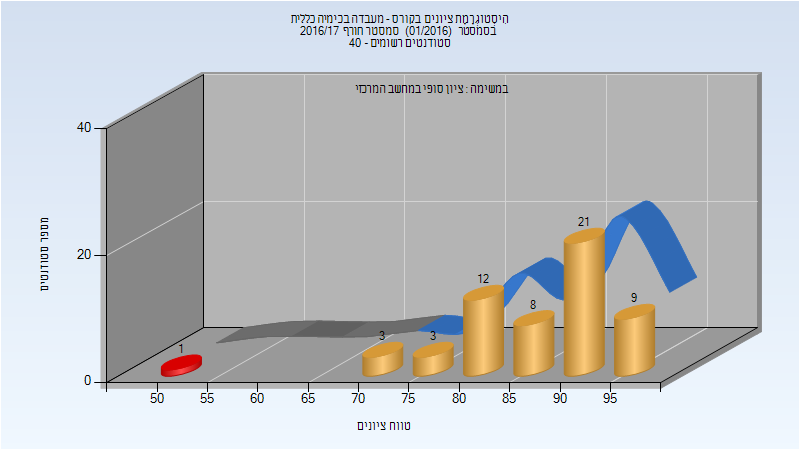

| סטודנטים | עברו/נכשלו | אחוז עוברים | ציון מינימלי | ציון מקסימלי | ממוצע | חציון |
| ---- | ---- | ---- | ---- | ---- | ---- | ---- |
| 57 | 56/1 | 98 | 52 | 97 | 87.281 | 90 |

## אביב 2017

| איש סגל | תפקיד |
| ---- | ---- |
| צ'ונטונוב לב | מרצה - אחראי מקצוע |
| אנגלברג לי | מתרגל |
| בסקין מריה |  |
| זלנר-יפע משה מיכאל |  |
| עוזרי ענבל |  |
| גלנט אור |  |
| הלוי גבריאלה |  |
| שטנברג דגני ירדן |  |
| מקרוב קונסטנטין |  |
| גלוז נעמה |  |
| קאושנסקי אלכסנדר |  |
| פרשל מאיה |  |
| גולדמן יבגניה |  |
| אגמי איריס |  |

### סופי מועד א'

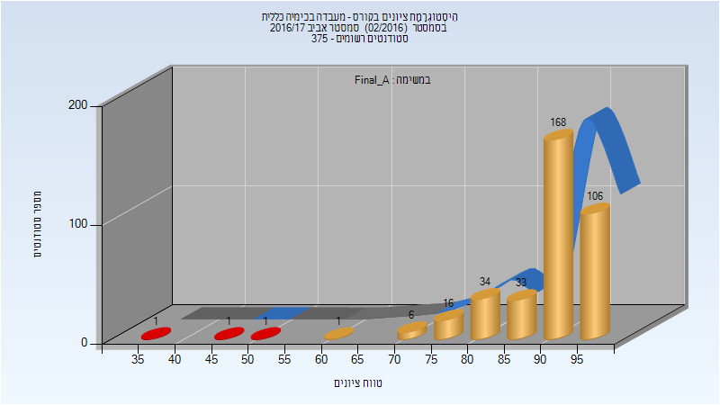

| סטודנטים | עברו/נכשלו | אחוז עוברים | ציון מינימלי | ציון מקסימלי | ממוצע | חציון |
| ---- | ---- | ---- | ---- | ---- | ---- | ---- |
| 368 | 365/3 | 99 | 36 | 98 | 90.478 | 93 |

### סופי

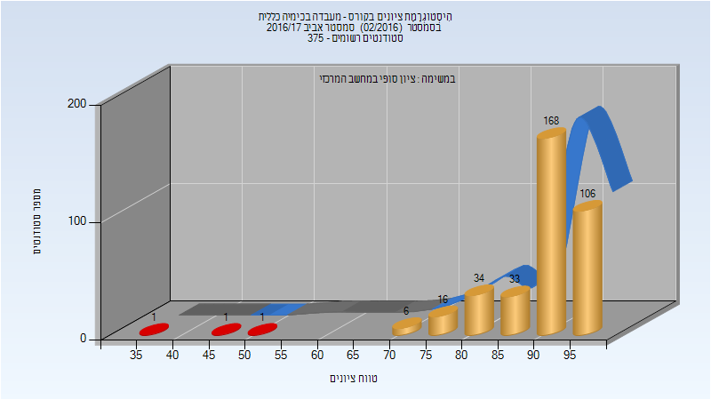

| סטודנטים | עברו/נכשלו | אחוז עוברים | ציון מינימלי | ציון מקסימלי | ממוצע | חציון |
| ---- | ---- | ---- | ---- | ---- | ---- | ---- |
| 366 | 363/3 | 99 | 36 | 98 | 90.615 | 93 |

## חורף 2017-2018

| איש סגל | תפקיד |
| ---- | ---- |
| דיזנדרוק צ'רלס | מרצה - אחראי מקצוע |
| ליבנה אחיה | מתרגל |
| פרשל מאיה |  |
| זלנר-יפע משה מיכאל |  |
| עוזרי ענבל |  |
| בסקין מריה |  |
| הלוי גבריאלה |  |

### סופי מועד א'

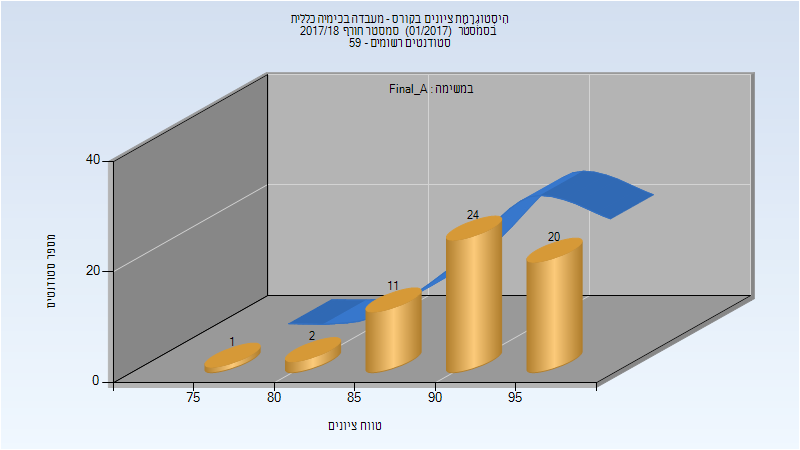

| סטודנטים | עברו/נכשלו | אחוז עוברים | ציון מינימלי | ציון מקסימלי | ממוצע | חציון |
| ---- | ---- | ---- | ---- | ---- | ---- | ---- |
| 58 | 58/0 | 100 | 78 | 98 | 92.5 | 94 |

### סופי

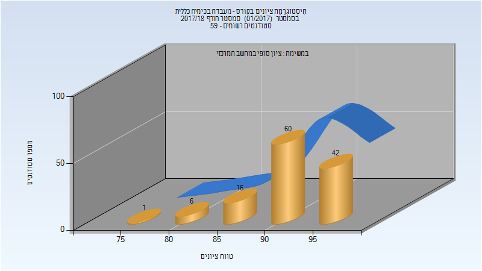

| סטודנטים | עברו/נכשלו | אחוז עוברים | ציון מינימלי | ציון מקסימלי | ממוצע | חציון |
| ---- | ---- | ---- | ---- | ---- | ---- | ---- |
| 125 | 125/0 | 100 | 78 | 98 | 92.728 | 93 |

## אביב 2018

| איש סגל | תפקיד |
| ---- | ---- |
| מעיין גליה | מדריך מעבדה - עם הרשאות מרצה אחראי |
| צ'ונטונוב לב |  |
| בסקין מריה | מדריך מעבדה |
| כדורי מאיה | מדריך מעבדה |
| חריטן עידן | מדריך מעבדה |
| אגמי איריס | מדריך מעבדה |
| אנגלברג לי | מדריך מעבדה |
| זלנר-יפע משה מיכאל | מדריך מעבדה |
| לוינמן מריה | מדריך מעבדה |
| גלוז נעמה | מדריך מעבדה |
| פרשל מאיה | מדריך מעבדה |
| גולדמן יבגניה | מדריך מעבדה |
| ליבנה אחיה | מדריך מעבדה |
| הלוי גבריאלה | מדריך מעבדה |

### סופי מועד א'

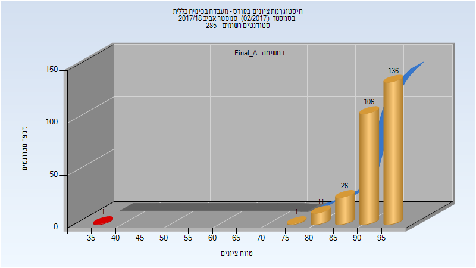

| סטודנטים | עברו/נכשלו | אחוז עוברים | ציון מינימלי | ציון מקסימלי | ממוצע | חציון |
| ---- | ---- | ---- | ---- | ---- | ---- | ---- |
| 281 | 280/1 | 100 | 35 | 99 | 93.274 | 94 |

### סופי

| סטודנטים | עברו/נכשלו | אחוז עוברים | ציון מינימלי | ציון מקסימלי | ממוצע | חציון |
| ---- | ---- | ---- | ---- | ---- | ---- | ---- |
| 280 | 279/1 | 100 | 35 | 99 | 93.307 | 94 |

## חורף 2018-2019

| איש סגל | תפקיד |
| ---- | ---- |
| הלוי גבריאלה | מרצה - אחראי מקצוע |
| שמידט אשר | מרצה |
| גולובצקי אנסטסיה | מרצה |
| פרשל מאיה | מרצה |

### סופי מועד א'

| סטודנטים | עברו/נכשלו | אחוז עוברים | ציון מינימלי | ציון מקסימלי | ממוצע | חציון |
| ---- | ---- | ---- | ---- | ---- | ---- | ---- |
| 56 | 56/0 | 100 | 84 | 98 | 92.161 | 93 |

### סופי

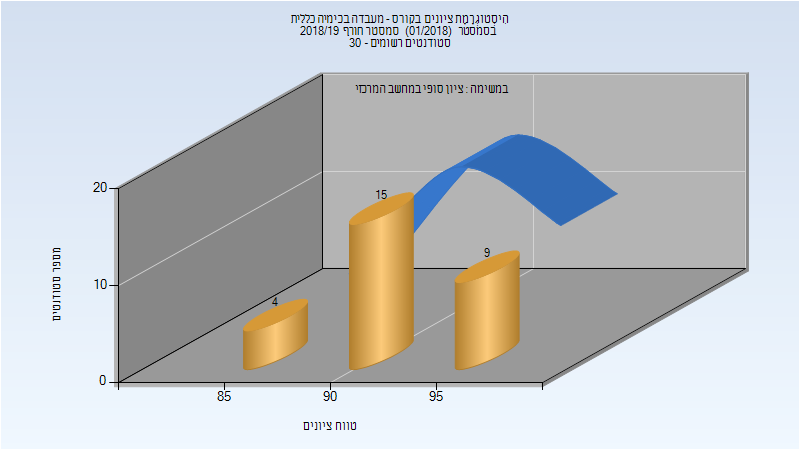

| סטודנטים | עברו/נכשלו | אחוז עוברים | ציון מינימלי | ציון מקסימלי | ממוצע | חציון |
| ---- | ---- | ---- | ---- | ---- | ---- | ---- |
| 56 | 56/0 | 100 | 84 | 98 | 92.161 | 93 |

## אביב 2019

| איש סגל | תפקיד |
| ---- | ---- |
| דה-רויטר גרהם | מדריך מעבדה - עם הרשאות מרצה אחראי |
| עמירב דרורי לילך |  |
| טרביה טארק | מדריך מעבדה |
| פוקרא מוחמד | מדריך מעבדה |
| אבו סאלח דועא | מדריך מעבדה |
| פרשל מאיה | מדריך מעבדה |
| ארוסטמיאן סופיה | מדריך מעבדה |
| בורשטיין תומר | מדריך מעבדה |
| הריס לימור | מדריך מעבדה |
| אטרש מוחמד | מדריך מעבדה |
| סויסה שלייף מעיין | מדריך מעבדה |
| פריאנטה עדי | מדריך מעבדה |
| זלנר-יפע משה מיכאל | מדריך מעבדה |
| יוחנובסקי אנה | מדריך מעבדה |
| נ'גם סאלי | מדריך מעבדה |
| לוינמן מריה | מדריך מעבדה |
| הלוי גבריאלה | סגל מנהלי - עם הרשאות מרצה אחראי |

### סופי מועד א'

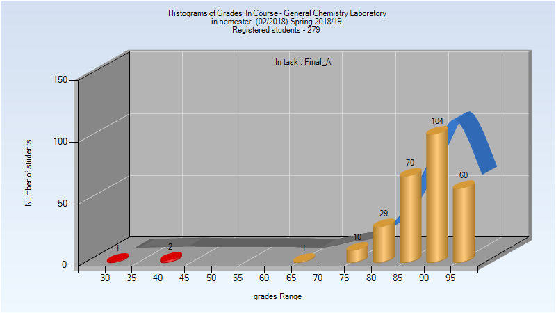

| סטודנטים | עברו/נכשלו | אחוז עוברים | ציון מינימלי | ציון מקסימלי | ממוצע | חציון |
| ---- | ---- | ---- | ---- | ---- | ---- | ---- |
| 277 | 274/3 | 99 | 34 | 98 | 89.715 | 91 |

### סופי

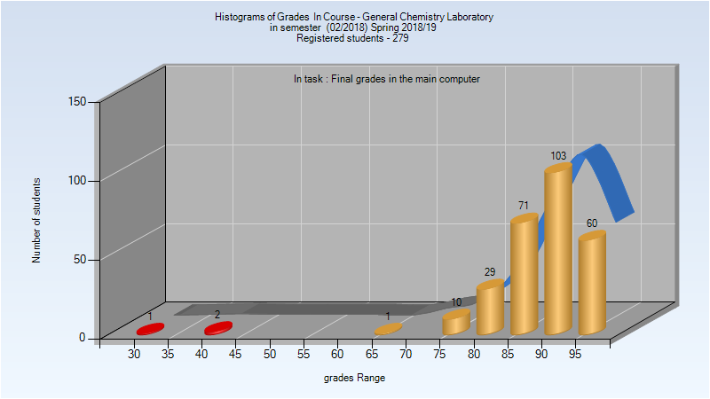

| סטודנטים | עברו/נכשלו | אחוז עוברים | ציון מינימלי | ציון מקסימלי | ממוצע | חציון |
| ---- | ---- | ---- | ---- | ---- | ---- | ---- |
| 277 | 274/3 | 99 | 34 | 98 | 89.704 | 91 |

## חורף 2019-2020

| איש סגל | תפקיד |
| ---- | ---- |
| שמידט אשר | מדריך מעבדה - עם הרשאות מרצה אחראי |
| זלנר-יפע משה מיכאל | מדריך מעבדה |
| אטרש מוחמד | מדריך מעבדה |
| גולובצקי אנסטסיה | מדריך מעבדה |
| הלוי גבריאלה | סגל מנהלי - עם הרשאות מרצה אחראי |

### סופי מועד א'

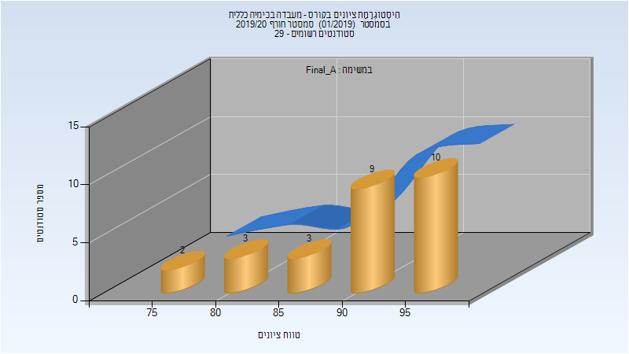

| סטודנטים | עברו/נכשלו | אחוז עוברים | ציון מינימלי | ציון מקסימלי | ממוצע | חציון |
| ---- | ---- | ---- | ---- | ---- | ---- | ---- |
| 27 | 27/0 | 100 | 76 | 97 | 91.185 | 92 |

### סופי

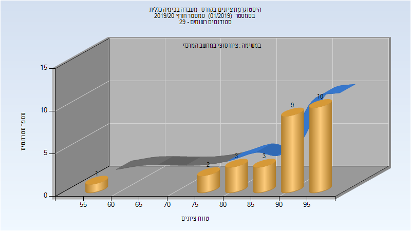

| סטודנטים | עברו/נכשלו | אחוז עוברים | ציון מינימלי | ציון מקסימלי | ממוצע | חציון |
| ---- | ---- | ---- | ---- | ---- | ---- | ---- |
| 28 | 28/0 | 100 | 55 | 97 | 89.893 | 93 |

## אביב 2020

| איש סגל | תפקיד |
| ---- | ---- |
| דה-רויטר גראהם | מדריך מעבדה - עם הרשאות מרצה אחראי |
| עמירב דרורי לילך |  |
| אגמי איריס | מדריך מעבדה |
| פוקרא מוחמד | מדריך מעבדה |
| מג'דוב מחמוד | מדריך מעבדה |
| שויחט חגית | מדריך מעבדה |
| פרשל מאיה | מדריך מעבדה |
| עתאמלה פאטמה | מדריך מעבדה |
| סקליאר ג'ניה | מדריך מעבדה |
| אטרש מוחמד | מדריך מעבדה |
| בהר אנסטסיה אס | מדריך מעבדה |
| זלנר-יפע משה מיכאל | מדריך מעבדה |
| טבק שיר | מדריך מעבדה |
| פריאנטה עדי | מדריך מעבדה |
| הלוי גבריאלה | סגל מנהלי - עם הרשאות מרצה אחראי |

### סופי מועד א'

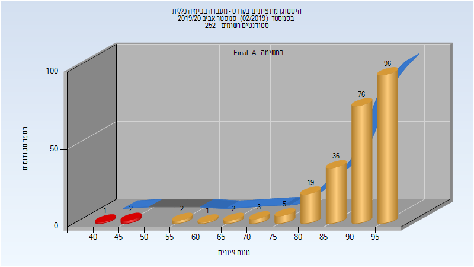

| סטודנטים | עברו/נכשלו | אחוז עוברים | ציון מינימלי | ציון מקסימלי | ממוצע | חציון |
| ---- | ---- | ---- | ---- | ---- | ---- | ---- |
| 242 | 240/2 | 99 | 44 | 99 | 91.021 | 93 |

### סופי

| סטודנטים | עברו/נכשלו | אחוז עוברים | ציון מינימלי | ציון מקסימלי | ממוצע | חציון |
| ---- | ---- | ---- | ---- | ---- | ---- | ---- |
| 243 | 240/3 | 99 | 44 | 99 | 90.84 | 93 |

## חורף 2020-2021

| איש סגל | תפקיד |
| ---- | ---- |
| שמידט אשר | מדריך מעבדה - עם הרשאות מרצה אחראי |
| אטרש מוחמד | מדריך מעבדה |
| זלנר-יפע משה מיכאל | מדריך מעבדה |
| פרשל מאיה | מדריך מעבדה |
| בהר אנסטסיה אס | מדריך מעבדה |
| הלוי גבריאלה | סגל מנהלי - עם הרשאות מרצה אחראי |

### סופי מועד א'

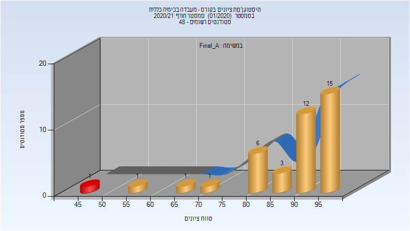

| סטודנטים | עברו/נכשלו | אחוז עוברים | ציון מינימלי | ציון מקסימלי | ממוצע | חציון |
| ---- | ---- | ---- | ---- | ---- | ---- | ---- |
| 39 | 38/1 | 97 | 48 | 99 | 88.974 | 93 |

### סופי

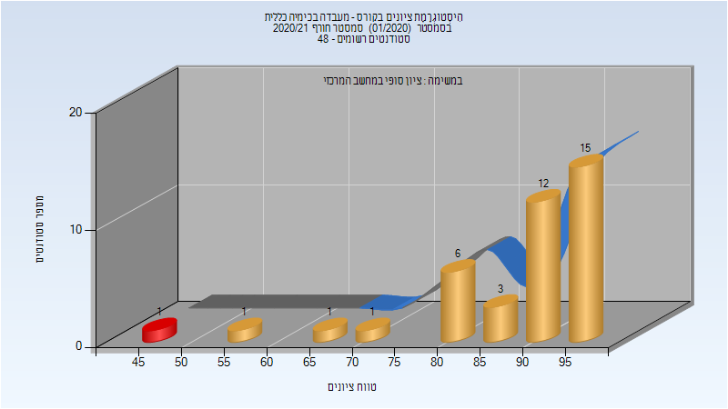

| סטודנטים | עברו/נכשלו | אחוז עוברים | ציון מינימלי | ציון מקסימלי | ממוצע | חציון |
| ---- | ---- | ---- | ---- | ---- | ---- | ---- |
| 39 | 38/1 | 97 | 48 | 99 | 88.974 | 93 |

