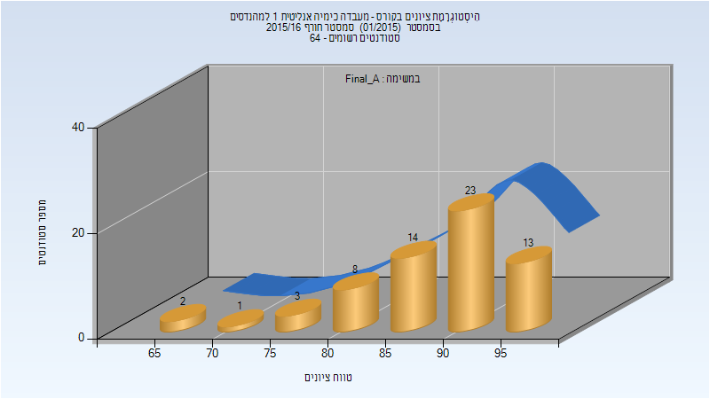
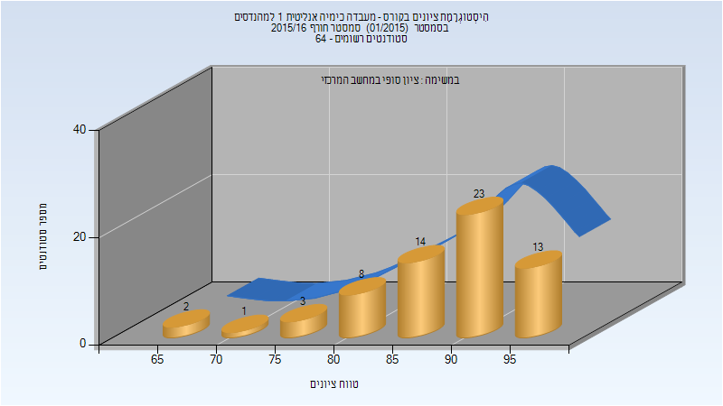
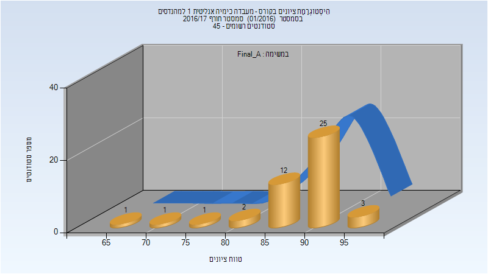
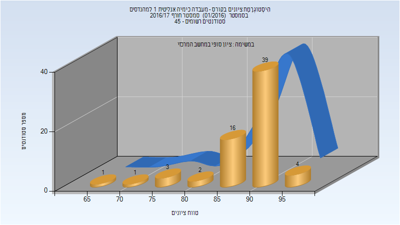
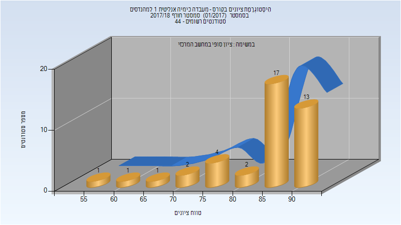
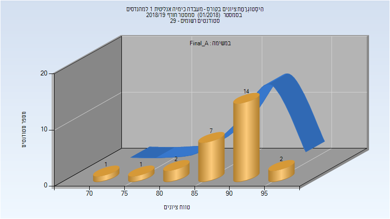
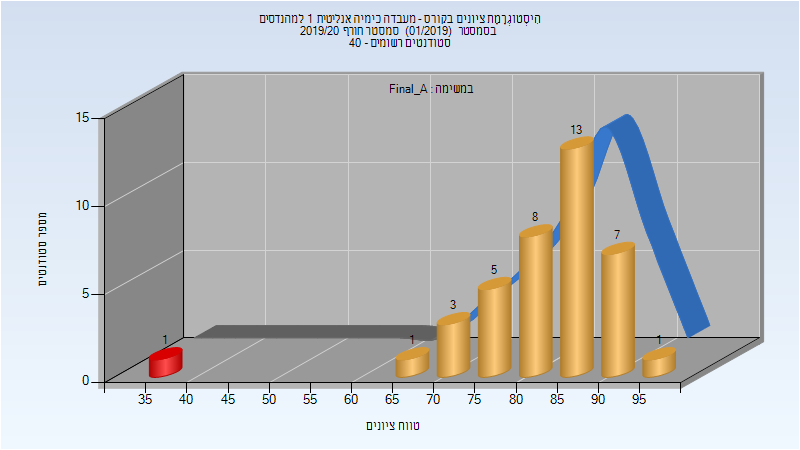
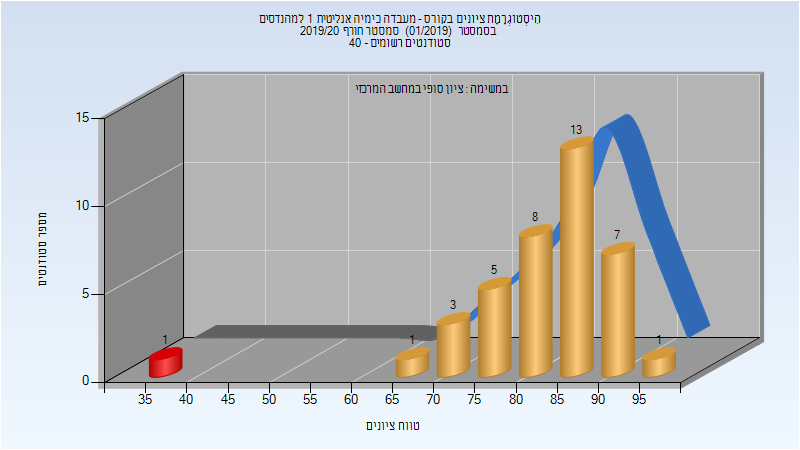

# 125102 - מעבדה כימיה אנליטית 1 למהנדסים

## חורף 2015-2016

| איש סגל | תפקיד |
| ---- | ---- |
| בלנק אהרן | מרצה - אחראי מקצוע |

### סופי מועד א'

| סטודנטים | עברו/נכשלו | אחוז עוברים | ציון מינימלי | ציון מקסימלי | ממוצע | חציון |
| ---- | ---- | ---- | ---- | ---- | ---- | ---- |
| 64 | 64/0 | 100 | 69 | 97 | 88.859 | 90 |

### סופי

| סטודנטים | עברו/נכשלו | אחוז עוברים | ציון מינימלי | ציון מקסימלי | ממוצע | חציון |
| ---- | ---- | ---- | ---- | ---- | ---- | ---- |
| 64 | 64/0 | 100 | 69 | 97 | 88.859 | 90 |

## חורף 2016-2017

| איש סגל | תפקיד |
| ---- | ---- |
| בלנק אהרן | מרצה - אחראי מקצוע |
| עבד אלהאדי מיכאל |  |
| גולדשטיין יוליה |  |
| הרוש עדי |  |
| גלנט אור |  |
| יוחנובסקי אנה |  |
| פרשל מאיה |  |
| מקרוב קונסטנטין |  |
| פרי-גל אפרת |  |
| לנדאו ילנה |  |

### סופי מועד א'

| סטודנטים | עברו/נכשלו | אחוז עוברים | ציון מינימלי | ציון מקסימלי | ממוצע | חציון |
| ---- | ---- | ---- | ---- | ---- | ---- | ---- |
| 45 | 45/0 | 100 | 66 | 96 | 89.311 | 91 |

### סופי

| סטודנטים | עברו/נכשלו | אחוז עוברים | ציון מינימלי | ציון מקסימלי | ממוצע | חציון |
| ---- | ---- | ---- | ---- | ---- | ---- | ---- |
| 66 | 66/0 | 100 | 66 | 96 | 89.424 | 91 |

## חורף 2017-2018

| איש סגל | תפקיד |
| ---- | ---- |
| בלנק אהרן | מדריך מעבדה - עם הרשאות מרצה אחראי |
| עבד אלהאדי מיכאל |  |
| זלמן בת-חן |  |
| גולדשטיין יוליה |  |
| לוי חרות |  |
| סויסה שלייף מעיין |  |
| יוחנובסקי אנה |  |
| איזנברג דוד |  |
| לפס שי |  |
| בר צבי שירה |  |
| מסללם מונא |  |

### סופי מועד א'

| סטודנטים | עברו/נכשלו | אחוז עוברים | ציון מינימלי | ציון מקסימלי | ממוצע | חציון |
| ---- | ---- | ---- | ---- | ---- | ---- | ---- |
| 41 | 41/0 | 100 | 56 | 94 | 85.073 | 89 |

### סופי

| סטודנטים | עברו/נכשלו | אחוז עוברים | ציון מינימלי | ציון מקסימלי | ממוצע | חציון |
| ---- | ---- | ---- | ---- | ---- | ---- | ---- |
| 41 | 41/0 | 100 | 56 | 94 | 85.073 | 89 |

## חורף 2018-2019

| איש סגל | תפקיד |
| ---- | ---- |
| איזנברג דוד | מרצה - אחראי מקצוע |
| מסללם מונא | מדריך מעבדה |
| בר צבי שירה | מדריך מעבדה |
| לוצקי איתי | מדריך מעבדה |
| סויסה שלייף מעיין | מדריך מעבדה |

### סופי מועד א'

| סטודנטים | עברו/נכשלו | אחוז עוברים | ציון מינימלי | ציון מקסימלי | ממוצע | חציון |
| ---- | ---- | ---- | ---- | ---- | ---- | ---- |
| 27 | 27/0 | 100 | 73.977 | 96.686 | 89.712 | 90.9 |

### סופי

| סטודנטים | עברו/נכשלו | אחוז עוברים | ציון מינימלי | ציון מקסימלי | ממוצע | חציון |
| ---- | ---- | ---- | ---- | ---- | ---- | ---- |
| 27 | 27/0 | 100 | 74 | 97 | 89.704 | 91 |

## חורף 2019-2020

| איש סגל | תפקיד |
| ---- | ---- |
| איזנברג דוד | מדריך מעבדה - עם הרשאות מרצה אחראי |
| סקליאר ג'ניה | מדריך מעבדה |
| לפס שי | מדריך מעבדה |
| מסללם מונא | מדריך מעבדה |
| שויחט חגית | מדריך מעבדה |
| טולדו הילה | מדריך מעבדה |
| עבד אלהאדי מיכאל | מדריך מעבדה |
| ליבוביץ ליאב | מדריך מעבדה |

### סופי מועד א'

| סטודנטים | עברו/נכשלו | אחוז עוברים | ציון מינימלי | ציון מקסימלי | ממוצע | חציון |
| ---- | ---- | ---- | ---- | ---- | ---- | ---- |
| 39 | 38/1 | 97 | 38 | 95 | 82.846 | 85 |

### סופי

| סטודנטים | עברו/נכשלו | אחוז עוברים | ציון מינימלי | ציון מקסימלי | ממוצע | חציון |
| ---- | ---- | ---- | ---- | ---- | ---- | ---- |
| 39 | 38/1 | 97 | 38 | 95 | 82.846 | 85 |

