# 125801 - כימיה אורגנית

## אביב 2010

| איש סגל | תפקיד |
| ---- | ---- |
| סמעאן סמאח | מרצה - אחראי מקצוע |

### סופי מועד א'

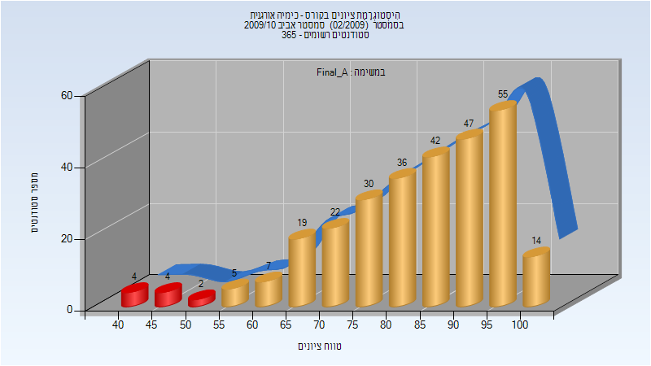

| סטודנטים | עברו/נכשלו | אחוז עוברים | ציון מינימלי | ציון מקסימלי | ממוצע | חציון |
| ---- | ---- | ---- | ---- | ---- | ---- | ---- |
| 287 | 277/10 | 97 | 42 | 100 | 83.718 | 86 |

### סופי מועד ב'

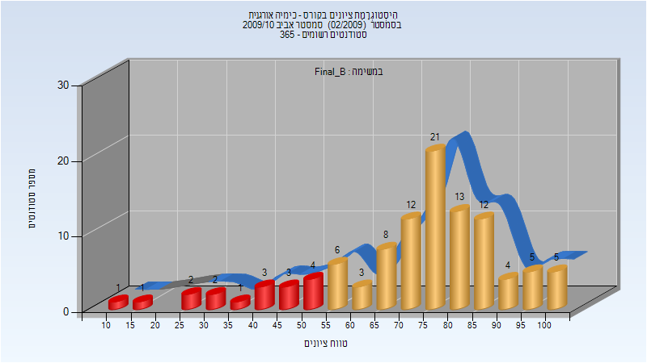

| סטודנטים | עברו/נכשלו | אחוז עוברים | ציון מינימלי | ציון מקסימלי | ממוצע | חציון |
| ---- | ---- | ---- | ---- | ---- | ---- | ---- |
| 106 | 89/17 | 84 | 10 | 100 | 72.349 | 76 |

## אביב 2011

### סופי מועד א'

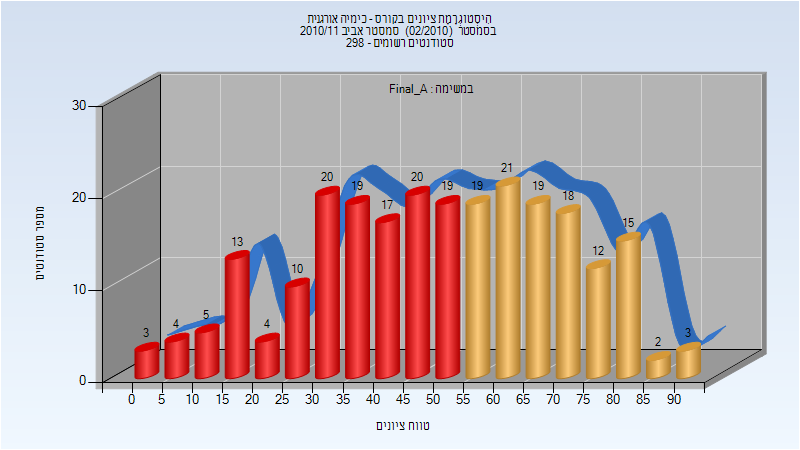

| סטודנטים | עברו/נכשלו | אחוז עוברים | ציון מינימלי | ציון מקסימלי | ממוצע | חציון |
| ---- | ---- | ---- | ---- | ---- | ---- | ---- |
| 243 | 109/134 | 45 | 0 | 94 | 50.267 | 51 |

### סופי מועד ב'

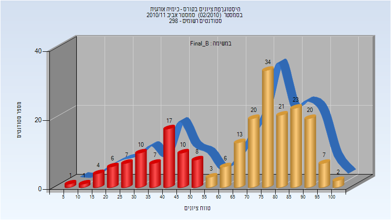

| סטודנטים | עברו/נכשלו | אחוז עוברים | ציון מינימלי | ציון מקסימלי | ממוצע | חציון |
| ---- | ---- | ---- | ---- | ---- | ---- | ---- |
| 220 | 149/71 | 68 | 5 | 100 | 66 | 74 |

## אביב 2012

### מבחן מועד א'

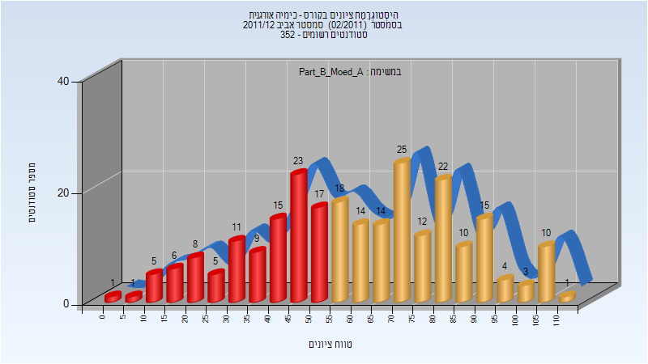

| סטודנטים | עברו/נכשלו | אחוז עוברים | ציון מינימלי | ציון מקסימלי | ממוצע | חציון |
| ---- | ---- | ---- | ---- | ---- | ---- | ---- |
| 249 | 148/101 | 59 | 2 | 111 | 61.157 | 60 |

### סופי מועד ב'

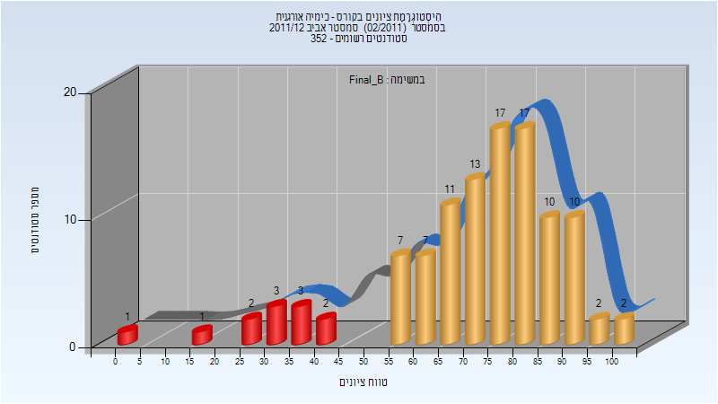

| סטודנטים | עברו/נכשלו | אחוז עוברים | ציון מינימלי | ציון מקסימלי | ממוצע | חציון |
| ---- | ---- | ---- | ---- | ---- | ---- | ---- |
| 108 | 96/12 | 89 | 2 | 100 | 71.843 | 75 |

## אביב 2014

| איש סגל | תפקיד |
| ---- | ---- |
| מעיין גליה | מרצה - אחראי מקצוע |
| גרציקוב יוליה | מתרגל |
| וינשטיין זבר ליבי | מתרגל |
| פרברי גלית ורד | מתרגל |
| שפירא רעות | מתרגל |
| מלצמן שי | מתרגל |
| ילקין טטיאנה | מתרגל |
| סיביליה שגיא | מתרגל |

### מבחן מועד א'

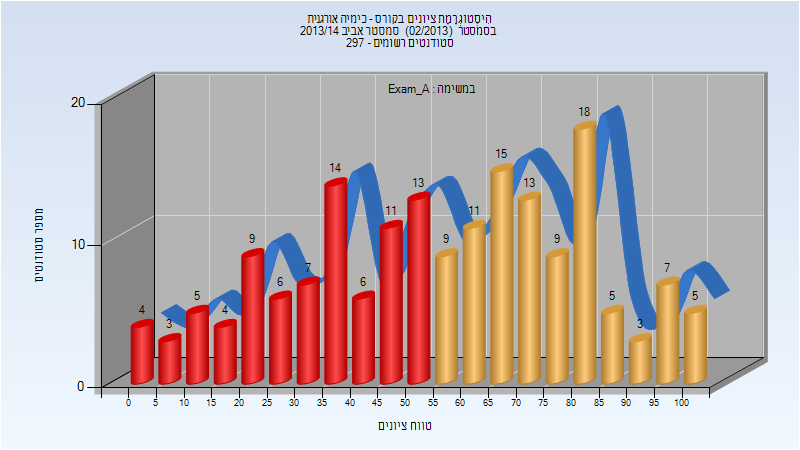

| סטודנטים | עברו/נכשלו | אחוז עוברים | ציון מינימלי | ציון מקסימלי | ממוצע | חציון |
| ---- | ---- | ---- | ---- | ---- | ---- | ---- |
| 177 | 95/82 | 54 | 1 | 103 | 55.963 | 58 |

### סופי מועד א'

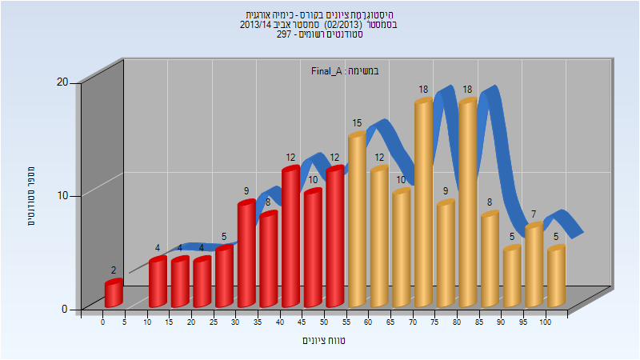

| סטודנטים | עברו/נכשלו | אחוז עוברים | ציון מינימלי | ציון מקסימלי | ממוצע | חציון |
| ---- | ---- | ---- | ---- | ---- | ---- | ---- |
| 177 | 107/70 | 60 | 2 | 100 | 59.955 | 62 |

### סופי מועד ב'

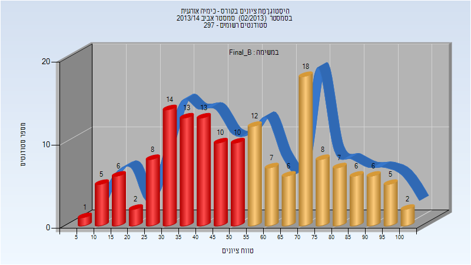

| סטודנטים | עברו/נכשלו | אחוז עוברים | ציון מינימלי | ציון מקסימלי | ממוצע | חציון |
| ---- | ---- | ---- | ---- | ---- | ---- | ---- |
| 159 | 77/82 | 48 | 9 | 100 | 54.484 | 54 |

## אביב 2015

| איש סגל | תפקיד |
| ---- | ---- |
| שוכן דנה | מתרגל |
| סיביליה שגיא | מתרגל |
| פרברי גלית ורד | מתרגל |
| סול מתן | מתרגל |
| אישן יואב | מרצה - אחראי מקצוע |
| גרציקוב יוליה | מתרגל - עם הרשאות מרצה אחראי |

### מבחן מועד א'

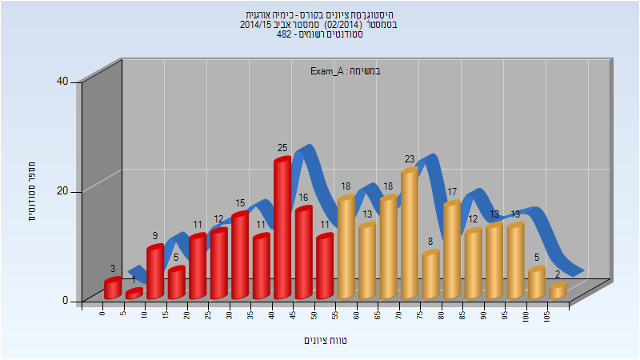

| סטודנטים | עברו/נכשלו | אחוז עוברים | ציון מינימלי | ציון מקסימלי | ממוצע | חציון |
| ---- | ---- | ---- | ---- | ---- | ---- | ---- |
| 261 | 142/119 | 54 | 0 | 109 | 57.352 | 58 |

### סופי מועד א'

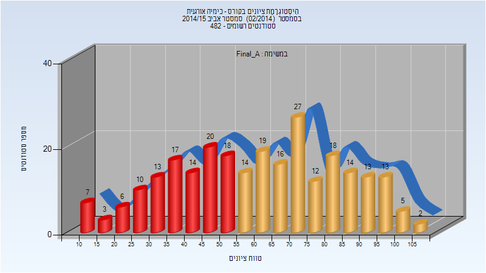

| סטודנטים | עברו/נכשלו | אחוז עוברים | ציון מינימלי | ציון מקסימלי | ממוצע | חציון |
| ---- | ---- | ---- | ---- | ---- | ---- | ---- |
| 261 | 153/108 | 59 | 11 | 109 | 60.743 | 61 |

### מבחן מועד ב'

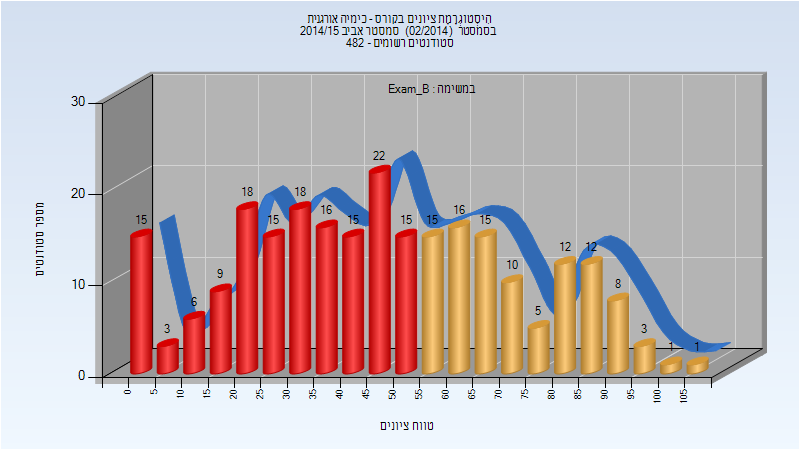

| סטודנטים | עברו/נכשלו | אחוז עוברים | ציון מינימלי | ציון מקסימלי | ממוצע | חציון |
| ---- | ---- | ---- | ---- | ---- | ---- | ---- |
| 250 | 98/152 | 39 | 0 | 106 | 47.408 | 47 |

### סופי מועד ב'

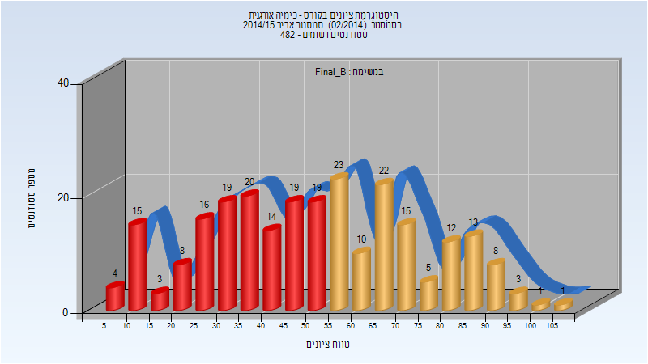

| סטודנטים | עברו/נכשלו | אחוז עוברים | ציון מינימלי | ציון מקסימלי | ממוצע | חציון |
| ---- | ---- | ---- | ---- | ---- | ---- | ---- |
| 250 | 113/137 | 45 | 8 | 106 | 51.656 | 51.5 |

### סופי

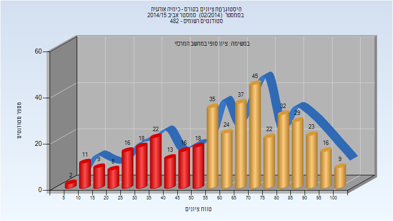

| סטודנטים | עברו/נכשלו | אחוז עוברים | ציון מינימלי | ציון מקסימלי | ממוצע | חציון |
| ---- | ---- | ---- | ---- | ---- | ---- | ---- |
| 405 | 272/133 | 67 | 8 | 100 | 62.116 | 66 |

## אביב 2016

| איש סגל | תפקיד |
| ---- | ---- |
| אייזן מוריס | מרצה - אחראי מקצוע |
| לוי מורן | מתרגל |
| גרציקוב יוליה | מתרגל |
| וינשטיין זבר ליבי | מתרגל |
| שפירא רעות | מתרגל |
| דנטוס מאוריסיו | מתרגל |
| סיביליה שגיא | מתרגל |
| שטנגר אמנון | מרצה |
| בריל אדם | מתרגל |

### מבחן מועד א'

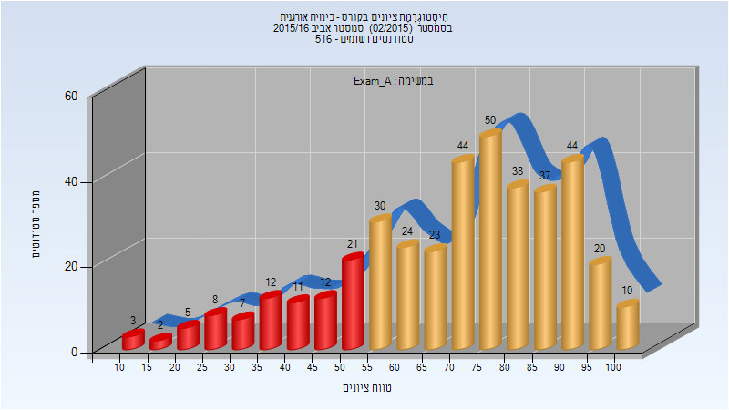

| סטודנטים | עברו/נכשלו | אחוז עוברים | ציון מינימלי | ציון מקסימלי | ממוצע | חציון |
| ---- | ---- | ---- | ---- | ---- | ---- | ---- |
| 401 | 320/81 | 80 | 10 | 100 | 70.586 | 74 |

### סופי מועד א'

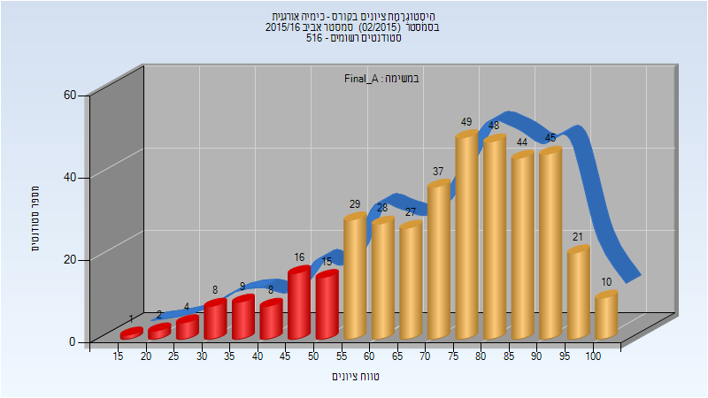

| סטודנטים | עברו/נכשלו | אחוז עוברים | ציון מינימלי | ציון מקסימלי | ממוצע | חציון |
| ---- | ---- | ---- | ---- | ---- | ---- | ---- |
| 401 | 338/63 | 84 | 18 | 100 | 72.908 | 76 |

### מבחן מועד ב'

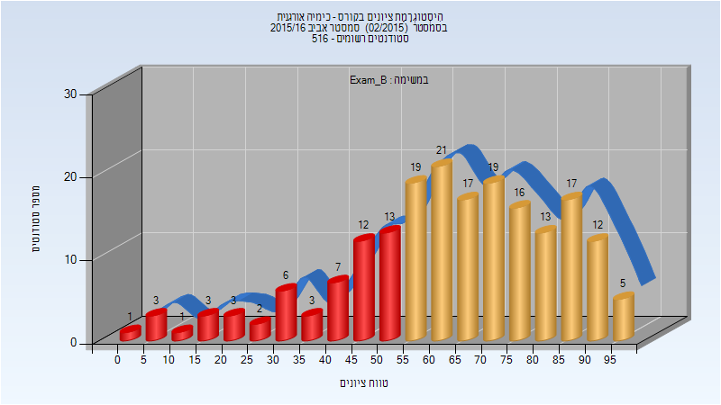

| סטודנטים | עברו/נכשלו | אחוז עוברים | ציון מינימלי | ציון מקסימלי | ממוצע | חציון |
| ---- | ---- | ---- | ---- | ---- | ---- | ---- |
| 193 | 139/54 | 72 | 4 | 98 | 63.606 | 65 |

### סופי מועד ב'

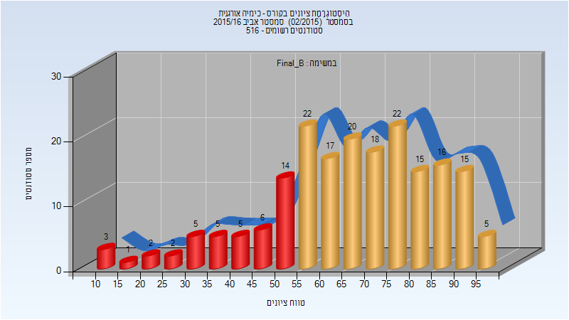

| סטודנטים | עברו/נכשלו | אחוז עוברים | ציון מינימלי | ציון מקסימלי | ממוצע | חציון |
| ---- | ---- | ---- | ---- | ---- | ---- | ---- |
| 193 | 150/43 | 78 | 10 | 98 | 66.399 | 68 |

### סופי

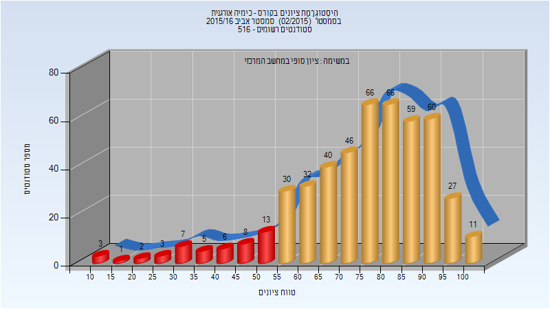

| סטודנטים | עברו/נכשלו | אחוז עוברים | ציון מינימלי | ציון מקסימלי | ממוצע | חציון |
| ---- | ---- | ---- | ---- | ---- | ---- | ---- |
| 485 | 437/48 | 90 | 10 | 100 | 75.177 | 78 |

## אביב 2017

| איש סגל | תפקיד |
| ---- | ---- |
| בריק אשרף | מרצה - אחראי מקצוע |
| שטנגר אמנון | מרצה |
| פרברי גלית ורד | מרצה |
| עיד עימאד | מתרגל - עם הרשאות מרצה אחראי |
| ארטיאן אלכס | מתרגל - עם הרשאות מרצה אחראי |
| כהן יאיר | מתרגל - עם הרשאות מרצה אחראי |
| סיביליה שגיא | מתרגל - עם הרשאות מרצה אחראי |
| לוי אבישי | מתרגל - עם הרשאות מרצה אחראי |

### מבחן מועד א'

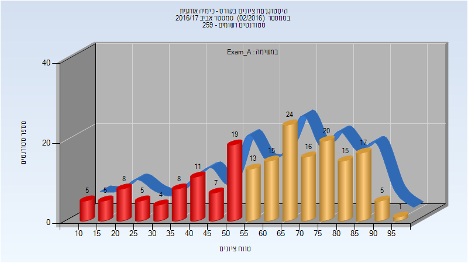

| סטודנטים | עברו/נכשלו | אחוז עוברים | ציון מינימלי | ציון מקסימלי | ממוצע | חציון |
| ---- | ---- | ---- | ---- | ---- | ---- | ---- |
| 198 | 126/72 | 64 | 10 | 95 | 59.879 | 64 |

### סופי מועד א'

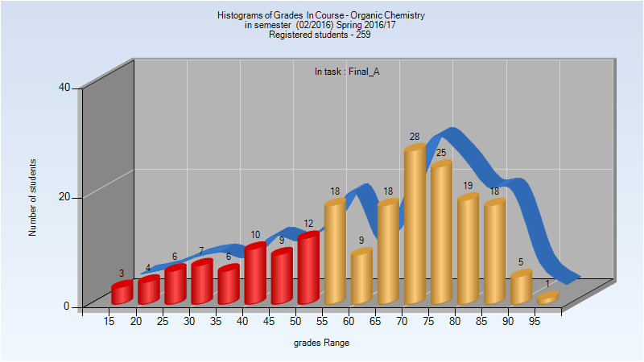

| סטודנטים | עברו/נכשלו | אחוז עוברים | ציון מינימלי | ציון מקסימלי | ממוצע | חציון |
| ---- | ---- | ---- | ---- | ---- | ---- | ---- |
| 198 | 141/57 | 71 | 18 | 95 | 63.722 | 68 |

### מבחן מועד ב'

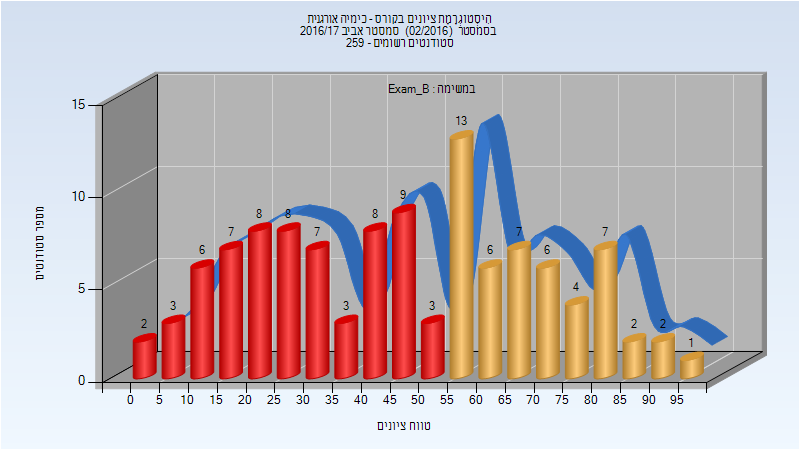

| סטודנטים | עברו/נכשלו | אחוז עוברים | ציון מינימלי | ציון מקסימלי | ממוצע | חציון |
| ---- | ---- | ---- | ---- | ---- | ---- | ---- |
| 112 | 48/64 | 43 | 2 | 95 | 46.509 | 48 |

### סופי מועד ב'

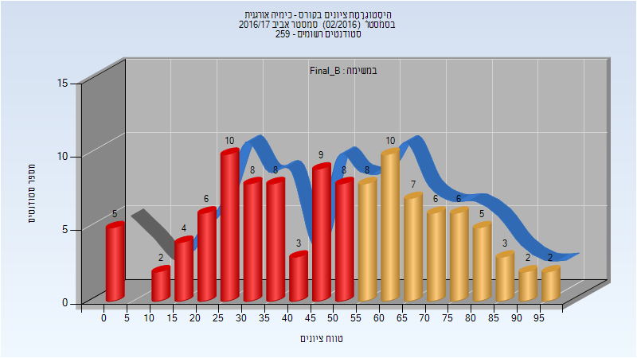

| סטודנטים | עברו/נכשלו | אחוז עוברים | ציון מינימלי | ציון מקסימלי | ממוצע | חציון |
| ---- | ---- | ---- | ---- | ---- | ---- | ---- |
| 112 | 49/63 | 44 | 0 | 95 | 49.277 | 52 |

### סופי

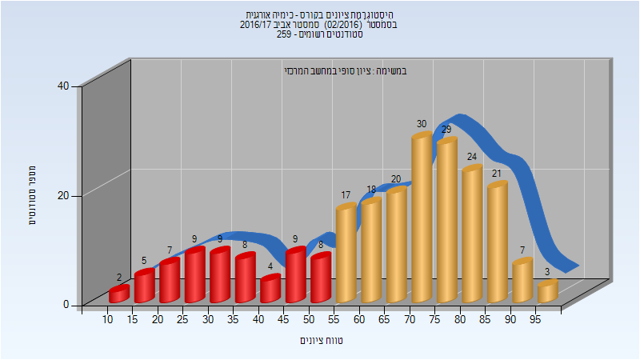

| סטודנטים | עברו/נכשלו | אחוז עוברים | ציון מינימלי | ציון מקסימלי | ממוצע | חציון |
| ---- | ---- | ---- | ---- | ---- | ---- | ---- |
| 230 | 169/61 | 73 | 11 | 95 | 63.639 | 69 |

## אביב 2018

| איש סגל | תפקיד |
| ---- | ---- |
| בריק אשרף | מרצה - אחראי מקצוע |
| פרברי גלית ורד | מרצה |
| פוגורצלב אלה | מרצה |
| סיביליה שגיא | מתרגל - עם הרשאות מרצה אחראי |
| כהן יאיר | מתרגל - עם הרשאות מרצה אחראי |
| לוי אבישי | מתרגל - עם הרשאות מרצה אחראי |
| מעודה אסף | מתרגל - עם הרשאות מרצה אחראי |
| עיד עימאד | מתרגל - עם הרשאות מרצה אחראי |

### סופי מועד א'

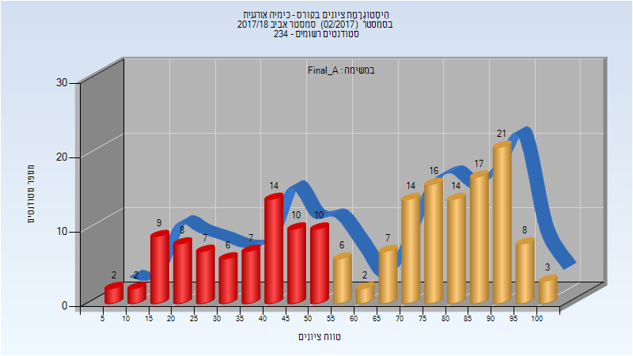

| סטודנטים | עברו/נכשלו | אחוז עוברים | ציון מינימלי | ציון מקסימלי | ממוצע | חציון |
| ---- | ---- | ---- | ---- | ---- | ---- | ---- |
| 183 | 108/75 | 59 | 6 | 100 | 62.191 | 70 |

### סופי מועד ב'

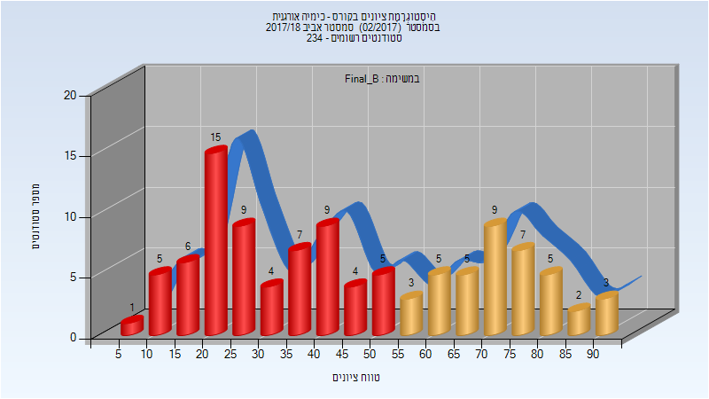

| סטודנטים | עברו/נכשלו | אחוז עוברים | ציון מינימלי | ציון מקסימלי | ממוצע | חציון |
| ---- | ---- | ---- | ---- | ---- | ---- | ---- |
| 104 | 39/65 | 38 | 7 | 92 | 46.356 | 42 |

### סופי

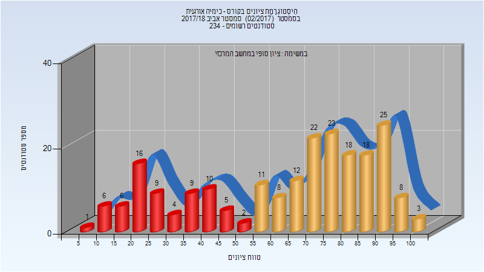

| סטודנטים | עברו/נכשלו | אחוז עוברים | ציון מינימלי | ציון מקסימלי | ממוצע | חציון |
| ---- | ---- | ---- | ---- | ---- | ---- | ---- |
| 216 | 148/68 | 69 | 7 | 100 | 63.412 | 72 |

## אביב 2019

| איש סגל | תפקיד |
| ---- | ---- |
| בריק אשרף | מרצה - אחראי מקצוע |
| אייזן מוריס | מרצה |
| פרברי גלית ורד | מרצה |
| לוי מורן | מתרגל - עם הרשאות מרצה אחראי |
| כהן אנטוני | מתרגל |
| לוי אבישי | מתרגל |
| עיד עימאד | מתרגל |
| סיביליה שגיא | מתרגל |
| שפירא רעות | מתרגל |

### סופי מועד א'

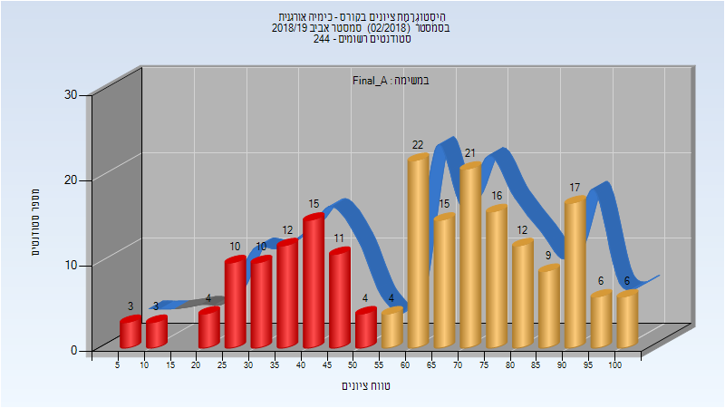

| סטודנטים | עברו/נכשלו | אחוז עוברים | ציון מינימלי | ציון מקסימלי | ממוצע | חציון |
| ---- | ---- | ---- | ---- | ---- | ---- | ---- |
| 200 | 128/72 | 64 | 5 | 100 | 61.915 | 65 |

### סופי מועד ב'

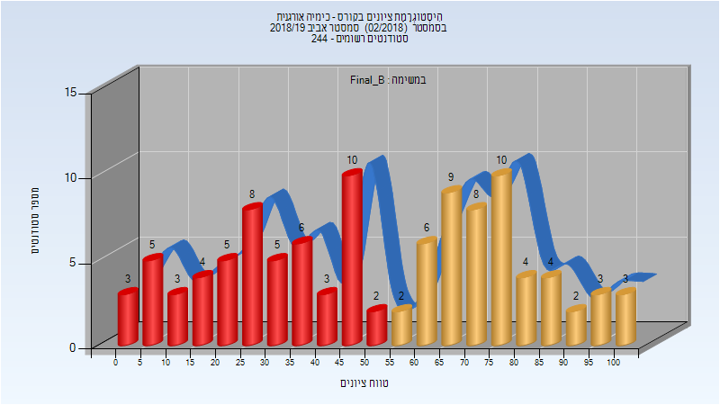

| סטודנטים | עברו/נכשלו | אחוז עוברים | ציון מינימלי | ציון מקסימלי | ממוצע | חציון |
| ---- | ---- | ---- | ---- | ---- | ---- | ---- |
| 105 | 51/54 | 49 | 2 | 100 | 51.853 | 50 |

### סופי

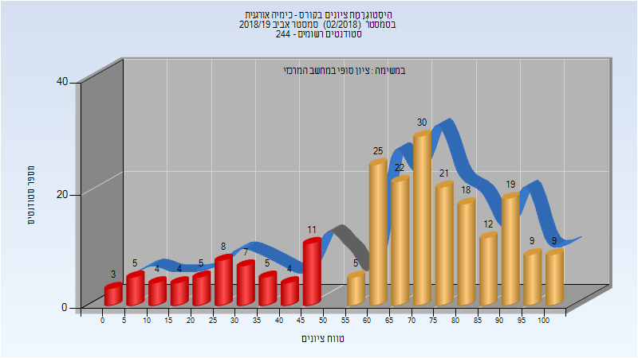

| סטודנטים | עברו/נכשלו | אחוז עוברים | ציון מינימלי | ציון מקסימלי | ממוצע | חציון |
| ---- | ---- | ---- | ---- | ---- | ---- | ---- |
| 226 | 170/56 | 75 | 2 | 100 | 65.027 | 70 |

## אביב 2020

| איש סגל | תפקיד |
| ---- | ---- |
| בריק אשרף | מרצה - אחראי מקצוע |
| פרברי גלית ורד | מרצה |
| אייזן מוריס | מרצה |
| שפירא רעות | מתרגל - עם הרשאות מרצה אחראי |
| כהן יאיר | מתרגל |
| עיד עימאד | מתרגל |
| כהן אנטוני | מתרגל |

### מבחן מועד א'

| סטודנטים | עברו/נכשלו | אחוז עוברים | ציון מינימלי | ציון מקסימלי | ממוצע | חציון |
| ---- | ---- | ---- | ---- | ---- | ---- | ---- |
| 149 | 97/52 | 65 | 10 | 105 | 63.718 | 67 |

### סופי מועד א'

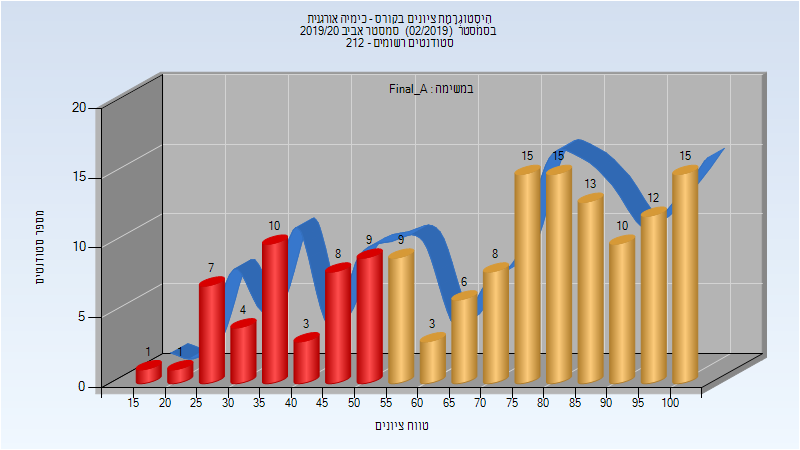

| סטודנטים | עברו/נכשלו | אחוז עוברים | ציון מינימלי | ציון מקסימלי | ממוצע | חציון |
| ---- | ---- | ---- | ---- | ---- | ---- | ---- |
| 149 | 106/43 | 71 | 15 | 100 | 70.06 | 77 |

### מבחן מועד ב'

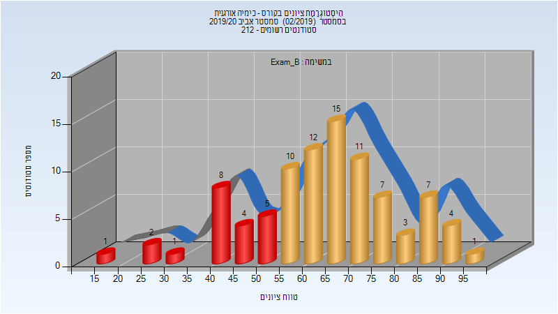

| סטודנטים | עברו/נכשלו | אחוז עוברים | ציון מינימלי | ציון מקסימלי | ממוצע | חציון |
| ---- | ---- | ---- | ---- | ---- | ---- | ---- |
| 91 | 70/21 | 77 | 15 | 95 | 62.363 | 65 |

### סופי מועד ב'

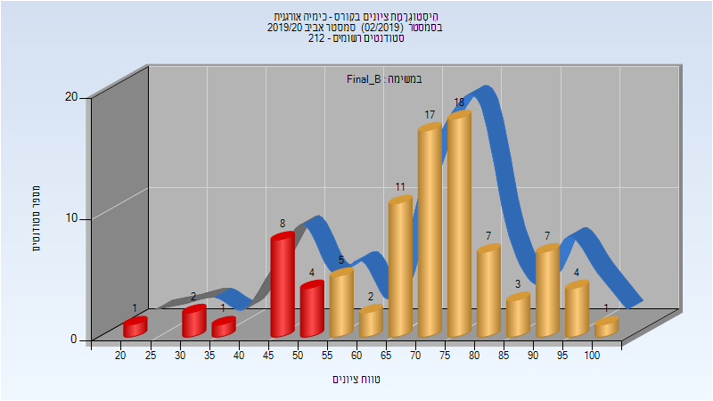

| סטודנטים | עברו/נכשלו | אחוז עוברים | ציון מינימלי | ציון מקסימלי | ממוצע | חציון |
| ---- | ---- | ---- | ---- | ---- | ---- | ---- |
| 91 | 75/16 | 82 | 20 | 100 | 69.868 | 73 |

### סופי

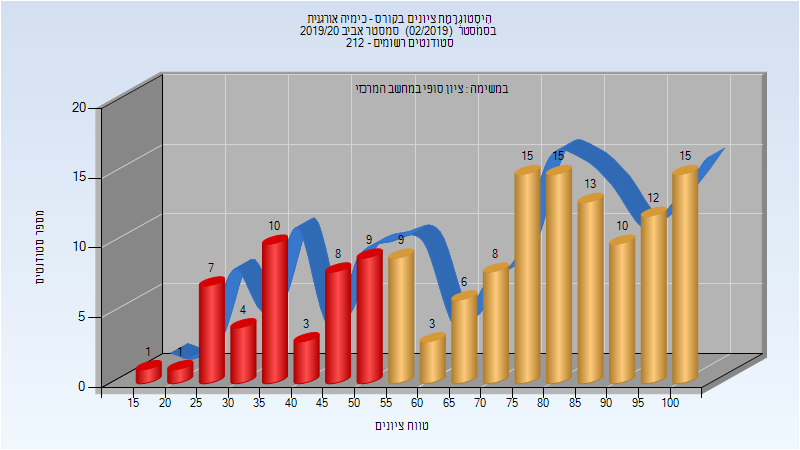

| סטודנטים | עברו/נכשלו | אחוז עוברים | ציון מינימלי | ציון מקסימלי | ממוצע | חציון |
| ---- | ---- | ---- | ---- | ---- | ---- | ---- |
| 190 | 171/19 | 90 | 15 | 100 | 77.169 | 79 |

