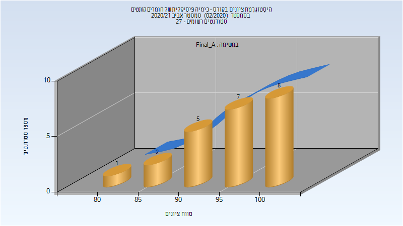

# 127451 - כימיה פיסיקלית של חומרים קוונטים

## אביב 2021

| איש סגל | תפקיד |
| ---- | ---- |
| ליפשיץ אפרת | מרצה - אחראי מקצוע |

### סופי מועד א'

| סטודנטים | עברו/נכשלו | אחוז עוברים | ציון מינימלי | ציון מקסימלי | ממוצע | חציון |
| ---- | ---- | ---- | ---- | ---- | ---- | ---- |
| 21 | 21/0 | 100 | 80 | 100 | 93.81 | 95 |

