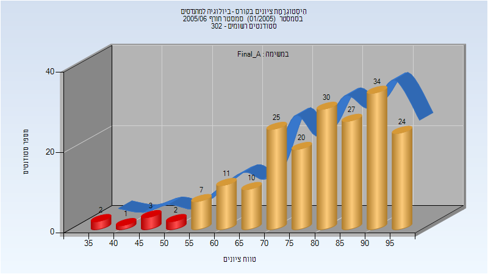
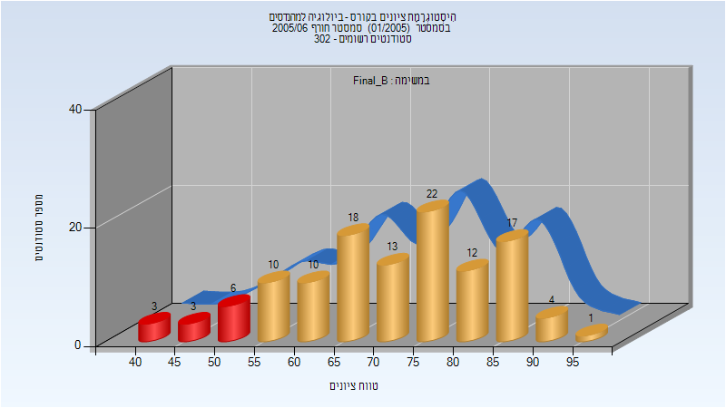

# 134010 - ביולוגיה למהנדסים

## חורף 2005-2006

| איש סגל | תפקיד |
| ---- | ---- |
| אסרף יהודה | מרצה - אחראי מקצוע |

### סופי מועד א'

| סטודנטים | עברו/נכשלו | אחוז עוברים | ציון מינימלי | ציון מקסימלי | ממוצע | חציון |
| ---- | ---- | ---- | ---- | ---- | ---- | ---- |
| 196 | 188/8 | 96 | 38 | 98 | 79.694 | 83 |

### סופי מועד ב'

| סטודנטים | עברו/נכשלו | אחוז עוברים | ציון מינימלי | ציון מקסימלי | ממוצע | חציון |
| ---- | ---- | ---- | ---- | ---- | ---- | ---- |
| 119 | 107/12 | 90 | 40 | 95 | 71.378 | 73 |

