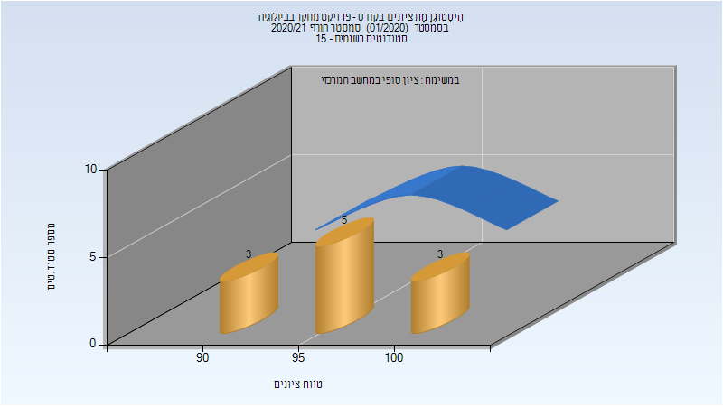

# 134049 - פרויקט מחקר בביולוגיה

**הערה**: מאגר ההיסטוגרמות הוקם עבור [CheeseFork](https://cheesefork.cf/), כלי בניית מערכת שעות עבור סטודנטים בטכניון. באתר בו אתם גולשים ניתן לעיין בהיסטוגרמות, אך הדרך היותר נוחה היא לעיין בהיסטוגרמות, ובמידע נוסף כגון חוות דעת של סטודנטים, באתר CheeseFork.

* [אביב 2022](#202102)
* [חורף 2021-2022](#202101)
* [חורף 2020-2021](#202001)
  * [סופי](#202001-Finals)
* [אביב 2020](#201902)
* [חורף 2019-2020](#201901)
* [אביב 2019](#201802)
* [חורף 2017-2018](#201701)

<h2 id="202102">אביב 2022</h2>

<h2 id="202101">חורף 2021-2022</h2>

<h2 id="202001">חורף 2020-2021</h2>

| איש סגל | תפקיד |
| ---- | ---- |
| קפלן אריאל | מדריך מעבדה - עם הרשאות מרצה אחראי |

<h3 id="202001-Finals">סופי</h3>

| סטודנטים | עברו/נכשלו | אחוז עוברים | ציון מינימלי | ציון מקסימלי | ממוצע | חציון |
| ---- | ---- | ---- | ---- | ---- | ---- | ---- |
| 11 | 11/0 | 100 | 93 | 100 | 96.636 | 95 |

<h2 id="201902">אביב 2020</h2>

<h2 id="201901">חורף 2019-2020</h2>

<h2 id="201802">אביב 2019</h2>

<h2 id="201701">חורף 2017-2018</h2>

