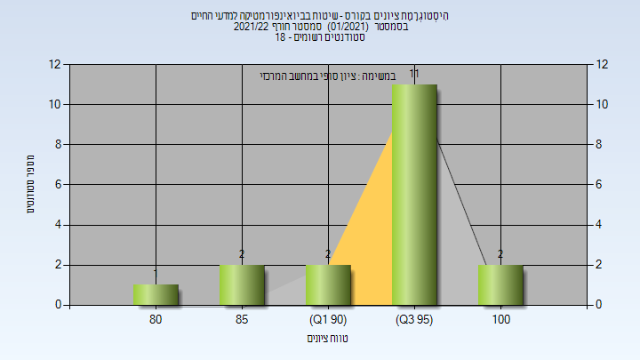

# 134158 - שיטות בביואינפורמטיקה למדעי החיים

## חורף 2021-2022

| איש סגל | תפקיד |
| ---- | ---- |
| מנדל-גוטפרוי יעל | מרצה - אחראי מקצוע |
| שליו דור | מתרגל - עם הרשאות מרצה אחראי |

### סופי

| סטודנטים | עברו/נכשלו | אחוז עוברים | ציון מינימלי | ציון מקסימלי | ממוצע | חציון |
| ---- | ---- | ---- | ---- | ---- | ---- | ---- |
| 18 | 18/0 | 100 | 83 | 100 | 94.167 | 95 |

