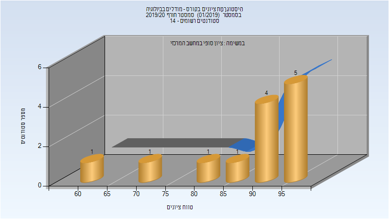

# 136042 - מודלים בביולוגיה

## חורף 2019-2020

| איש סגל | תפקיד |
| ---- | ---- |
| שמש תום | מרצה - אחראי מקצוע |

### סופי

| סטודנטים | עברו/נכשלו | אחוז עוברים | ציון מינימלי | ציון מקסימלי | ממוצע | חציון |
| ---- | ---- | ---- | ---- | ---- | ---- | ---- |
| 13 | 13/0 | 100 | 60 | 98 | 88.462 | 92 |

