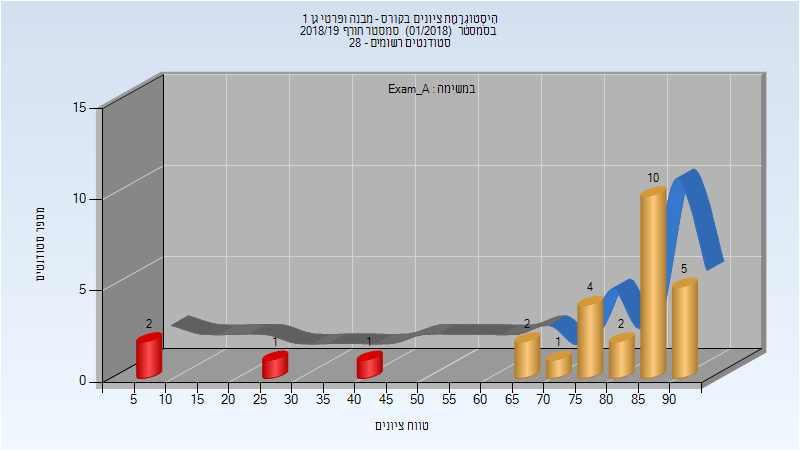
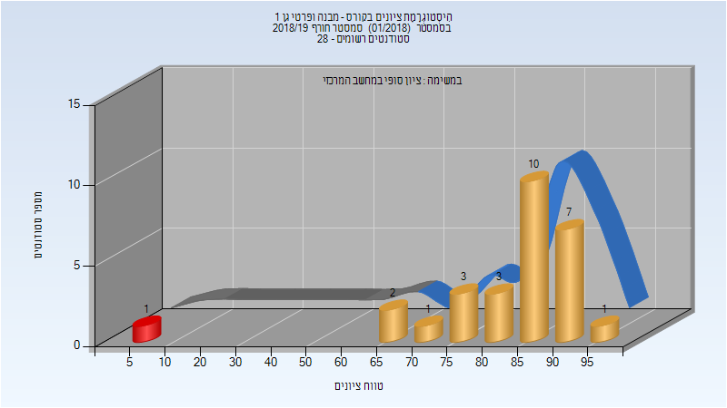
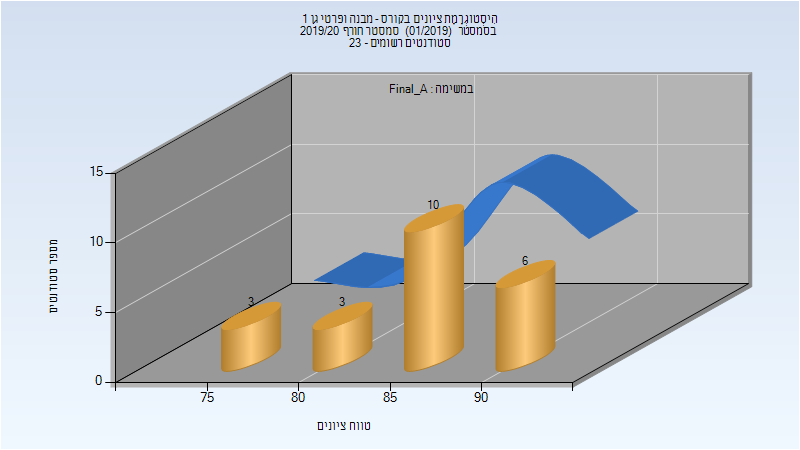
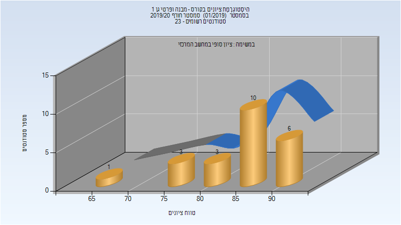
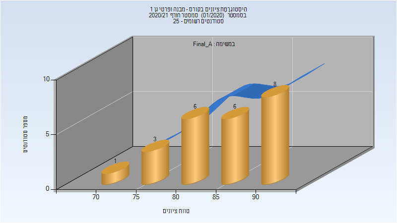

# 204005 - מבנה ופרטי גן 1

## חורף 2018-2019

| איש סגל | תפקיד |
| ---- | ---- |
| חבצלת יונתן | מרצה - אחראי מקצוע |
| ביטון מיכל | מרצה |

### מבחן מועד א'

| סטודנטים | עברו/נכשלו | אחוז עוברים | ציון מינימלי | ציון מקסימלי | ממוצע | חציון |
| ---- | ---- | ---- | ---- | ---- | ---- | ---- |
| 28 | 24/4 | 86 | 7 | 92 | 74.5 | 85 |

### סופי מועד א'

| סטודנטים | עברו/נכשלו | אחוז עוברים | ציון מינימלי | ציון מקסימלי | ממוצע | חציון |
| ---- | ---- | ---- | ---- | ---- | ---- | ---- |
| 28 | 24/4 | 86 | 7 | 92 | 74.5 | 85 |

### סופי

| סטודנטים | עברו/נכשלו | אחוז עוברים | ציון מינימלי | ציון מקסימלי | ממוצע | חציון |
| ---- | ---- | ---- | ---- | ---- | ---- | ---- |
| 28 | 27/1 | 96 | 8 | 95 | 82.357 | 88 |

## חורף 2019-2020

| איש סגל | תפקיד |
| ---- | ---- |
| חבצלת יונתן | מרצה - אחראי מקצוע |
| ביטון מיכל | מרצה |

### סופי מועד א'

| סטודנטים | עברו/נכשלו | אחוז עוברים | ציון מינימלי | ציון מקסימלי | ממוצע | חציון |
| ---- | ---- | ---- | ---- | ---- | ---- | ---- |
| 22 | 22/0 | 100 | 76 | 93 | 86.955 | 88.5 |

### סופי

| סטודנטים | עברו/נכשלו | אחוז עוברים | ציון מינימלי | ציון מקסימלי | ממוצע | חציון |
| ---- | ---- | ---- | ---- | ---- | ---- | ---- |
| 23 | 23/0 | 100 | 65 | 93 | 86 | 88 |

## חורף 2020-2021

| איש סגל | תפקיד |
| ---- | ---- |
| חבצלת יונתן | מרצה - אחראי מקצוע |
| צלניק ירון | מרצה |

### סופי מועד א'

| סטודנטים | עברו/נכשלו | אחוז עוברים | ציון מינימלי | ציון מקסימלי | ממוצע | חציון |
| ---- | ---- | ---- | ---- | ---- | ---- | ---- |
| 24 | 24/0 | 100 | 72 | 94 | 85.292 | 85.5 |

