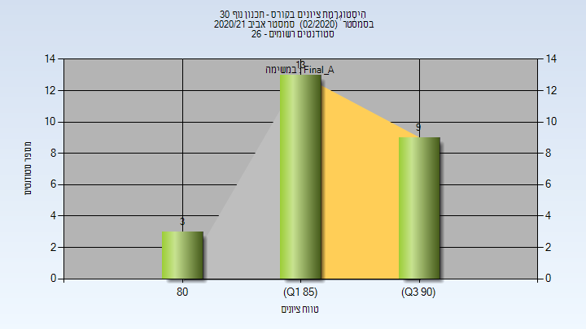
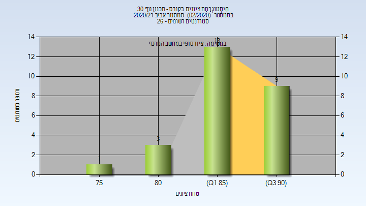

# 204062 - תכנון נוף 30

## אביב 2021

| איש סגל | תפקיד |
| ---- | ---- |
| מג'אר טליה | מרצה - אחראי מקצוע |
| ברמן אסיף | מרצה |

### סופי מועד א'

| סטודנטים | עברו/נכשלו | אחוז עוברים | ציון מינימלי | ציון מקסימלי | ממוצע | חציון |
| ---- | ---- | ---- | ---- | ---- | ---- | ---- |
| 25 | 25/0 | 100 | 80 | 93 | 87.64 | 88 |

### סופי

| סטודנטים | עברו/נכשלו | אחוז עוברים | ציון מינימלי | ציון מקסימלי | ממוצע | חציון |
| ---- | ---- | ---- | ---- | ---- | ---- | ---- |
| 26 | 26/0 | 100 | 77 | 93 | 87.231 | 88 |

