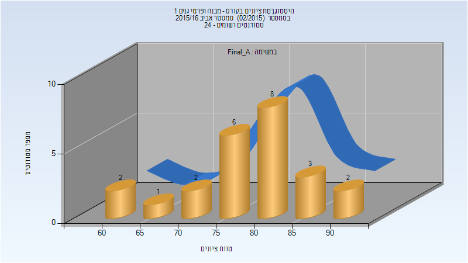
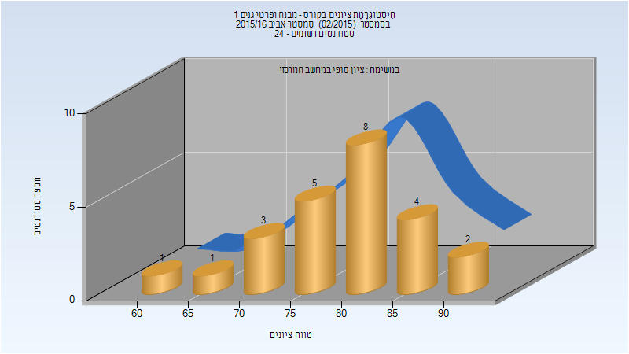

# 204400 - מבנה ופרטי גנים 1

## אביב 2016

| איש סגל | תפקיד |
| ---- | ---- |
| אריאב לי | מרצה - אחראי מקצוע |
| אילת דוד | מרצה |

### סופי מועד א'

| סטודנטים | עברו/נכשלו | אחוז עוברים | ציון מינימלי | ציון מקסימלי | ממוצע | חציון |
| ---- | ---- | ---- | ---- | ---- | ---- | ---- |
| 24 | 24/0 | 100 | 62 | 93 | 79.083 | 80 |

### סופי

| סטודנטים | עברו/נכשלו | אחוז עוברים | ציון מינימלי | ציון מקסימלי | ממוצע | חציון |
| ---- | ---- | ---- | ---- | ---- | ---- | ---- |
| 24 | 24/0 | 100 | 62 | 93 | 79.833 | 80.5 |

