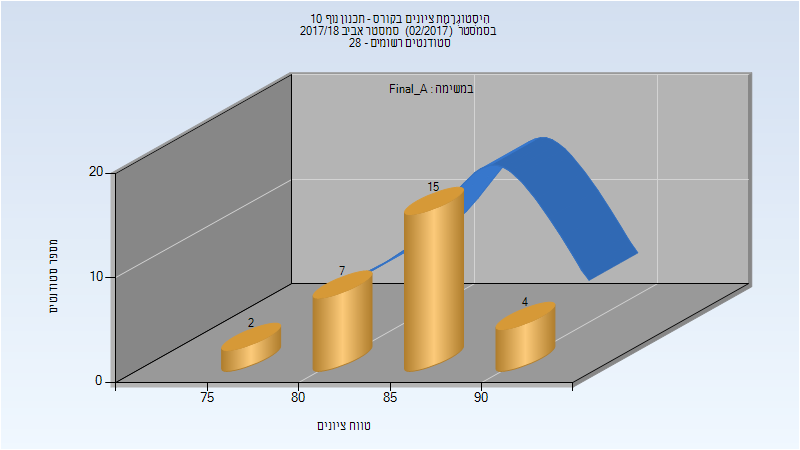
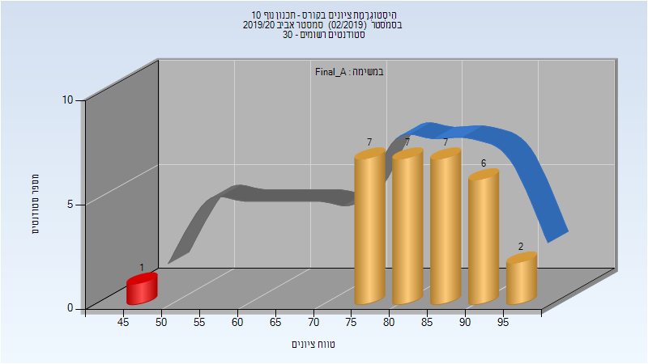

# 204620 - תכנון נוף 10

## אביב 2018

| איש סגל | תפקיד |
| ---- | ---- |
| סופר יעל | מנחה פרויקטים  - עם הרשאות מרצה אחראי |
| וקסמן לב |  |

### סופי מועד א'

| סטודנטים | עברו/נכשלו | אחוז עוברים | ציון מינימלי | ציון מקסימלי | ממוצע | חציון |
| ---- | ---- | ---- | ---- | ---- | ---- | ---- |
| 28 | 28/0 | 100 | 77 | 93 | 85.786 | 86 |

### סופי

| סטודנטים | עברו/נכשלו | אחוז עוברים | ציון מינימלי | ציון מקסימלי | ממוצע | חציון |
| ---- | ---- | ---- | ---- | ---- | ---- | ---- |
| 28 | 28/0 | 100 | 77 | 93 | 85.786 | 86 |

## אביב 2020

| איש סגל | תפקיד |
| ---- | ---- |
| סופר יעל | מנחה פרויקטים  - עם הרשאות מרצה אחראי |
| מג'אר טליה |  |
| חגי אביטל |  |

### סופי מועד א'

| סטודנטים | עברו/נכשלו | אחוז עוברים | ציון מינימלי | ציון מקסימלי | ממוצע | חציון |
| ---- | ---- | ---- | ---- | ---- | ---- | ---- |
| 30 | 29/1 | 97 | 49 | 96 | 83.567 | 84.5 |

