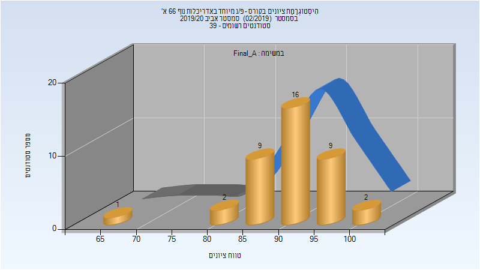

# 204718 - פ/נ מיוחד באדריכלות נוף 66 א'

## אביב 2020

| איש סגל | תפקיד |
| ---- | ---- |
| גלון ישראל | מנחה פרויקטים  - עם הרשאות מרצה אחראי |

### סופי מועד א'

| סטודנטים | עברו/נכשלו | אחוז עוברים | ציון מינימלי | ציון מקסימלי | ממוצע | חציון |
| ---- | ---- | ---- | ---- | ---- | ---- | ---- |
| 39 | 39/0 | 100 | 65 | 100 | 91.538 | 92 |

### סופי

| סטודנטים | עברו/נכשלו | אחוז עוברים | ציון מינימלי | ציון מקסימלי | ממוצע | חציון |
| ---- | ---- | ---- | ---- | ---- | ---- | ---- |
| 39 | 39/0 | 100 | 65 | 100 | 91.538 | 92 |

