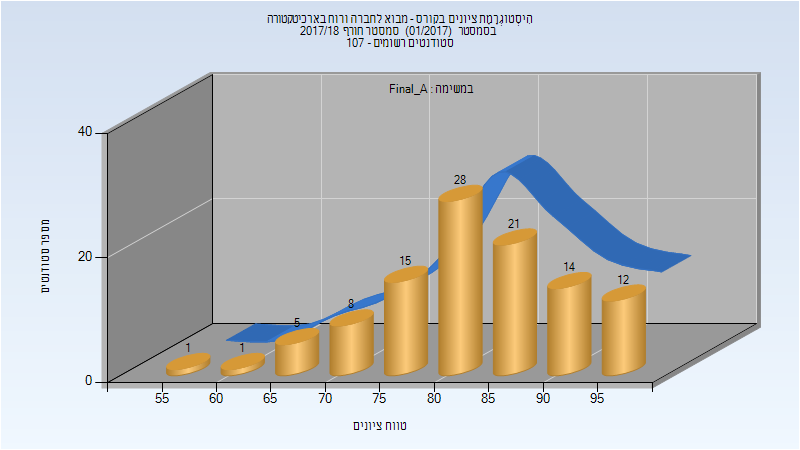
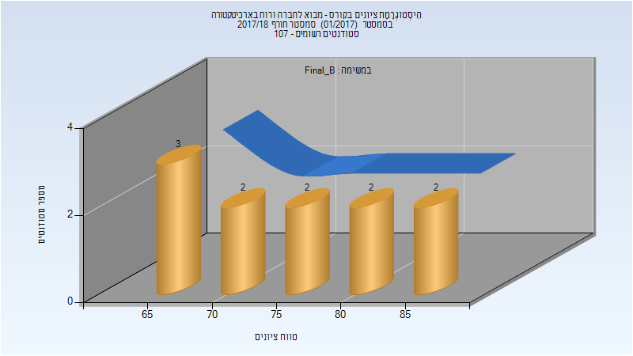
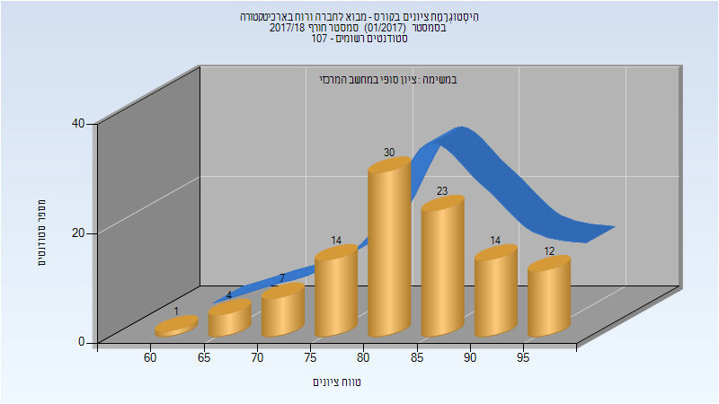
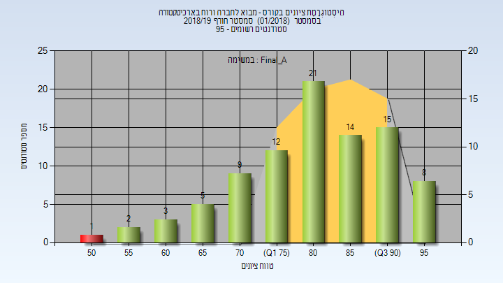
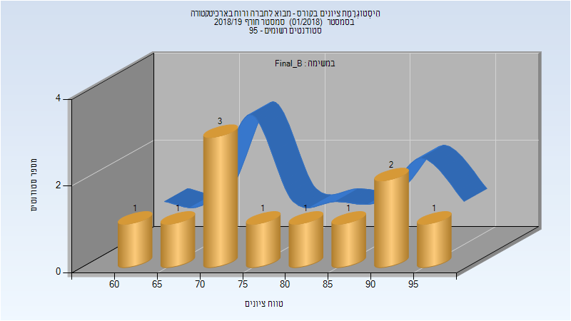
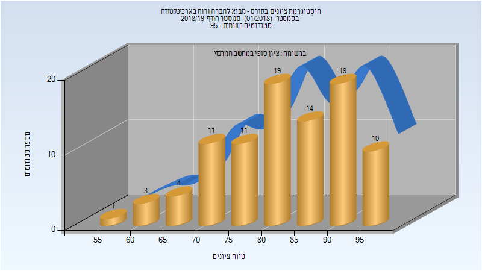
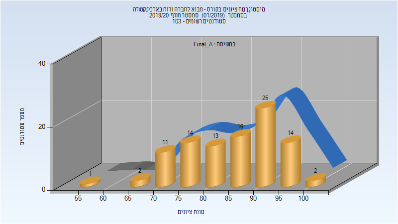
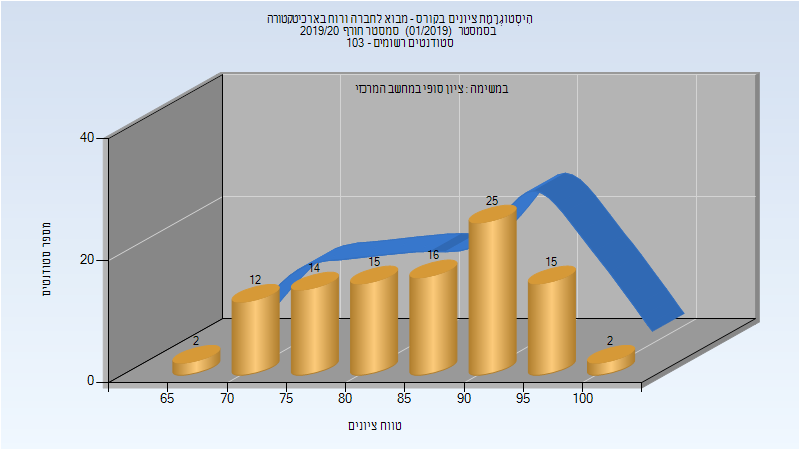

# 205012 - מבוא לחברה ורוח בארכיטקטורה

## חורף 2017-2018

| איש סגל | תפקיד |
| ---- | ---- |
| פוקס אהרון-רון | מרצה - אחראי מקצוע |
| כהן עינבל | מתרגל - עם הרשאות מרצה אחראי |
| דשבסקי ליליה | מתרגל - עם הרשאות מרצה אחראי |
| לייבו זיו | מתרגל - עם הרשאות מרצה אחראי |

### סופי מועד א'

| סטודנטים | עברו/נכשלו | אחוז עוברים | ציון מינימלי | ציון מקסימלי | ממוצע | חציון |
| ---- | ---- | ---- | ---- | ---- | ---- | ---- |
| 105 | 105/0 | 100 | 58 | 99 | 83.6 | 84 |

### סופי מועד ב'

| סטודנטים | עברו/נכשלו | אחוז עוברים | ציון מינימלי | ציון מקסימלי | ממוצע | חציון |
| ---- | ---- | ---- | ---- | ---- | ---- | ---- |
| 11 | 11/0 | 100 | 66 | 87 | 76.364 | 74 |

### סופי

| סטודנטים | עברו/נכשלו | אחוז עוברים | ציון מינימלי | ציון מקסימלי | ממוצע | חציון |
| ---- | ---- | ---- | ---- | ---- | ---- | ---- |
| 105 | 105/0 | 100 | 62 | 99 | 84.286 | 84 |

## חורף 2018-2019

| איש סגל | תפקיד |
| ---- | ---- |
| פוקס אהרון-רון | מרצה - אחראי מקצוע |
| כהן עינבל | מתרגל - עם הרשאות מרצה אחראי |

### סופי מועד א'

| סטודנטים | עברו/נכשלו | אחוז עוברים | ציון מינימלי | ציון מקסימלי | ממוצע | חציון |
| ---- | ---- | ---- | ---- | ---- | ---- | ---- |
| 90 | 89/1 | 99 | 52.589 | 98.8 | 82.139 | 83.6945 |

### סופי מועד ב'

| סטודנטים | עברו/נכשלו | אחוז עוברים | ציון מינימלי | ציון מקסימלי | ממוצע | חציון |
| ---- | ---- | ---- | ---- | ---- | ---- | ---- |
| 11 | 11/0 | 100 | 64 | 96 | 78.909 | 74 |

### סופי

| סטודנטים | עברו/נכשלו | אחוז עוברים | ציון מינימלי | ציון מקסימלי | ממוצע | חציון |
| ---- | ---- | ---- | ---- | ---- | ---- | ---- |
| 92 | 92/0 | 100 | 56 | 99 | 83.304 | 84 |

## חורף 2019-2020

| איש סגל | תפקיד |
| ---- | ---- |
| פוקס אהרון-רון | מרצה - אחראי מקצוע |
| שגיא אלון | מתרגל - עם הרשאות מרצה אחראי |
| כהן עינבל | מתרגל - עם הרשאות מרצה אחראי |
| קרסנובייב אולג | מתרגל - עם הרשאות מרצה אחראי |

### סופי מועד א'

| סטודנטים | עברו/נכשלו | אחוז עוברים | ציון מינימלי | ציון מקסימלי | ממוצע | חציון |
| ---- | ---- | ---- | ---- | ---- | ---- | ---- |
| 97 | 97/0 | 100 | 56 | 100 | 85.474 | 87 |

### סופי

| סטודנטים | עברו/נכשלו | אחוז עוברים | ציון מינימלי | ציון מקסימלי | ממוצע | חציון |
| ---- | ---- | ---- | ---- | ---- | ---- | ---- |
| 100 | 100/0 | 100 | 66 | 100 | 85.66 | 87 |

