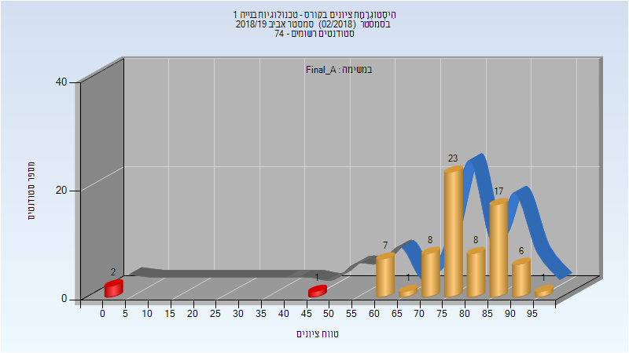
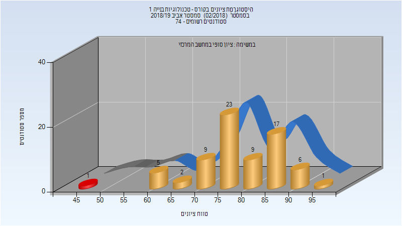
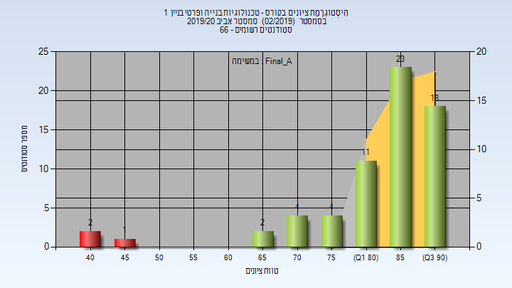
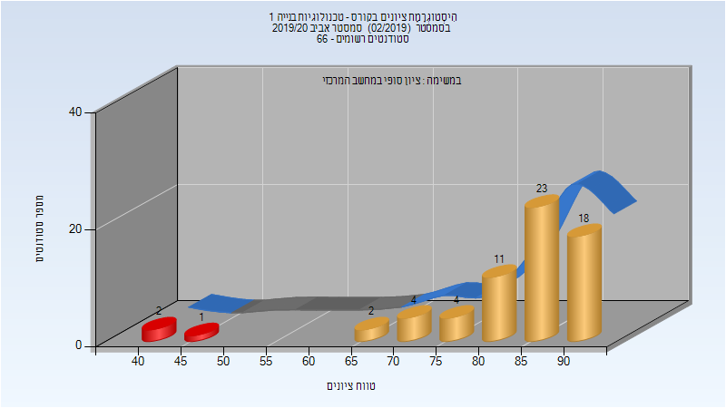

# 205426 - טכנולוגיות בנייה 1

## אביב 2019

| איש סגל | תפקיד |
| ---- | ---- |
| קרני אייל | מרצה - אחראי מקצוע |
| כהנא דניאל | מתרגל - עם הרשאות מרצה אחראי |
| פרידמן דינה | מתרגל - עם הרשאות מרצה אחראי |
| רביב מאיר | מתרגל - עם הרשאות מרצה אחראי |
| דרורי דפנה | מתרגל - עם הרשאות מרצה אחראי |
| בר-און דוד | מתרגל - עם הרשאות מרצה אחראי |
| ארידור יהודה | מתרגל - עם הרשאות מרצה אחראי |

### סופי מועד א'

| סטודנטים | עברו/נכשלו | אחוז עוברים | ציון מינימלי | ציון מקסימלי | ממוצע | חציון |
| ---- | ---- | ---- | ---- | ---- | ---- | ---- |
| 74 | 71/3 | 96 | 0 | 95 | 76.662 | 79 |

### סופי

| סטודנטים | עברו/נכשלו | אחוז עוברים | ציון מינימלי | ציון מקסימלי | ממוצע | חציון |
| ---- | ---- | ---- | ---- | ---- | ---- | ---- |
| 73 | 72/1 | 99 | 47 | 95 | 79 | 79 |

## אביב 2020

| איש סגל | תפקיד |
| ---- | ---- |
| קרני אייל | מרצה - אחראי מקצוע |

### סופי מועד א'

| סטודנטים | עברו/נכשלו | אחוז עוברים | ציון מינימלי | ציון מקסימלי | ממוצע | חציון |
| ---- | ---- | ---- | ---- | ---- | ---- | ---- |
| 65 | 62/3 | 95 | 41 | 94 | 83.369 | 86 |

### סופי

| סטודנטים | עברו/נכשלו | אחוז עוברים | ציון מינימלי | ציון מקסימלי | ממוצע | חציון |
| ---- | ---- | ---- | ---- | ---- | ---- | ---- |
| 65 | 62/3 | 95 | 41 | 94 | 82.862 | 86 |

