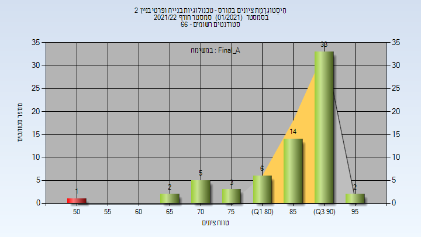

# 205427 - טכנולוגיות בנייה 2

## חורף 2021-2022

| איש סגל | תפקיד |
| ---- | ---- |
| בן-ארי אורן | מרצה - אחראי מקצוע |

### סופי מועד א'

| סטודנטים | עברו/נכשלו | אחוז עוברים | ציון מינימלי | ציון מקסימלי | ממוצע | חציון |
| ---- | ---- | ---- | ---- | ---- | ---- | ---- |
| 66 | 65/1 | 98 | 50 | 95 | 86.742 | 90 |

### סופי

| סטודנטים | עברו/נכשלו | אחוז עוברים | ציון מינימלי | ציון מקסימלי | ממוצע | חציון |
| ---- | ---- | ---- | ---- | ---- | ---- | ---- |
| 66 | 65/1 | 98 | 50 | 95 | 86.742 | 90 |

