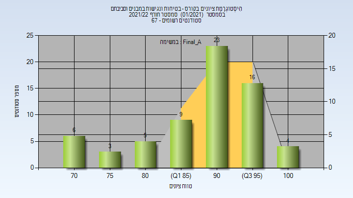

# 205510 - בטיחות ונגישות במבנים וסביבתם

## חורף 2021-2022

| איש סגל | תפקיד |
| ---- | ---- |
| גונן אריה | מרצה - אחראי מקצוע |

### סופי מועד א'

| סטודנטים | עברו/נכשלו | אחוז עוברים | ציון מינימלי | ציון מקסימלי | ממוצע | חציון |
| ---- | ---- | ---- | ---- | ---- | ---- | ---- |
| 66 | 66/0 | 100 | 70 | 100 | 89.394 | 92 |

