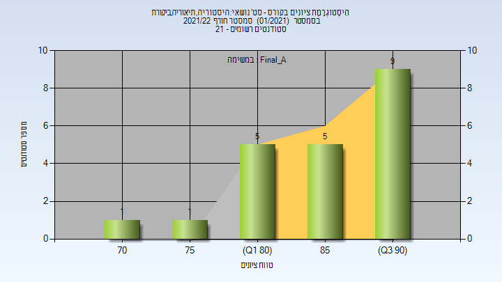

# 205580 - סט' נושאי#היסטוריה,תיאוריה,ביקורת

## חורף 2020-2021

| איש סגל | תפקיד |
| ---- | ---- |
| פרייס דן | מרצה - אחראי מקצוע |
| אבידן יוני | מרצה |

### סופי מועד א'

| סטודנטים | עברו/נכשלו | אחוז עוברים | ציון מינימלי | ציון מקסימלי | ממוצע | חציון |
| ---- | ---- | ---- | ---- | ---- | ---- | ---- |
| 23 | 23/0 | 100 | 74 | 92 | 84.913 | 85 |

### סופי

| סטודנטים | עברו/נכשלו | אחוז עוברים | ציון מינימלי | ציון מקסימלי | ממוצע | חציון |
| ---- | ---- | ---- | ---- | ---- | ---- | ---- |
| 23 | 23/0 | 100 | 74 | 92 | 84.913 | 85 |

## חורף 2021-2022

| איש סגל | תפקיד |
| ---- | ---- |
| פרייס דן | מרצה - אחראי מקצוע |
| אבידן יוני | מתרגל - עם הרשאות מרצה אחראי |
| זהר אלון | מתרגל - עם הרשאות מרצה אחראי |

### סופי מועד א'

| סטודנטים | עברו/נכשלו | אחוז עוברים | ציון מינימלי | ציון מקסימלי | ממוצע | חציון |
| ---- | ---- | ---- | ---- | ---- | ---- | ---- |
| 21 | 21/0 | 100 | 72 | 92 | 86.19 | 88 |

