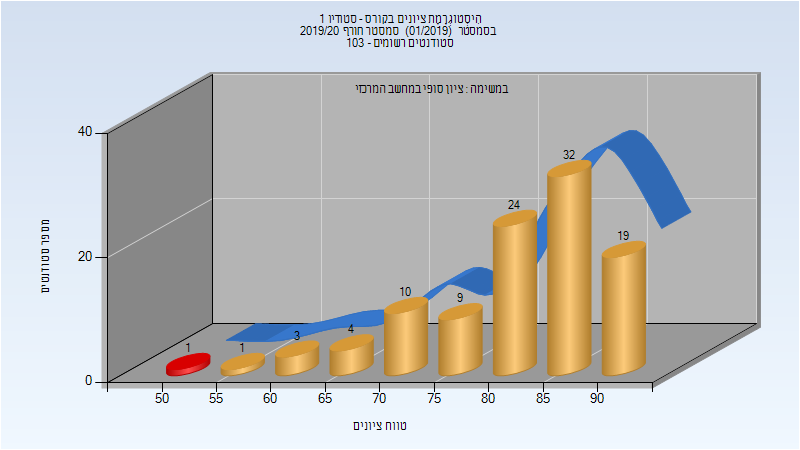
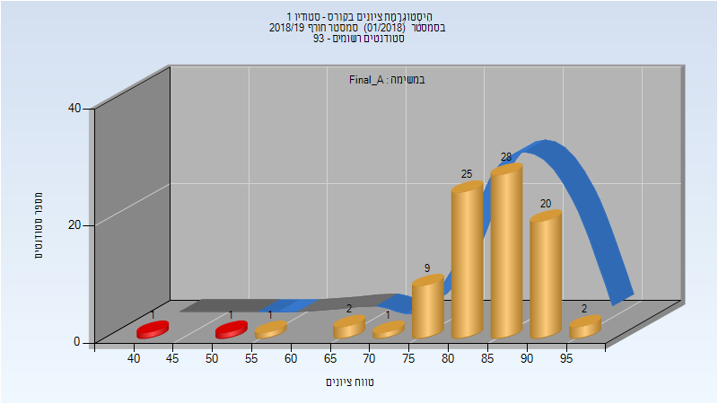
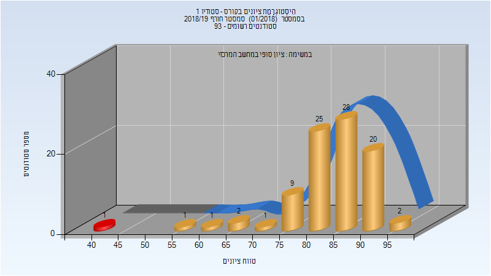
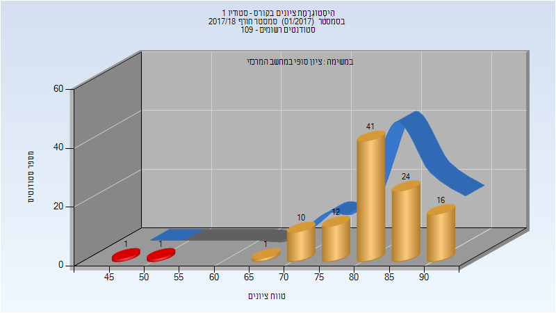
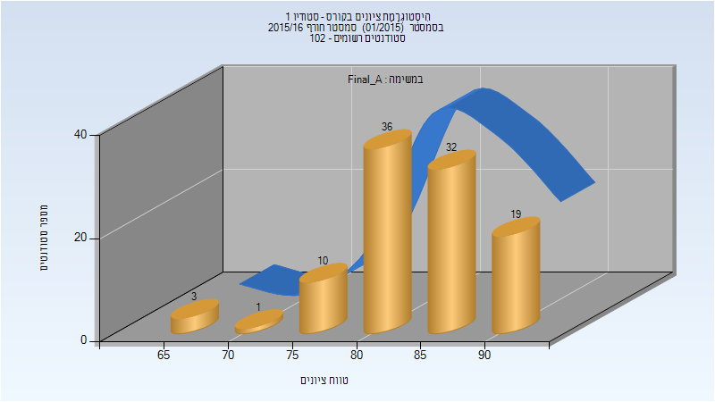
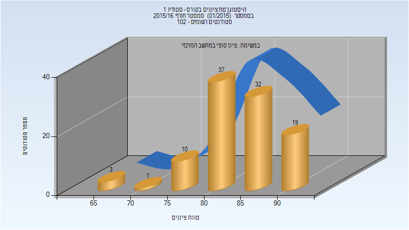

# 205665 - סטודיו 1

**הערה**: מאגר ההיסטוגרמות הוקם עבור [CheeseFork](https://cheesefork.cf/), כלי בניית מערכת שעות עבור סטודנטים בטכניון. באתר בו אתם גולשים ניתן לעיין בהיסטוגרמות, אך הדרך היותר נוחה היא לעיין בהיסטוגרמות, ובמידע נוסף כגון חוות דעת של סטודנטים, באתר CheeseFork.

* [חורף 2019-2020](#201901)
  * [סופי](#201901-Finals)
* [חורף 2018-2019](#201801)
  * [סופי מועד א'](#201801-Final_A)
  * [סופי](#201801-Finals)
* [חורף 2017-2018](#201701)
  * [סופי מועד א'](#201701-Final_A)
  * [סופי](#201701-Finals)
* [חורף 2015-2016](#201501)
  * [סופי מועד א'](#201501-Final_A)
  * [סופי](#201501-Finals)

<h2 id="201901">חורף 2019-2020</h2>

| איש סגל | תפקיד |
| ---- | ---- |
| בן-אברהם אורן | מנחה פרויקטים  - עם הרשאות מרצה אחראי |
| מג'אר טליה |  |

<h3 id="201901-Finals">סופי</h3>

| סטודנטים | עברו/נכשלו | אחוז עוברים | ציון מינימלי | ציון מקסימלי | ממוצע | חציון |
| ---- | ---- | ---- | ---- | ---- | ---- | ---- |
| 103 | 102/1 | 99 | 50 | 93 | 81.767 | 84 |

<h2 id="201801">חורף 2018-2019</h2>

| איש סגל | תפקיד |
| ---- | ---- |
| פישר-גבירצמן דפנה | מנחה פרויקטים  - עם הרשאות מרצה אחראי |
| קרמר דליה |  |
| יפה חצב |  |
| אבן אורלי |  |
| אריאב לי |  |
| קנטי גרינשלג יונתן |  |
| מרגלית גיא |  |
| שפי שהם |  |

<h3 id="201801-Final_A">סופי מועד א'</h3>

| סטודנטים | עברו/נכשלו | אחוז עוברים | ציון מינימלי | ציון מקסימלי | ממוצע | חציון |
| ---- | ---- | ---- | ---- | ---- | ---- | ---- |
| 90 | 88/2 | 98 | 40 | 97 | 83.889 | 85 |

<h3 id="201801-Finals">סופי</h3>

| סטודנטים | עברו/נכשלו | אחוז עוברים | ציון מינימלי | ציון מקסימלי | ממוצע | חציון |
| ---- | ---- | ---- | ---- | ---- | ---- | ---- |
| 90 | 89/1 | 99 | 40 | 97 | 84 | 85 |

<h2 id="201701">חורף 2017-2018</h2>

| איש סגל | תפקיד |
| ---- | ---- |
| פישר-גבירצמן דפנה | מנחה פרויקטים  - עם הרשאות מרצה אחראי |
| אריאב לי |  |
| קנטי יונתן |  |
| קרמר דליה |  |
| יפה חצב |  |
| שחר דורית |  |
| ויסמן-אילן מיה |  |
| ביטון רונית |  |
| אבידן יוני |  |

<h3 id="201701-Final_A">סופי מועד א'</h3>

| סטודנטים | עברו/נכשלו | אחוז עוברים | ציון מינימלי | ציון מקסימלי | ממוצע | חציון |
| ---- | ---- | ---- | ---- | ---- | ---- | ---- |
| 105 | 103/2 | 98 | 45 | 94 | 82.095 | 83 |

<h3 id="201701-Finals">סופי</h3>

| סטודנטים | עברו/נכשלו | אחוז עוברים | ציון מינימלי | ציון מקסימלי | ממוצע | חציון |
| ---- | ---- | ---- | ---- | ---- | ---- | ---- |
| 106 | 104/2 | 98 | 45 | 94 | 82.075 | 83 |

<h2 id="201501">חורף 2015-2016</h2>

| איש סגל | תפקיד |
| ---- | ---- |
| פישר-גבירצמן דפנה | מנחה פרויקטים  - עם הרשאות מרצה אחראי |
| קלוש ניצן | מנחה פרויקטים |
| גולדשטיין אורן | מנחה פרויקטים |
| אריאב לי | מנחה פרויקטים |
| כהן אורי | מנחה פרויקטים |
| ויסמן-אילן מיה | מנחה פרויקטים |
| הר-גיל גיל | מנחה פרויקטים |
| קרמר דליה | מנחה פרויקטים |
| רוזנר צופיה | מנחה פרויקטים |

<h3 id="201501-Final_A">סופי מועד א'</h3>

| סטודנטים | עברו/נכשלו | אחוז עוברים | ציון מינימלי | ציון מקסימלי | ממוצע | חציון |
| ---- | ---- | ---- | ---- | ---- | ---- | ---- |
| 101 | 101/0 | 100 | 66 | 92 | 84 | 85 |

<h3 id="201501-Finals">סופי</h3>

| סטודנטים | עברו/נכשלו | אחוז עוברים | ציון מינימלי | ציון מקסימלי | ממוצע | חציון |
| ---- | ---- | ---- | ---- | ---- | ---- | ---- |
| 102 | 102/0 | 100 | 68 | 92 | 84.01 | 84.5 |

