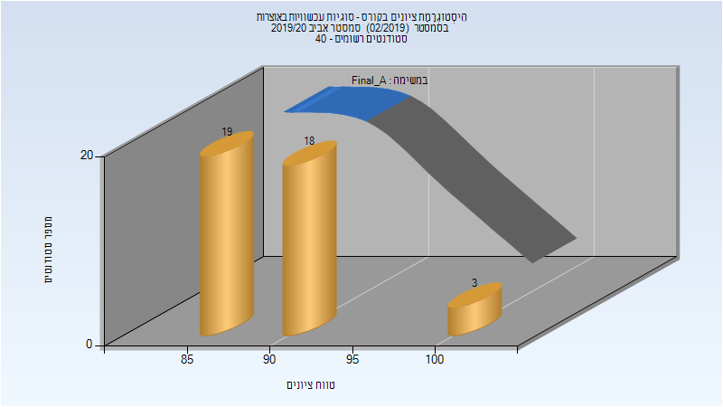
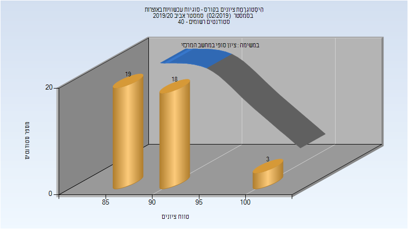

# 205837 - סוגיות עכשוויות באוצרות

## אביב 2020

| איש סגל | תפקיד |
| ---- | ---- |
| שושן דניאל | מרצה - אחראי מקצוע |
| אבידן יוני | מרצה |

### סופי מועד א'

| סטודנטים | עברו/נכשלו | אחוז עוברים | ציון מינימלי | ציון מקסימלי | ממוצע | חציון |
| ---- | ---- | ---- | ---- | ---- | ---- | ---- |
| 40 | 40/0 | 100 | 88 | 100 | 90.3 | 90 |

### סופי

| סטודנטים | עברו/נכשלו | אחוז עוברים | ציון מינימלי | ציון מקסימלי | ממוצע | חציון |
| ---- | ---- | ---- | ---- | ---- | ---- | ---- |
| 40 | 40/0 | 100 | 88 | 100 | 90.3 | 90 |

