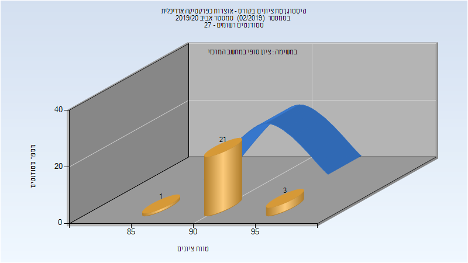

# 205838 - אוצרות כפרקטיקה אדריכלית

## אביב 2020

| איש סגל | תפקיד |
| ---- | ---- |
| שושן דניאל | מנחה פרויקטים  - עם הרשאות מרצה אחראי |
| מטלון עמית |  |

### סופי מועד א'

| סטודנטים | עברו/נכשלו | אחוז עוברים | ציון מינימלי | ציון מקסימלי | ממוצע | חציון |
| ---- | ---- | ---- | ---- | ---- | ---- | ---- |
| 25 | 25/0 | 100 | 85 | 95 | 90.64 | 90 |

### סופי

| סטודנטים | עברו/נכשלו | אחוז עוברים | ציון מינימלי | ציון מקסימלי | ממוצע | חציון |
| ---- | ---- | ---- | ---- | ---- | ---- | ---- |
| 25 | 25/0 | 100 | 85 | 95 | 90.64 | 90 |

