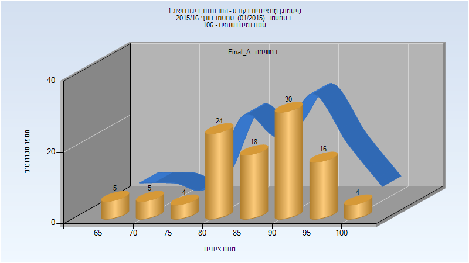
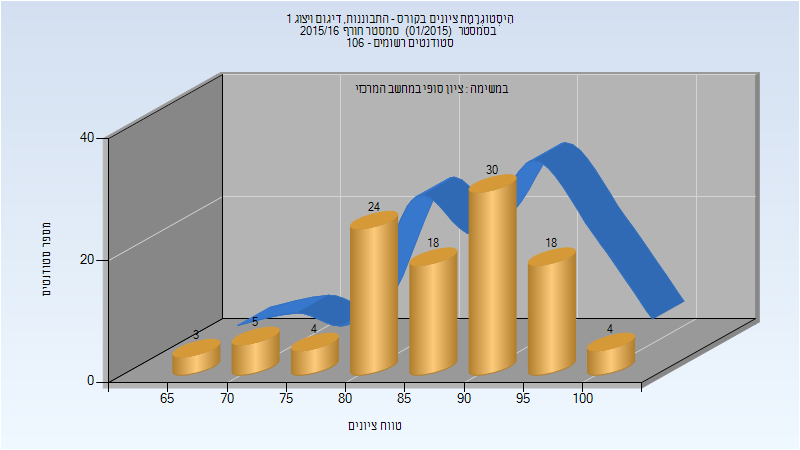
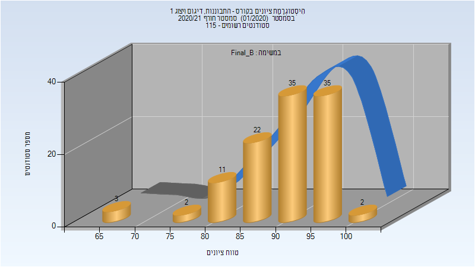
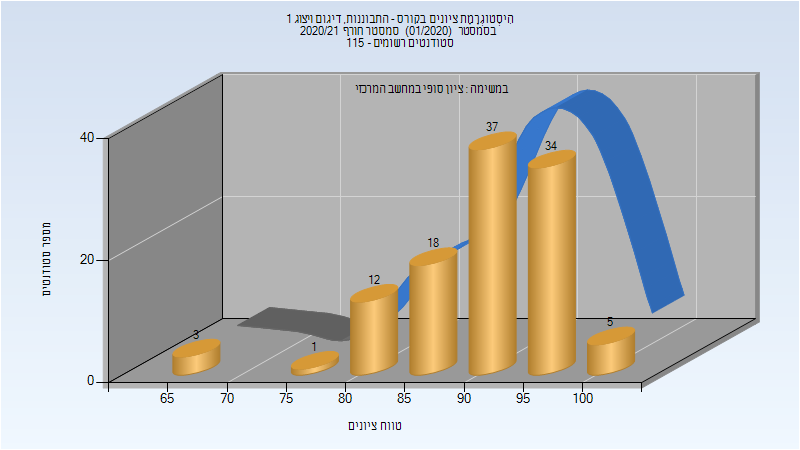
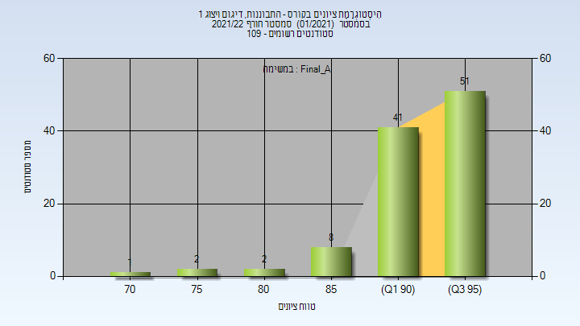
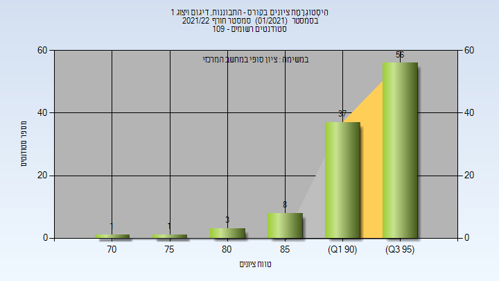

# 205922 - התבוננות, דיגום ויצוג 1

## חורף 2015-2016

| איש סגל | תפקיד |
| ---- | ---- |
| בלונדר אריאל | מרצה - אחראי מקצוע |
| סופר הדס | מתרגל |
| שמש אבישג | מתרגל |

### סופי מועד א'

| סטודנטים | עברו/נכשלו | אחוז עוברים | ציון מינימלי | ציון מקסימלי | ממוצע | חציון |
| ---- | ---- | ---- | ---- | ---- | ---- | ---- |
| 106 | 106/0 | 100 | 65 | 100 | 86.887 | 87 |

### סופי

| סטודנטים | עברו/נכשלו | אחוז עוברים | ציון מינימלי | ציון מקסימלי | ממוצע | חציון |
| ---- | ---- | ---- | ---- | ---- | ---- | ---- |
| 106 | 106/0 | 100 | 65 | 100 | 87.453 | 88 |

## חורף 2017-2018

| איש סגל | תפקיד |
| ---- | ---- |
| גרובמן יעקב | מרצה - אחראי מקצוע |
| צ'ירקה ורה | מתרגל - עם הרשאות מרצה אחראי |
| עוזרי עזרא | מתרגל - עם הרשאות מרצה אחראי |

### סופי מועד א'

| סטודנטים | עברו/נכשלו | אחוז עוברים | ציון מינימלי | ציון מקסימלי | ממוצע | חציון |
| ---- | ---- | ---- | ---- | ---- | ---- | ---- |
| 112 | 107/5 | 96 | 0 | 100 | 87.054 | 92 |

### סופי

| סטודנטים | עברו/נכשלו | אחוז עוברים | ציון מינימלי | ציון מקסימלי | ממוצע | חציון |
| ---- | ---- | ---- | ---- | ---- | ---- | ---- |
| 108 | 108/0 | 100 | 71 | 100 | 91.148 | 93 |

## חורף 2018-2019

| איש סגל | תפקיד |
| ---- | ---- |
| גרובמן יעקב | מרצה - אחראי מקצוע |
| עוזרי עזרא | מתרגל - עם הרשאות מרצה אחראי |
| הרשקוביץ רחלי | מתרגל - עם הרשאות מרצה אחראי |

### סופי מועד א'

| סטודנטים | עברו/נכשלו | אחוז עוברים | ציון מינימלי | ציון מקסימלי | ממוצע | חציון |
| ---- | ---- | ---- | ---- | ---- | ---- | ---- |
| 93 | 90/3 | 97 | 25 | 99 | 88.677 | 91 |

### סופי

| סטודנטים | עברו/נכשלו | אחוז עוברים | ציון מינימלי | ציון מקסימלי | ממוצע | חציון |
| ---- | ---- | ---- | ---- | ---- | ---- | ---- |
| 93 | 90/3 | 97 | 25 | 99 | 88.677 | 91 |

## חורף 2019-2020

| איש סגל | תפקיד |
| ---- | ---- |
| גרובמן יעקב | מרצה - אחראי מקצוע |
| הרשקוביץ רחלי | מתרגל - עם הרשאות מרצה אחראי |
| עוזרי עזרא | מתרגל - עם הרשאות מרצה אחראי |

### סופי מועד א'

| סטודנטים | עברו/נכשלו | אחוז עוברים | ציון מינימלי | ציון מקסימלי | ממוצע | חציון |
| ---- | ---- | ---- | ---- | ---- | ---- | ---- |
| 101 | 100/1 | 99 | 38 | 100 | 91.723 | 93 |

### סופי

| סטודנטים | עברו/נכשלו | אחוז עוברים | ציון מינימלי | ציון מקסימלי | ממוצע | חציון |
| ---- | ---- | ---- | ---- | ---- | ---- | ---- |
| 101 | 100/1 | 99 | 38 | 100 | 91.723 | 93 |

## חורף 2020-2021

| איש סגל | תפקיד |
| ---- | ---- |
| גרובמן יעקב | מרצה - אחראי מקצוע |
| עוזרי עזרא | מתרגל - עם הרשאות מרצה אחראי |

### סופי מועד א'

| סטודנטים | עברו/נכשלו | אחוז עוברים | ציון מינימלי | ציון מקסימלי | ממוצע | חציון |
| ---- | ---- | ---- | ---- | ---- | ---- | ---- |
| 110 | 110/0 | 100 | 66.5 | 100 | 91.206 | 92.6 |

### סופי מועד ב'

| סטודנטים | עברו/נכשלו | אחוז עוברים | ציון מינימלי | ציון מקסימלי | ממוצע | חציון |
| ---- | ---- | ---- | ---- | ---- | ---- | ---- |
| 110 | 110/0 | 100 | 66.5 | 100 | 91.206 | 92.6 |

### סופי

| סטודנטים | עברו/נכשלו | אחוז עוברים | ציון מינימלי | ציון מקסימלי | ממוצע | חציון |
| ---- | ---- | ---- | ---- | ---- | ---- | ---- |
| 110 | 110/0 | 100 | 67 | 100 | 91.264 | 93 |

## חורף 2021-2022

| איש סגל | תפקיד |
| ---- | ---- |
| שאומן דוידה | מרצה - אחראי מקצוע |
| עוזרי עזרא | מתרגל - עם הרשאות מרצה אחראי |

### סופי מועד א'

| סטודנטים | עברו/נכשלו | אחוז עוברים | ציון מינימלי | ציון מקסימלי | ממוצע | חציון |
| ---- | ---- | ---- | ---- | ---- | ---- | ---- |
| 105 | 105/0 | 100 | 74.2 | 99.25 | 93.908 | 94.7 |

### סופי

| סטודנטים | עברו/נכשלו | אחוז עוברים | ציון מינימלי | ציון מקסימלי | ממוצע | חציון |
| ---- | ---- | ---- | ---- | ---- | ---- | ---- |
| 105 | 105/0 | 100 | 74 | 99 | 93.933 | 95 |

