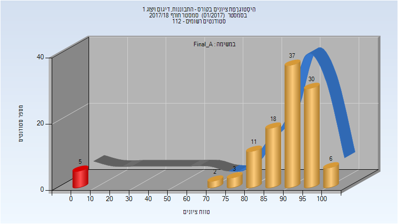
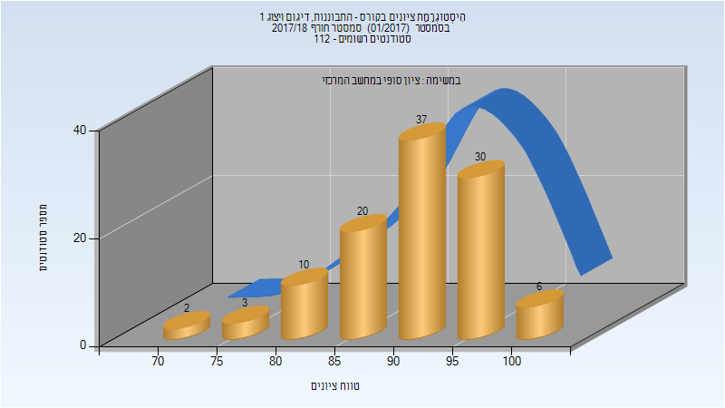
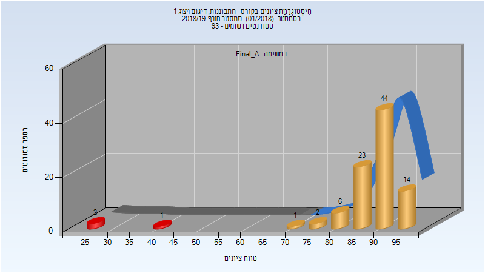
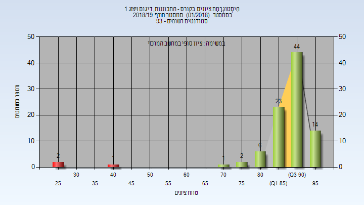
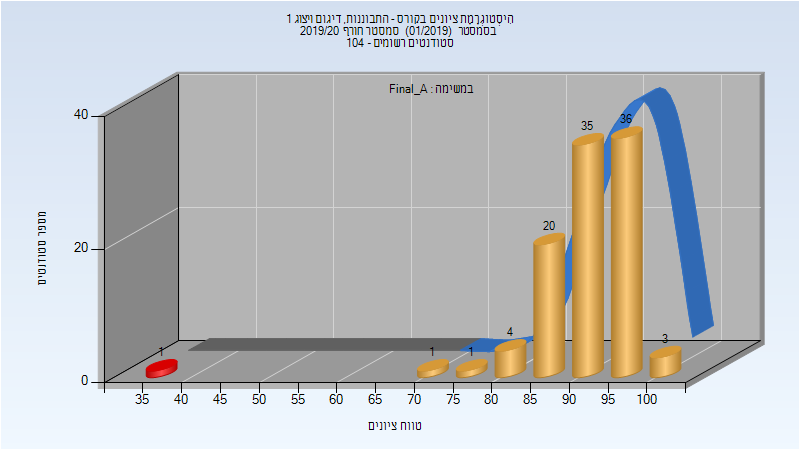

# 205922 - התבוננות, דיגום ויצוג 1

## חורף 2017-2018

| איש סגל | תפקיד |
| ---- | ---- |
| גרובמן יעקב | מרצה - אחראי מקצוע |
| צ'ירקה ורה | מתרגל - עם הרשאות מרצה אחראי |
| עוזרי עזרא | מתרגל - עם הרשאות מרצה אחראי |

### סופי מועד א'

| סטודנטים | עברו/נכשלו | אחוז עוברים | ציון מינימלי | ציון מקסימלי | ממוצע | חציון |
| ---- | ---- | ---- | ---- | ---- | ---- | ---- |
| 112 | 107/5 | 96 | 0 | 100 | 87.054 | 92 |

### סופי

| סטודנטים | עברו/נכשלו | אחוז עוברים | ציון מינימלי | ציון מקסימלי | ממוצע | חציון |
| ---- | ---- | ---- | ---- | ---- | ---- | ---- |
| 108 | 108/0 | 100 | 71 | 100 | 91.148 | 93 |

## חורף 2018-2019

| איש סגל | תפקיד |
| ---- | ---- |
| גרובמן יעקב | מרצה - אחראי מקצוע |
| הרשקוביץ רחלי | מתרגל - עם הרשאות מרצה אחראי |
| עוזרי עזרא | מתרגל - עם הרשאות מרצה אחראי |

### סופי מועד א'

| סטודנטים | עברו/נכשלו | אחוז עוברים | ציון מינימלי | ציון מקסימלי | ממוצע | חציון |
| ---- | ---- | ---- | ---- | ---- | ---- | ---- |
| 93 | 90/3 | 97 | 25 | 99 | 88.677 | 91 |

### סופי

| סטודנטים | עברו/נכשלו | אחוז עוברים | ציון מינימלי | ציון מקסימלי | ממוצע | חציון |
| ---- | ---- | ---- | ---- | ---- | ---- | ---- |
| 93 | 90/3 | 97 | 25 | 99 | 88.677 | 91 |

## חורף 2019-2020

| איש סגל | תפקיד |
| ---- | ---- |
| גרובמן יעקב | מרצה - אחראי מקצוע |
| הרשקוביץ רחלי | מתרגל - עם הרשאות מרצה אחראי |
| עוזרי עזרא | מתרגל - עם הרשאות מרצה אחראי |

### סופי מועד א'

| סטודנטים | עברו/נכשלו | אחוז עוברים | ציון מינימלי | ציון מקסימלי | ממוצע | חציון |
| ---- | ---- | ---- | ---- | ---- | ---- | ---- |
| 101 | 100/1 | 99 | 38 | 100 | 91.723 | 93 |

### סופי

| סטודנטים | עברו/נכשלו | אחוז עוברים | ציון מינימלי | ציון מקסימלי | ממוצע | חציון |
| ---- | ---- | ---- | ---- | ---- | ---- | ---- |
| 101 | 100/1 | 99 | 38 | 100 | 91.723 | 93 |

