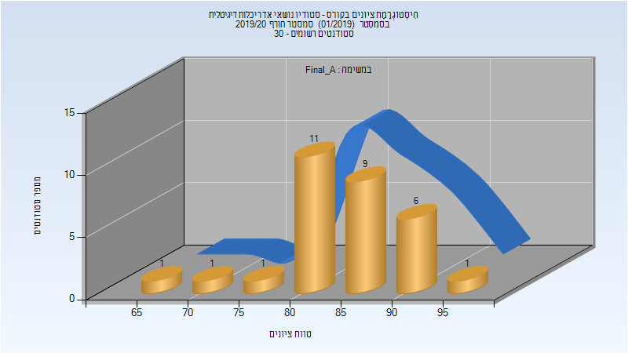

# 206176 - סטודיו נושאי אדר' דיגיטלית

## חורף 2019-2020

| איש סגל | תפקיד |
| ---- | ---- |
| פישר-גבירצמן דפנה | מרצה - אחראי מקצוע |
| פרייס דן |  |

### סופי מועד א'

| סטודנטים | עברו/נכשלו | אחוז עוברים | ציון מינימלי | ציון מקסימלי | ממוצע | חציון |
| ---- | ---- | ---- | ---- | ---- | ---- | ---- |
| 30 | 30/0 | 100 | 65 | 95 | 84.067 | 85 |

### סופי

| סטודנטים | עברו/נכשלו | אחוז עוברים | ציון מינימלי | ציון מקסימלי | ממוצע | חציון |
| ---- | ---- | ---- | ---- | ---- | ---- | ---- |
| 30 | 30/0 | 100 | 65 | 95 | 84.067 | 85 |

