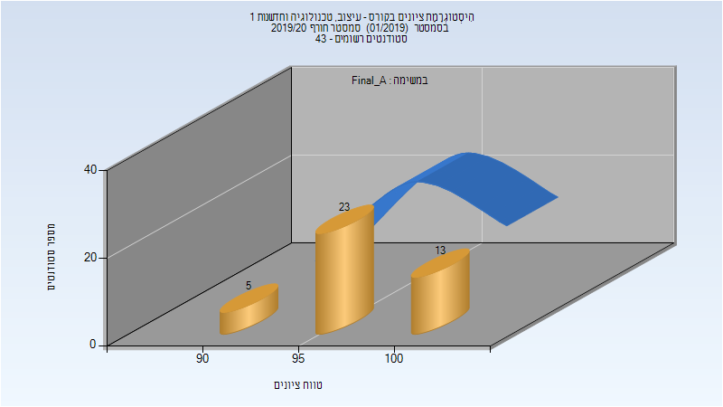
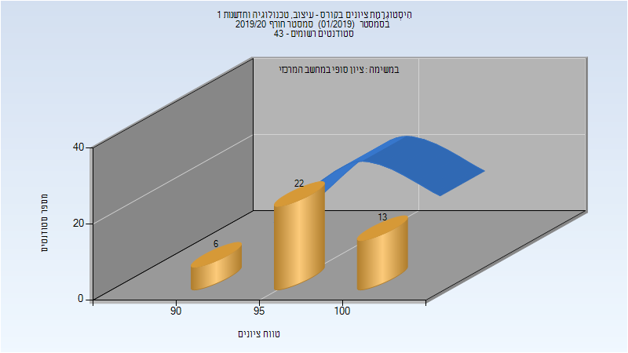

# 206827 - עיצוב, טכנולוגיה וחדשנות 1

## חורף 2019-2020

| איש סגל | תפקיד |
| ---- | ---- |
| טרזי עזרא | מרצה - אחראי מקצוע |

### סופי מועד א'

| סטודנטים | עברו/נכשלו | אחוז עוברים | ציון מינימלי | ציון מקסימלי | ממוצע | חציון |
| ---- | ---- | ---- | ---- | ---- | ---- | ---- |
| 41 | 41/0 | 100 | 90 | 100 | 96.683 | 96 |

### סופי

| סטודנטים | עברו/נכשלו | אחוז עוברים | ציון מינימלי | ציון מקסימלי | ממוצע | חציון |
| ---- | ---- | ---- | ---- | ---- | ---- | ---- |
| 41 | 41/0 | 100 | 90 | 100 | 96.683 | 96 |

